# BackPropagation

**The core idea of neural networks is to compute weighted sums of the values in the input layer and create a mapping between the input and output layer by a series of functions (in general, nonlinear functions).**

* Every neural network has an input layer, a series of hidden layers and an output layer. 

### Example
Let us take the task of classifying our images into four categories ‘cat’, ‘dog’, ‘frog’ and ‘horse’. The values in the input layer represent the pixel values of a given image that we want to classify into four categories. The small circles in each layer are called neurons. The values of the output layer represent the score for each category. We classify the image into the category that gets the highest score. For instance, if the ‘frog’ neuron in the output layer receives the highest value in comparison to the other neurons of the layer, we say the image is a ‘frog’. The other intermediary layers are called hidden layers.

### Understand the Architecture of  neuron
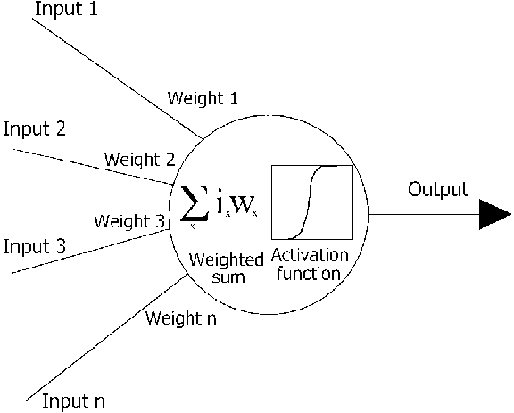

Every junction between two layers have a set of parameters called weights. These weights are not random numbers, the weight matrix between different layers can be visualized as a template or a feature that we are looking for in the image to classify it. The values of the next layer are calculated by applying a function called activation function to the values of the previous layer and the weights in between the two layers. Commonly used activation functions are sigmoid, tanh, Rectified Linear Unit (also called ReLU), leaky ReLU and Maxout. The difference between the output that we predict using the network and the actual class of the image determines the loss of the network. Greater the number of images that we classify correctly, lesser the loss. There are several ways of computing the loss of a neural network. One naive approach would be to find the mean squared error i.e, the mean of squares of the difference between the predicted and actual values. Other techniques that are often used to compute loss are softmax(cross-entropy) and support vector machine (hinge) loss. So, the aim of a neural network problem is to learn the best set of weights to give us the desired scores in the output layer. In other words, to minimize the loss function of the network.

### What is backpropagation?
Training a neural network typically happens in two phases.
#### Forward Pass:
We compute the outputs of every node in the forward pass and calculate the final loss of the network.
#### Backward Pass:
We start at the end of the network, backpropagate or feed the errors back, recursively apply chain rule to compute gradients all the way to the inputs of the network and then update the weights. This method of backpropagating the errors and computing the gradients is called backpropagation.

### A short recap of derivatives:
Let us consider the following function.
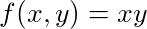

Product of two variables.
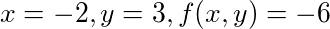

Partial derivatives of the function w.r.t the inputs.
It is simple enough to find the partial derivative with respect to either of the inputs. For example, if

Let us take sample values as inputs to the function.
The partial derivative on variable x ( ∂f/ ∂x) and variable y ( ∂f/ ∂y) are 3 and -2 respectively. This gives us an understanding that increasing the variable x by an amount ε would increase the output function by 3ε. Similarly, increasing the variable y by an amount ε would decrease the output function by 2ε. Thus, the derivative of a function on each variable tells us the sensitivity of the function with respect to that variable.

### Analogy
Drawing a parallel analogy, by computing the gradients of the loss function with respect to the weights and the inputs of the neural network, we can determine the sensitivity of the loss function with respect to these parameters. These gradients are a measure of how well the neural network is performing and how the parameters of the model are affecting the loss function. It also helps us in fine tuning the weights of the network to minimize our loss and find a model that fits our data

### How to backpropagate?
We’ll be using the following example throughout the rest of the article.

This example will be used throughout the rest of the article.
It’s a good practice to draw computation graphs and analyse the expressions, albeit easier only for simple expressions. So, let’s draw one. We also introduce intermediary variables like x and y to make our calculations simpler.
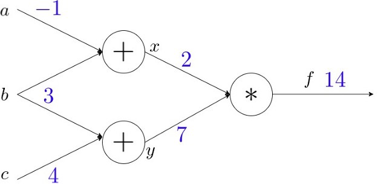

Every node in a computational graph can compute two things — the output of the node and the local gradient of the node without even being aware of the rest of the graph. Local gradients of a node are the derivatives of the output of the node with respect to each of the inputs.

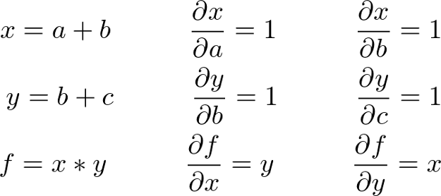
We have marked the outputs on the graph and have also calculated the local gradients of the nodes. Backpropagation is a “local” process and can be viewed as a recursive application of the chain rule. Now, we want the sensitivity of our output (loss) function w.r.t to the input variables a, b and c of the graph (i.e. ∂f/ ∂a, ∂f/ ∂b and ∂f/ ∂c). We start with the output variable and find the derivative of the output of the graph w.r.t to every variable by recursive chain rule. The derivative of the output variable w.r.t itself is one.

Backpropagating and finding the gradient of f w.r.t all the variables in the graph by the application of chain rule. Blue elements represent the outputs of the nodes whereas red element represents the gradients that were calculated during backpropagation. (Note that f = (a+b)(b+c), x= a+b and y = b+c)

Let us take one node in the graph and get a clear picture.
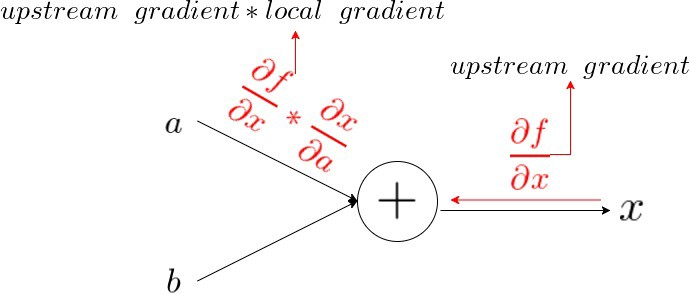

A closer look of backpropagation — considering a single node.
We computed the outputs and local gradients of every node before we started backpropagating. The graph which was unaware of the existence of other nodes when we calculated the outputs and local gradients, interacts with the other nodes and learns the derivative of its output value on the final output of the graph ( ∂f/ ∂x). Thus, we find the derivative of the output of the graph w.r.t a variable ( ∂f/ ∂a) by multiplying its local gradient ( ∂x/ ∂a) with the upstream gradient that we receive from the node’s output value. ( ∂f/ ∂x). This is the essence of backpropagation. If we look at variable b, we can use the multivariate chain rule to find the derivative of the output f w.r.t the variable b.

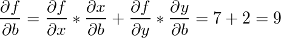
We can also interpret this multivariate chain rule by saying “gradients add at branches”. Thus, we have found the sensitivity of variables a, b and c on the output f by computing the derivatives through backpropagation.

### Why backpropagation?
Let us look at two strategies by which we can compute gradients.
#### Strategy 1: Forward differentiation
It is the usual way of finding gradients, the way that we all learnt in our high school. Let us consider the same example again. Without loss of generality, we choose variable b and find gradients upwards.

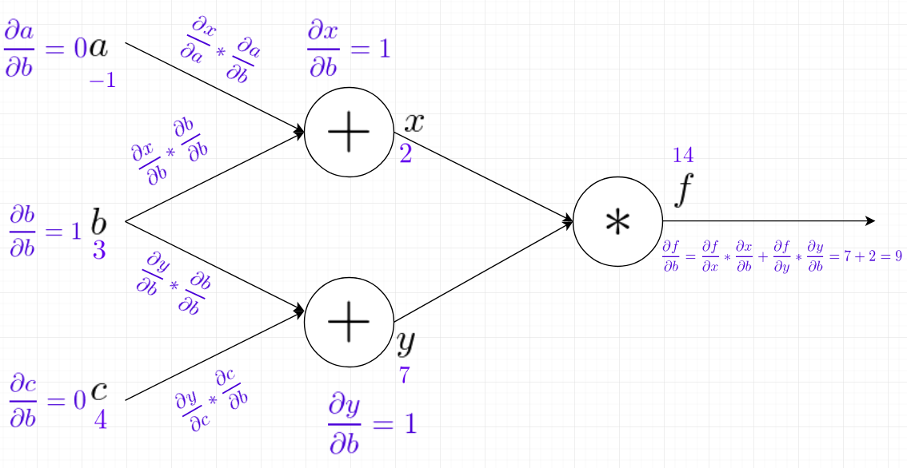
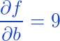

Thus, we have computed the derivative of f (our output) w.r.t. variable b (one of the inputs).
Forward differentiation determines how one of the inputs affect every node in the graph.
#### Strategy 2: Reverse Differentiation:
We already implemented reverse differentiation when we learnt how to do backpropagation. Just to have a recap, let’s look at the graph without any chain-rule steps written on the graph.
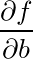

If you notice properly, by doing reverse differentiation (or backpropagation), we have computed the derivative of f (our output or loss function) with respect to every node in the graph. Yeah, you saw that right, with respect to every single node in the graph!
Forward-mode differentiation gave us the derivative of our output with respect to one of the inputs, but reverse-mode differentiation gives us all of them.
As we have only three variables as input to the graph, we can see a thrice speedup by performing backpropagation (reverse differentiation) instead of forward differentiation.
Why thrice speedup?

We found only the derivative of f w.r.t b in forward differentiation.

Whereas, we found the derivative of f w.r.t all the three input variables, by backprop in one fell swoop.
So, is that all?
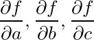

Image result for gradient descent
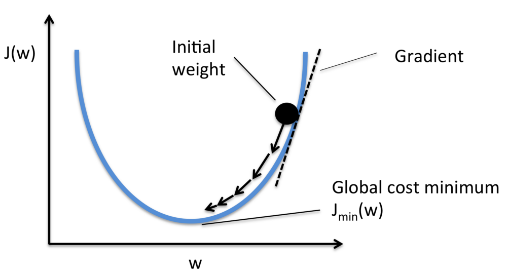

Gradient Descent. J(w) represents the loss and w represents the weight. Source: Google Images

To reiterate, loss function quantifies the quality of our weights. Having calculated the gradients of our loss function with respect to all the parameters of the neural networks, its time to update the model parameters using these gradients to make our model more fit to the data. A commonly used technique to optimize weight parameters is gradient descent. In gradient descent, we take small baby steps in the direction of the minima to get optimized weight parameters. The size of the steps that we take to reach the optimum value is determined by a parameter called learning rate. Other commonly used techniques for weight updation are AdaGrad, RMSProp and Adam optimization. Thus, by making use of the gradients computed through an efficient backprop, we are able to find the best set of weights that minimizes our loss function. We do this by backpropagating the neural network multiple times until we reach a steady loss.

