# Deep Learning

_Deep Learning has received a lot of hype in recent years due to its impressive performance on many applications, including language translation, medical diagnosis from X-rays, recognizing images to help with self-driving cars, beating the top Go players as well as beating high-ranking DotA players, learning how to play Atari games just from the pixel data… all these to name a few of Deep Learning’s recent accomplishments! In this post, we will (gently) introduce you to the inner workings behind Deep Learning at an intuitive level._

## **What is Machine Learning? And how is Machine Learning any different from “traditional algorithms”?**
### traditional Approach
If you’ve taken a class on algorithms, the standard metaphor for an algorithm is a recipe. An algorithm is a series of steps, that when performed in a specific order, produced your desired output. A “cooking algorithm” for a robot to make bread might go something like this:
Add to a large bowl 3 cups of flour, 1 tablespoon of salt and 3 tablespoons of sugar.
In a separate bowl, dissolve 1 package of yeast in warm water.
Combine the two bowls and knead for 10 minutes.
And so on… (I’m not a bread expert, so I shan’t write a recipe for bread here)
### ML Approach
In Machine Learning, we don’t specify the algorithm the way we did above. Rather, we specify the template (or the “architecture”) on what shape the cooking recipe might take:
Add to a large bowl __ cups of flour, __ tablespoon of salt and __ tablespoons of sugar.
In a separate bowl, dissolve __ package of yeast in warm water.
Combine the two bowls and knead for __ minutes.

### Lets try to understand
The blanks are numbers that are not specified in the beginning but we will have to find out. We then write an algorithm (another series of instructions) to figure out those numbers according to what is “best” (we’ll define this later), relying on the data that we have access to.
At a very high level, the task of Machine Learning is thus two-fold:
Find the best template that is best suited for the task. Deep Learning is simply a subset of the templates we get to choose from that have proven effective across many tasks.
Use the data to figure out what are the best numbers to fill up the template. This is the “Learning” part of “Machine Learning”.

To give a more concrete example, consider the task of predicting house prices based on features such as house size (in sq m), number of stories, distance to nearest school (in m) etc.
```markdown
A standard algorithm might perhaps be something like this: The house price is approximately (100 * house size) + (1000 * number of stories) — (30 * distance to nearest school. A (parametric) Machine Learning approach would look something like this:
Step 1: I’ve specified the template: The house price is __ * house size + __ * number of stories + __ * distance to nearest school.
Step 2: Looking at the data of all the houses I have listed, it seems that the best numbers to fill in the blanks is (90.3, 1006.2, -40.5) respectively.
```

### examples of such input-output pairs are:
* Input: Image (a series of pixels) from a photograph; Output: TRUE/FALSE on whether there is a car in the image or not
* Input: Image (a series of pixels) from a Chest X-Ray; Output: Probability on the likelihood the person has a chest infection
* Input: Sound Recording of a customer-service call; Output: A prediction on how the customer felt about the call with a score from 1–10
* Input: Sequence of words in English; Output: The corresponding translation in French

### Idea
Summary: Machine Learning consists of two steps: specify a template and find the best parameters for that template.


## Deep Learning 
Deep Learning is simply a subset of the architectures (or templates) that employs “neural networks” which we can specify during Step 1. “Neural networks” (more specifically, artificial neural networks) are loosely based on how our human brain works, and the basic unit of a neural network is a neuron.
At the basic level, a neuron does two things:
Receive input from other neurons and combine them together
Perform some kind of transformation to give the neuron’s output
In (1), we often take some linear combination of the inputs. In layman terms, if we had three inputs to the neuron (let’s call them x1, x2, and x3), then we would combine them like this:


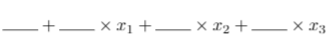

where the individual blanks are parameters to be optimized for later (i.e. learn from the data what numbers best fill in those blanks). In mathematical terms, the blanks that are attached to the inputs (x1, x2 and x3) are called weights and the blank that is not attached to any input is called the bias.
With the linear combination, we apply some function (called the activation function) to achieve our eventual output. Common examples of these functions are:
Sigmoid Function (A function which ‘squeezes’ all the initial output to be between 0 and 1)
tanh Function (A function which ‘squeezes’ all the initial output to be between -1 and 1)
ReLU Function (If the initial output is negative, then output 0. If not, do nothing to the initial output)
That’s all there is to a neuron!

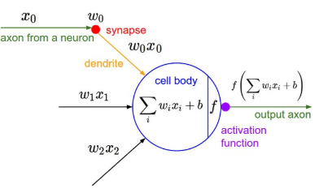

Now that we’ve described a neuron, a “neural network” is simply made out of layers of neurons, connected in a way that the input of one layer of neuron is the output of the previous layer of neurons (after activation):


Now, what’s the point of an activation function? The first step of the neuron makes sense, but is the second step really necessary? An activation function provides some non-linearity to the function, which we need to represent complex functions. See Footnote 1 for an explanation on why that is.
Let’s go through a simple example of a neural network to really solidify our understanding. Let’s say we’ve done our training (more on that later) and we’ve filled in the numbers to the template, so we’ve got a full model. Suppose we wish to predict whether someone will pass or fail their driving test. We have as input three features: age, sex, no. of lessons. We have two neurons in our intermediate layer. Let’s say that each neuron describes how well they will do in their parking and road driving respectively.

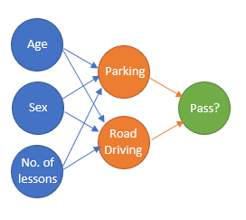
Now we’ve already filled in the best numbers, so we know the best way to describe someone’s performance on parking depending on their age, sex, and number of lessons. Let’s say the function is like this:


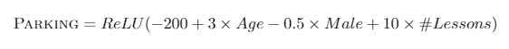

We consider two people:
Person A: A 20 year old, male, who has taken 10 lessons. The ‘parking’ neuron for him would output 0 (since ReLU converts all negative outputs to 0).
Person B: A 50 year old, female, who has taken 20 lessons. The ‘parking’ neuron for her would output 150.5 (since ReLU leaves positive outputs alone).
Similarly, for the road driving neuron, we could have a function like this:

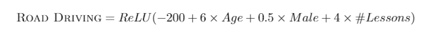
For the above two people, we have Person A having a ‘road driving score’ of 0 and Person B has a ‘road driving score’ of 179.5.
Now, these two scores contribute to the final output of whether someone passed in this formula:

A function to compute the probability of someone passing based on the output of the two intermediate neurons
At the final layer, we have calculated that Person A’s probability to pass would be Sigmoid(-3) = 4.74% and Person’s B probability to pass would be Sigmoid(2.9925) = 95.22%. Remember that sigmoid is a function to squeeze our value within 0 and 1, a function useful to get probabilities! You can find a sigmoid calculator here: 
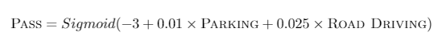
At the end of the day, though, when the numbers have been filled into this template, neural networks are just complicated functions with neurons that build on other neurons. The power of neural networks is that in practice they turn out to have the flexibility to (approximately) represent well the underlying relationships between the task’s input and output.
As a side note: While the term neural network can refer to the template (model architecture), it is often also used to refer to the full model (with the parameters filled into the template).

There is an inaccuracy in our example that I would like to highlight. In our example, we knew exactly what the intermediate neuron was doing — calculating performance in parking and road driving. In neural networks, however, we have no idea what the neuron is doing; it figured out by itself what are the best intermediate features to compute that will lead to an accurate prediction of the final output. It could be ‘parking’ and ‘road driving’, or it could be something else we don’t really understand. That’s why people say neural networks are not explainable — we have no clue what those intermediate representations mean on a human-understandable level.


From self-driving cars to facial recognition technology, our machines seem able to make sense of what they see. This is an impressive feat: after all, machines can only process images as a series of numbers. How does a machine translate this series of numbers into recognizing what object is in the image?

a new model architecture called Convolutional Neural Networks (which are also called CNNs or ConvNets). This is a new type of architecture that will exploit special properties of image data, so let’s dive in!

First, we need to talk about the properties of images before we can discuss how to exploit them in our neural network. In a computer, images are stored as a 2-dimensional array of pixels arranged spatially, each pixel corresponding to one small part of the image. In fact, the word “pixel” comes from the phrase “pi(x)cture element”, since it forms one small element within the image:


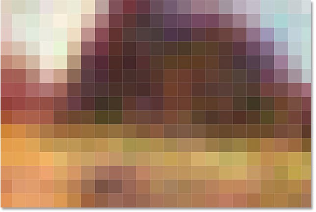
Now each pixel stores a color; and a color is represented in a computer with three numbers, corresponding to the amount of Red, Green and Blue respectively in that color as a range from 0–255 (inclusive). So really, if you consider the color channels as another dimension, an image can be represented as a 3-dimensional array (the first two dimensions store the pixels as they are presented in the image, the last dimension has three channels — Red, Green and Blue).

What does this mean for our Deep Learning algorithms? When we take an image as an input, we are really taking a 3-D array of numbers. Each number is an individual feature of our image that we pass through our neural network. Suppose our image dimensions are 256 * 256; then we feed into our neural network as input 256 * 256 * 3 = 196,608 features in total. (That’s a lot of features!) And from these 196,608 features, we need to find some complicated function that transforms it into perhaps a prediction on what object the image represents. A simple example would be — is there a cat in the picture?

Recall that having 196,908 features means that we need 196,908 + 1 = 196,909 parameters in one neuron. Remember that our output of the neuron first takes some linear combination of the input features before applying an activation function:


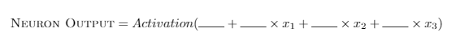
In the case of three input features (x1, x2 and x3), we have four blanks that we need to fill in the numbers to — one corresponding to each feature and one bias term (not attached to any feature). If we have 196,908 features, we are left with 196,909 blanks that we need to find the best numbers to. All of this in just one neuron! Now if we have a neural network, that’s a lot of parameters to learn!

To make things more complicated, the cat can be anywhere in the picture. The cat can be at the top right of the picture, or at the bottom left — they correspond to a very different set of 196,608 features yet they represent the same thing: a cat.

Recall from above that the nature of images is such that:
There are a lot of ‘input features’, each corresponding to the R, G and B value of each pixel, which thus requires a lot of parameters.
A cat in the top left or a cat in the bottom right of the image should give similar outputs.
At this point, perhaps we can consider the following method. Suppose we have an image we want to test:

Step 1: Split the image into four equal quadrants. Let’s take the image size to originally be 256 * 256 * 3(channels). Then, each quadrant of the image will have 128 * 128 * 3 features.
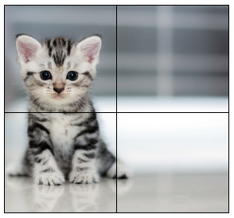

We cut our image into four equal quadrants of size 128x128 pixels. Remember that each pixel has 3 channels (R, G and B)
Step 2: Apply a neuron for the top-left quadrant to convert the 128 * 128 * 3 features into one single number. Just for intuition’s sake (although this is not entirely accurate), let’s say this neuron is in charge of recognizing a cat within the 128 * 128 * 3 features:
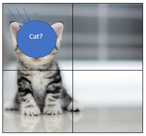

We apply the neuron which takes in the 128 * 128 * 3 features in the top-left quadrant
Step 3: Apply the exact same neuron for the top-right quadrant, the bottom-left quadrant and the bottom-right quadrant. This is called parameter sharing, since we use the exact same neuron for all four quadrants.
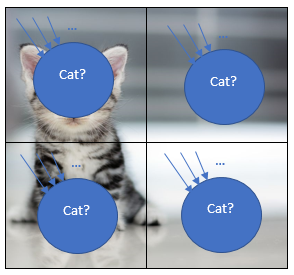


We apply the exact same neuron with the exact same parameters to all four quadrants of the image
Step 4: After applying that neuron for all four quadrants, we have four different numbers (intuitively speaking, these numbers represent whether there is a cat or not in each of the quadrants).
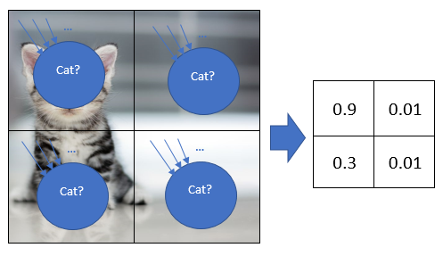


We get four different output numbers even though we apply the same neuron since the inputs are different (although the parameters are the same)
Remember that we get four different numbers because we put different input features, even though the function (and the parameters remain the same).


A formulation of the neuron output in terms of its input features x1, x2 and x3
From the above formulation, the input features (x1, x2 and x3) have changed even though the numbers filling in the blanks have not; therefore, these input features give rise to a different output.
Step 5: We want one number to tell us whether there is a cat in the entire picture. So we just take the maximum of those four numbers to get a single number.

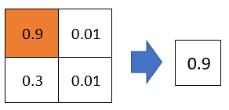
What does this algorithm do in terms of addressing our earlier concerns?
Our initial concern was that there were too many features and therefore too many parameters. Recall that even if we just have one neuron for all these features, we’d need 256 * 256 * 3 + 1 = 196,609 parameters for each neuron. If we split this into four different quadrants and use the exact same parameters for all four quadrants, we only need 128 * 128 * 3 + 1 = 49,153 parameters — a reduction by almost four times!
It doesn’t matter where the cat is in the image, all it matters is that there is a cat in the image. By using the same neuron for recognizing a cat in all four quadrants, we address this issue since the ‘cat-recognizing neuron’ should tell us which quadrant has a cat!


### Understand deeply
The first important type of layer that a CNN has is called the Convolution (Conv) layer, which corresponds to Steps 1 to 4 in the algorithm above. The Conv layer is a special type of neural network layer which uses parameter sharing and apply the same smaller set of parameters spatially across the image, just like we did with our cat-identifying neuron in Steps 1 to 4. This is unlike a standard neural network layer which will have parameters for the whole image.

A Convolution layer has these few hyper-parameters that we can specify:
Filter size. This corresponds to how many input features in the width and height dimensions one neuron takes in. In our earlier example, the filter size was 128 * 128 because each neuron looked at 128 * 128 pixels spatially (width and height). We always assume that we do not split up the image by its depth (or the channels), only the width and height. So if we specify the filter size, the number of parameters in our neuron is filter_width * filter_height * input_depth + 1. In our example, the number of parameters are 128 * 128 * 3 + 1 = 49,153.


Typically though, a reasonable filter size might be more along the order of 3 * 3 or 5 * 5.
* Stride. Sometimes a cat doesn’t appear nicely in the quadrants but might appear somewhere in the middle of two (or more) quadrants. In that case, perhaps we should apply our neuron not just exclusively in the four quadrants, but we want to apply the neuron in overlapping regions as well. Stride is simply how many pixels we want to move (towards the right/down direction) when we apply the neuron again. In our earlier example, we moved with stride 128 so we went to the next quadrant immediately without visiting any overlapping region. More commonly, we typically move with stride 1 or 2.


A Convolution layer has these few hyper-parameters that we can specify:
* Filter size. This corresponds to how many input features in the width and height dimensions one neuron takes in. In our earlier example, the filter size was 128 * 128 because each neuron looked at 128 * 128 pixels spatially (width and height). We always assume that we do not split up the image by its depth (or the channels), only the width and height. So if we specify the filter size, the number of parameters in our neuron is filter_width * filter_height * input_depth + 1. In our example, the number of parameters are 128 * 128 * 3 + 1 = 49,153. Typically though, a reasonable filter size might be more along the order of 3 * 3 or 5 * 5.
Stride. Sometimes a cat doesn’t appear nicely in the quadrants but might appear somewhere in the middle of two (or more) quadrants. In that case, perhaps we should apply our neuron not just exclusively in the four quadrants, but we want to apply the neuron in overlapping regions as well. Stride is simply how many pixels we want to move (towards the right/down direction) when we apply the neuron again. In our earlier example, we moved with stride 128 so we went to the next quadrant immediately without visiting any overlapping region. More commonly, we typically move with stride 1 or 2.


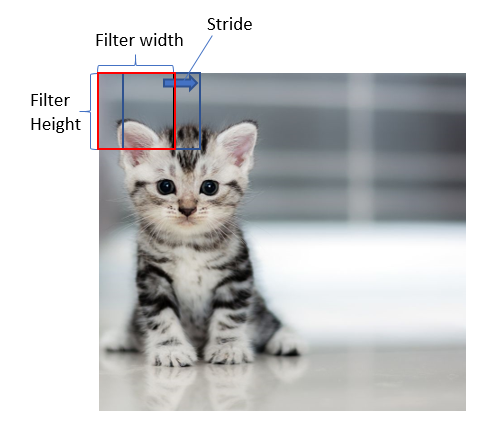

Depth. In our earlier example, we applied just one neuron to identify whether there was a cat or not and share the parameters by applying the same neuron in each quadrant. Suppose we wanted another neuron to identify whether there was a dog or not as well. This neuron would be applied in the same way as the cat-identifying neuron, but have different parameters and therefore a different output for each quadrant. How would this change our parameter and output size? Well, if we had two such neurons, we’d have (128 * 128 * 3 + 1) * 2 = 98,306 parameters. And at the end of Step 4, we’ll have 2 * 2 * 2 = 8 output numbers. The first two terms, 2 * 2, refers to the height and width (of our four quadrant areas) and the last term, 2, refers to the fact that we had two different neurons applied to each quadrant. This last term is what we call depth.
I don’t want to introduce too many concepts all at one go, so let’s give a small quiz to consolidate these concepts.
Suppose we have an image of input size 256 * 256 * 3. I apply a conv layer with filter size 3 * 3, stride 1, and depth 64.
How many parameters do we have in our conv layer?
What are the output dimensions of this conv layer?


```markdown
Number of parameters: We work out the case for depth = 1, since that’s just one neuron applied throughout. This neuron takes in 3 * 3 * 3 (filter size * input channels) features, and so the number of parameters for this one neuron are 3 * 3 * 3 + 1 = 28. We know that depth = 64, meaning there are 64 such neurons. This gives us a total of 28 * 64 = 1,792 parameters.
Output dimensions: Let’s think of it in the dimension of width first. We have a row of 256 pixels in our original input image. At the start, the center of our filter (what the neuron takes as input) will be at pixel 2, since we have a 3 * 3 filter. Thus, since the leftmost side of the filter will be at pixel 1, the center of the filter will be at pixel 2. This filter moves rightwards by 1 pixel at each time to apply the neuron(s). At the end of all our steps, the center of our filter will be at pixel 255, again because we have a 3 * 3 filter (so pixel 256 will be taken up by the rightmost side of the filter). So given that the center of our filter starts at pixel 2 and ends at 255 while moving 1 pixel each step, the math suggests that we’ve applied the neuron 254 times across the width. Similarly, we’ve applied the neuron 254 times across the height. And since we have 64 neurons doing that (depth = 64), our output dimensions are 254 * 254 * 64.
```


Padding. Recall that the center of the 3x3 filter started at pixel 2 (instead of at pixel 1) and ended at pixel 255 (instead of at pixel 256). To make the center the filter start at pixel 1, we can pad the image with a border of ‘0’s, like this:
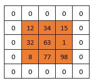

This is an example of padding a 3x3 image with a padding border of size 1. This ensures that the center of a 3x3 filter will begin at pixel 1 of the original image.
And with that, we’ve covered exactly what a convolution layer is as used in many cutting-edge systems out there! There is another layer we will introduce, and then we’ll put all the layers together in one big architecture and discuss the intuition behind that!
Summary: A layer common in CNNs in the Conv layer, which is defined by the filter size, stride, depth and padding. The Conv layer uses the same parameters and applies the same neuron(s) across different regions of the image, thereby reducing the number of parameters needed.
The next layer we will go through is called the pooling layer, which corresponds roughly to Steps 4 and 5 in the algorithm laid out at the start. If you recall, we had four numbers in our basic algorithm after applying the conv layer and we wanted it to reduce it to one number. We simply took the four input numbers and output the maximum as our output number. This is an example of max-pooling, which as its name suggests, takes the maximum of the numbers it looks at.
More generally, a pooling layer has a filter size and a stride, similar to a convolution layer. Let’s take the simple example of an input with depth 1 (i.e. it only has 1 depth slice). If we apply a max-pool with filter size 2x2 and stride 2, so there is no overlapping region, we get:

Max-pooling with filter 2 and stride 2. Note that a max-pool layer of filter 2 and stride 2 is commonly seen in many models today. Image taken from CS231N notes: http://cs231n.github.io/convolutional-networks/

This max-pool seems very similar to a conv layer, except that there are no parameters (since it just takes the maximum of the four numbers it sees within the filter). When we introduce depth, however, we see more differences between the pooling layer and the conv layer.
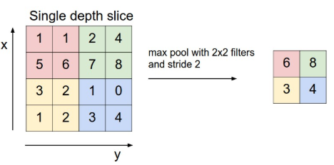

The pooling layer applies to each individual depth channel separately. That is, the max-pooling operation does not take the maximum across the different depths; it only takes the maximum in a single depth channel. This is unlike the conv layer, which combines inputs from all the depth channels. This also means that the depth size of our output layer does not and cannot change, unlike the conv layer where the output depth might be different from input depth.
The purpose of the pooling layer, ultimately, is to reduce the spatial size (width and height) of the layers and it does not touch on the depth at all. This reduces the number of parameters (and thus computation) required in future layers after this pooling layer.
To give a quick example, let’s suppose after our first conv layer (with pooling), we have an output dimension of 256 * 256 * 64. We now apply a max-pooling (with filter size 2x2 and stride 2) operation to this, what are the output dimensions after the max pooling layer?
— —
Answer: 128 * 128 * 64, since the max-pool operator reduces the dimensions on the width and height by half, while leaving the depth dimension unchanged.


The last layer that commonly appears in CNNs is one that we’ve seen before in earlier parts — and that is the Fully-Connected (FC) layer. The FC layer is the same as our standard neural network — every neuron in the next layer takes as input every neuron in the previous layer’s output. Hence, the name Fully Connected, since all neurons in the next layer are always connected to all the neurons in the previous layer


We usually use FC layers at the very end of our CNNs. So when we reach this stage, we can flatten the neurons into a one-dimensional array of features. If the output of the previous layer was 7 * 7 * 5, we can flatten them into a row of 7*7*5 = 245 features as our input layer in the above diagram. Then, we apply the hidden layers as per usual.
Summary: We also typically use our traditional Fully-Connected layers at the end of our CNNs.
Now let’s put them all together. One important benchmark that is commonly used amongst researchers in Computer Vision is this challenge called ImageNet Large Scale Visual Recognition Challenge (ILSVRC). ImageNet refers to a huge database of images, and the challenge of ILSVRC is to accurately classify an input image into 1,000 separate object categories.
One of the models that was hailed at the turning point in using deep learning is AlexNet, which won the ILSVRC in 2012. In a paper titled “The History Began from AlexNet: A Comprehensive Survey on Deep Learning Approaches”, I quote:
AlexNet achieved state-of-the-art recognition accuracy against all the traditional machine learning and computer vision approaches. It was a significant breakthrough in the field of machine learning and computer vision for visual recognition and classification tasks and is the point in history where interest in deep learning increased rapidly.


AlexNet showed that amazing improvements in accuracy can be achieved when we go deep — i.e. stack more and more layers together like we’ve seen. In fact, architectures after AlexNet decided to keep going deeper, with more than a hundred layers!
AlexNet’s architecture can be summarized somewhat as follows:

As you can see, AlexNet is simply made out of the building blocks of:
* Conv Layers (with ReLU acitvations)
* Max Pool Layers
* FC Layers
* Softmax Layers
These are layers we’ve all seen in one way or another thus far! As you can see, we’ve already covered the building blocks for powerful Deep Learning models and all we need to do is stack many of these layers together. Why does stacking so many layers together work, and what is each layer really doing?
We can visualize some of the intermediate layers. This is a visualization of the first conv layer of AlexNet:

We can see that in the first few layers, the neural network is trying to extract out some low-level features. These first few layers then combine in subsequent layers to form more and more complex features, and in the end, figure out what represents objects like cats, dogs etc.
Why did the neural network pick out those features in particular in the first layer? It just figured out that these are the best parameters to characterize the first few layers; they simply produced the minimal loss.
Summary: AlexNet was a CNN which revolutionized the field of Deep Learning, and is built from conv layers, max-pooling layers and FC layers. When many layers are put together, the earlier layers learn low-level features and combine them in later layers for more complex representations.

