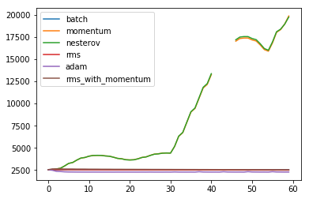

# Gradient Descent

Gradient Descent is one of the most used algorithms in Machine Learning and Deep Learning.

It is an optimization algorithm used in training a model. In simple words, Gradient Descent finds the parameters that minimize the cost function (error in prediction). Gradient Descent does this by iteratively moves toward a set of parameter values that minimize the function, taking steps in the opposite direction of the gradient

## Table of Contents 
* [Batch gradient descent](#Batch)
* [Stochastic gradient descent](#Stochastic)
* [Full gradient descent](#Full)
* [Momentum](#Momentum)
* [Nesterov Momentum](#Nesterov)
* [RMS w/o Momentum](#rms)
* [Adam Momentum](#adam)
* [RMS Momentum](#rms1)


## Basic Imports
```markdown
from __future__ import print_function, division
from builtins import range
# Note: you may need to update your version of future
# sudo pip install -U future

import numpy as np

def forward(X, W1, b1, W2, b2):
    # sigmoid
    # Z = 1 / (1 + np.exp(-( X.dot(W1) + b1 )))

    # relu
    Z = X.dot(W1) + b1
    Z[Z < 0] = 0

    A = Z.dot(W2) + b2
    expA = np.exp(A)
    Y = expA / expA.sum(axis=1, keepdims=True)
    return Y, Z

def derivative_w2(Z, T, Y):
    return Z.T.dot(Y - T)

def derivative_b2(T, Y):
    return (Y - T).sum(axis=0)

def derivative_w1(X, Z, T, Y, W2):
    # return X.T.dot( ( ( Y-T ).dot(W2.T) * ( Z*(1 - Z) ) ) ) # for sigmoid
    return X.T.dot( ( ( Y-T ).dot(W2.T) * (Z > 0) ) ) # for relu

def derivative_b1(Z, T, Y, W2):
    # return (( Y-T ).dot(W2.T) * ( Z*(1 - Z) )).sum(axis=0) # for sigmoid
    return (( Y-T ).dot(W2.T) * (Z > 0)).sum(axis=0) # for relu
    
from util import get_normalized_data, error_rate, cost, y2indicator
import matplotlib.pyplot as plt

# compare 3 scenarios:
# 1. batch SGD
# 2. batch SGD with momentum
# 3. batch SGD with Nesterov momentum

max_iter = 20 # make it 30 for sigmoid
print_period = 50

Xtrain, Xtest, Ytrain, Ytest = get_normalized_data()
lr = 0.00004
reg = 0.01

Ytrain_ind = y2indicator(Ytrain)
Ytest_ind = y2indicator(Ytest)

N, D = Xtrain.shape
batch_sz = 500
n_batches = N // batch_sz

M = 300
K = 10
W1 = np.random.randn(D, M) / np.sqrt(D)
b1 = np.zeros(M)
W2 = np.random.randn(M, K) / np.sqrt(M)
b2 = np.zeros(K)

# save initial weights
W1_0 = W1.copy()
b1_0 = b1.copy()
W2_0 = W2.copy()
b2_0 = b2.copy()
```

## Batch gradient descent <a name="Batch"></a>
```markdown
Losses_batch = []
errors_batch = []
for i in range(max_iter):
    for j in range(n_batches):
        Xbatch  = Xtrain[j*batch_sz:(j+1):batch_sz,]
        Ybatch  = Ytrain_ind[j*batch_sz:(j+1):batch_sz,]
        py_batch,Z = forward(Xbatch,W1,b1,W2,b2)
        
        # print("batch cost at iteration",i,"at batch",j,"with cost",cost(py_batch,Ybatch))
        
        W2 -= lr*(derivative_w2(Z,Ybatch,py_batch)+reg*W2)
        b2 -= lr*(derivative_b2(Ybatch,py_batch)+reg*b2)
        W1 -= lr*(derivative_w1(Xbatch,Z,Ybatch,py_batch,W2)+reg*W1)
        b1 -= lr*(derivative_b1(Z,Ybatch,py_batch,W2)+reg*b1)
        
        if j%print_period == 0:
            py,_ = forward(Xtest,W1,b1,W2,b2)
            l = cost(py,Ytest_ind)
            Losses_batch.append(l)
            print("Cost at iteration i=%d, j=%d: %.6f" % (i, j, l))
            e = error_rate(py, Ytest)
            errors_batch.append(e)
            print("Error rate:", e)

pY, _ = forward(Xtest, W1, b1, W2, b2)
print("Final error rate:", error_rate(pY, Ytest))
        
        
```

## Stochastic gradient descent <a name="Stochastic"></a>


Stochastic gradient descent (SGD) performs a parameter update for each observation. So instead of looping over each observation, it just needs one to perform the parameter update. SGD is usually faster than batch gradient descent, but its frequent updates cause a higher variance in the error rate, that can sometimes jump around instead of decreasing.

## Full gradient descent <a name="Full"></a>

## Momentum <a name="Momentum"></a>


```markdown
W1 = W1_0.copy()
b1 = b1_0.copy()
W2 = W2_0.copy()
b2 = b2_0.copy()
Losses_momentum = []
errors_momentum = []
mu =0.9
dW2 = 0
db2 = 0
dW1 = 0
db1 = 0
gW2 = 0
gb2 = 0
gW1 = 0
gb1 = 0

for i in range(max_iter):
    for j in range(n_batches):
        Xbatch  = Xtrain[j*batch_sz:(j+1):batch_sz,]
        Ybatch  = Ytrain_ind[j*batch_sz:(j+1):batch_sz,]
        py_batch,Z = forward(Xbatch,W1,b1,W2,b2)
        
        # print("batch cost at iteration",i,"at batch",j,"with cost",cost(py_batch,Ybatch))
        
        # update gradients
        gW2 += derivative_w2(Z,Ybatch,py_batch)+reg*W2
        gb2 += derivative_b2(Ybatch,py_batch)+reg*b2
        gW1 += derivative_w1(Xbatch,Z,Ybatch,py_batch,W2)+reg*W1
        gb1 += derivative_b1(Z,Ybatch,py_batch,W2)+reg*b1
        
        # update velocites
        dW2 = mu*dW2 - lr*gW2
        db2 = mu*db2 - lr*gb2
        dW1 = mu*dW1 - lr*gW1
        db1 = mu*db1 - lr*gb1
        
        # update gradients
        W2 += dW2
        b2 += db2
        W1 += dW1
        b1 += db1
        
        if j%print_period == 0:
            py,_ = forward(Xtest,W1,b1,W2,b2)
            l = cost(py,Ytest_ind)
            Losses_momentum.append(l)
            print("Cost at iteration i=%d, j=%d: %.6f" % (i, j, l))
            e = error_rate(py, Ytest)
            errors_momentum.append(e)
            print("Error rate:", e)

pY, _ = forward(Xtest, W1, b1, W2, b2)
print("Final error rate:", error_rate(pY, Ytest))
        
```

## Nesterov Momentum <a name="Nesterov"></a>


```markdown
W1 = W1_0.copy()
b1 = b1_0.copy()
W2 = W2_0.copy()
b2 = b2_0.copy()
Losses_nesterov = []
errors_nesterov = []
mu =0.9
vW2 = 0
vb2 = 0
vW1 = 0
vb1 = 0
gW2 = 0
gb2 = 0
gW1 = 0
gb1 = 0

for i in range(max_iter):
    for j in range(n_batches):
        Xbatch  = Xtrain[j*batch_sz:(j+1):batch_sz,]
        Ybatch  = Ytrain_ind[j*batch_sz:(j+1):batch_sz,]
        py_batch,Z = forward(Xbatch,W1,b1,W2,b2)
        
        # print("batch cost at iteration",i,"at batch",j,"with cost",cost(py_batch,Ybatch))
        
        # update gradients
        gW2 += derivative_w2(Z,Ybatch,py_batch)+reg*W2
        gb2 += derivative_b2(Ybatch,py_batch)+reg*b2
        gW1 += derivative_w1(Xbatch,Z,Ybatch,py_batch,W2)+reg*W1
        gb1 += derivative_b1(Z,Ybatch,py_batch,W2)+reg*b1
        
        # update velocites
        vW2 = mu*vW2 - lr*gW2
        vb2 = mu*vb2 - lr*gb2
        vW1 = mu*vW1 - lr*gW1
        vb1 = mu*vb1 - lr*gb1
        
        # update gradients
        W2 += mu*vW2 - lr*gW2
        b2 += mu*vb2 - lr*gb2
        W1 += mu*vW1 - lr*gW1
        b1 += mu*vb1 - lr*gb1
        
        if j%print_period == 0:
            py,_ = forward(Xtest,W1,b1,W2,b2)
            l = cost(py,Ytest_ind)
            Losses_nesterov.append(l)
            print("Cost at iteration i=%d, j=%d: %.6f" % (i, j, l))
            e = error_rate(py, Ytest)
            errors_nesterov.append(e)
            print("Error rate:", e)

pY, _ = forward(Xtest, W1, b1, W2, b2)
print("Final error rate:", error_rate(pY, Ytest))
        
```

## RMS <a name="rms"></a>


```markdown
W1 = W1_0.copy()
b1 = b1_0.copy()
W2 = W2_0.copy()
b2 = b2_0.copy()
Losses_rms = []
errors_rms = []
lr0 = 0.001 # if you set this too high you'll get NaN!
cache_W2 = 1
cache_b2 = 1
cache_W1 = 1
cache_b1 = 1
g2 = 0
gb2 = 0
gW1 = 0
Gb1 = 0
decay_rate = 0.999
eps = 1e-10

for i in range(max_iter):
    for j in range(n_batches):
        Xbatch  = Xtrain[j*batch_sz:(j+1):batch_sz,]
        Ybatch  = Ytrain_ind[j*batch_sz:(j+1):batch_sz,]
        py_batch,Z = forward(Xbatch,W1,b1,W2,b2)
        
        # print("batch cost at iteration",i,"at batch",j,"with cost",cost(py_batch,Ybatch))
        
        ## calculatig gradient
        gW2 = derivative_w2(Z,Ybatch,py_batch)+reg*W2
        gb2 = derivative_b2(Ybatch,py_batch)+reg*b2
        gW1 = derivative_w1(Xbatch,Z,Ybatch,py_batch,W2)+reg*W1
        gb1 = derivative_b1(Z,Ybatch,py_batch,W2)+reg*b1
        
        ## update cache
        cache_W2 = cache_W2*decay_rate +(1-decay_rate)*gW2*gW2
        cache_b2 = cache_b2*decay_rate +(1-decay_rate)*gb2*gb2
        cache_W1 = cache_W1*decay_rate +(1-decay_rate)*gW1*gW1
        cache_b1 = cache_b1*decay_rate +(1-decay_rate)*gb1*gb1
        
        db1 = mu * db1 + (1 - mu) * lr0 * gb1 / (np.sqrt(cache_b1) + eps)

        
        ## upadating gradient
        W2 -= lr0*gW2 / (np.sqrt(cache_W2+eps))
        b2 -= lr0*gb2 / (np.sqrt(cache_b2+eps))
        W1 -= lr0*gW1 / (np.sqrt(cache_W1+eps))
        b1 -= lr0*gb1 / (np.sqrt(cache_b1+eps))
        
        
        
        
        
        if j%print_period == 0:
            py,_ = forward(Xtest,W1,b1,W2,b2)
            l = cost(py,Ytest_ind)
            Losses_rms.append(l)
            print("Cost at iteration i=%d, j=%d: %.6f" % (i, j, l))
            e = error_rate(py, Ytest)
            errors_rms.append(e)
            print("Error rate:", e)

pY, _ = forward(Xtest, W1, b1, W2, b2)
print("Final error rate:", error_rate(pY, Ytest))
        
```

## Adam Optimizer <a name="adam"></a>


```markdown
W1 = W1_0.copy()
b1 = b1_0.copy()
W2 = W2_0.copy()
b2 = b2_0.copy()

# 1st moment
mW1 = 0
mb1 = 0
mW2 = 0
mb2 = 0

# 2nd moment
vW1 = 0
vb1 = 0
vW2 = 0
vb2 = 0

# hyperparams
lr0 = 0.001
beta1 = 0.9
beta2 = 0.999
eps = 1e-8

# 1. Adam
loss_adam = []
err_adam = []
t = 1


for i in range(max_iter):
    for j in range(n_batches):
        Xbatch  = Xtrain[j*batch_sz:(j+1):batch_sz,]
        Ybatch  = Ytrain_ind[j*batch_sz:(j+1):batch_sz,]
        py_batch,Z = forward(Xbatch,W1,b1,W2,b2)
        
        # print("batch cost at iteration",i,"at batch",j,"with cost",cost(py_batch,Ybatch))
        
        ## calculatig gradient
        gW2 = derivative_w2(Z,Ybatch,py_batch)+reg*W2
        gb2 = derivative_b2(Ybatch,py_batch)+reg*b2
        gW1 = derivative_w1(Xbatch,Z,Ybatch,py_batch,W2)+reg*W1
        gb1 = derivative_b1(Z,Ybatch,py_batch,W2)+reg*b1
        
        ## update mean m
        mW1 = beta1*mW1+(1-beta1)*gW1
        mb1 = beta1*mb1+(1-beta1)*gb1
        mW2 = beta1*mW2+(1-beta1)*gW2
        mb2 = beta1*mb2+(1-beta1)*gb2
        
        ## update mean v
        vW1 = beta2*vW1+(1-beta2)*gW1*gW1
        vb1 = beta2*vb1+(1-beta2)*gb1*gb1
        vW2 = beta2*vW2+(1-beta2)*gW2*gW2
        vb2 = beta2*vb2+(1-beta2)*gb2*gb2
        
        correction1 = 1-beta1 ** t
        
        correction2 = 1-beta2 ** t
        
        # mean m correction
        hat_mW1 = mW1 / correction1
        hat_mb1 = mb1 / correction1
        hat_mW2 = mW2 / correction1
        hat_mb2 = mb2 / correction1

        # velocity v correction
        hat_vW1 = vW1 / correction2
        hat_vb1 = vb1 / correction2
        hat_vW2 = vW2 / correction2
        hat_vb2 = vb2 / correction2
        
        W2 -= lr0 * hat_mW2 /np.sqrt(hat_vW2+eps) 
        b2 -= lr0 * hat_mb2 /np.sqrt(hat_vb2+eps)
        W1 -= lr0 * hat_mW1 /np.sqrt(hat_vW1+eps)
        b1 -= lr0 * hat_mb1 /np.sqrt(hat_vb1+eps)
        
        t += 1
        
    
        if j%print_period == 0:
            py,_ = forward(Xtest,W1,b1,W2,b2)
            l = cost(py,Ytest_ind)
            loss_adam.append(l)
            print("Cost at iteration i=%d, j=%d: %.6f" % (i, j, l))
            e = error_rate(py, Ytest)
            err_adam.append(e)
            print("Error rate:", e)

pY, _ = forward(Xtest, W1, b1, W2, b2)
print("Final error rate:", error_rate(pY, Ytest))
```

## RMS With Momnetum <a name="rms1"></a>


```markdown
W1 = W1_0.copy()
b1 = b1_0.copy()
W2 = W2_0.copy()
b2 = b2_0.copy()
Losses_rms_with_momentum = []
errors_rms_with_momentum = []
lr0 = 0.001 # if you set this too high you'll get NaN!
cache_W2 = 1
cache_b2 = 1
cache_W1 = 1
cache_b1 = 1
g2 = 0
gb2 = 0
gW1 = 0
gb1 = 0
decay_rate = 0.999
eps = 1e-10

for i in range(max_iter):
    for j in range(n_batches):
        Xbatch  = Xtrain[j*batch_sz:(j+1):batch_sz,]
        Ybatch  = Ytrain_ind[j*batch_sz:(j+1):batch_sz,]
        py_batch,Z = forward(Xbatch,W1,b1,W2,b2)
        
        # print("batch cost at iteration",i,"at batch",j,"with cost",cost(py_batch,Ybatch))
        
        ## calculatig gradient
        gW2 = derivative_w2(Z,Ybatch,py_batch)+reg*W2
        gb2 = derivative_b2(Ybatch,py_batch)+reg*b2
        gW1 = derivative_w1(Xbatch,Z,Ybatch,py_batch,W2)+reg*W1
        gb1 = derivative_b1(Z,Ybatch,py_batch,W2)+reg*b1
        
        ## update cache
        cache_W2 = cache_W2*decay_rate +(1-decay_rate)*gW2*gW2
        cache_b2 = cache_b2*decay_rate +(1-decay_rate)*gb2*gb2
        cache_W1 = cache_W1*decay_rate +(1-decay_rate)*gW1*gW1
        cache_b1 = cache_b1*decay_rate +(1-decay_rate)*gb1*gb1
        
        
        ## upadating gradient
        dW2 = mu * dW2 + (1 - mu) *lr0*gW2 / (np.sqrt(cache_W2+eps))
        db2 = mu * db2 + (1 - mu) *lr0*gb2 / (np.sqrt(cache_b2+eps))
        dW1 = mu * dW1 + (1 - mu) *lr0*gW1 / (np.sqrt(cache_W1+eps))
        db1 = mu * db1 + (1 - mu) *lr0*gb1 / (np.sqrt(cache_b1+eps))
        
        W2 -= dW2
        b2 -= db2
        W1 -= dW1
        b1 -= db1
        
        
        
        
        if j%print_period == 0:
            py,_ = forward(Xtest,W1,b1,W2,b2)
            l = cost(py,Ytest_ind)
            Losses_rms_with_momentum.append(l)
            print("Cost at iteration i=%d, j=%d: %.6f" % (i, j, l))
            e = error_rate(py, Ytest)
            errors_rms_with_momentum.append(e)
            print("Error rate:", e)

pY, _ = forward(Xtest, W1, b1, W2, b2)
print("Final error rate:", error_rate(pY, Ytest))
        
```


### Plot the learnings
```markdown
plt.plot(Losses_batch, label="batch")
plt.plot(Losses_momentum, label="momentum")
plt.plot(Losses_nesterov, label="nesterov")
plt.plot(Losses_rms, label="rms")
plt.plot(loss_adam, label="adam")
plt.plot(Losses_rms_with_momentum, label="rms_with_momentum")
plt.legend()
plt.show()
```


