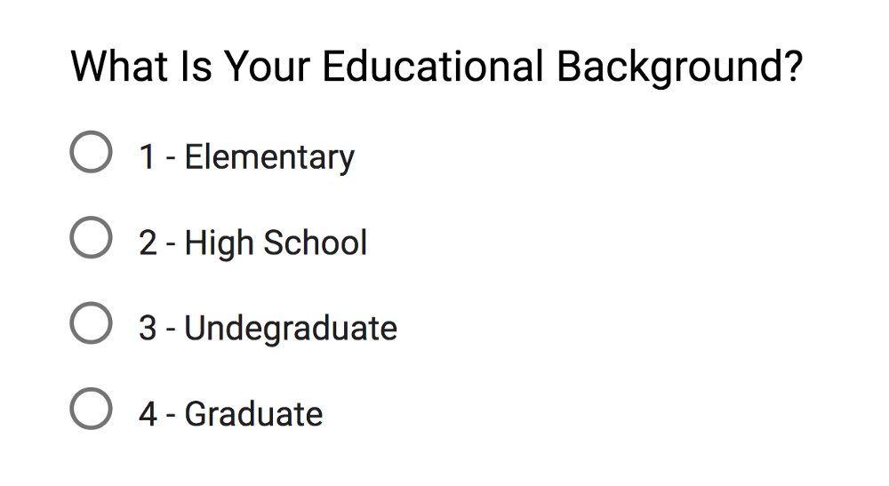
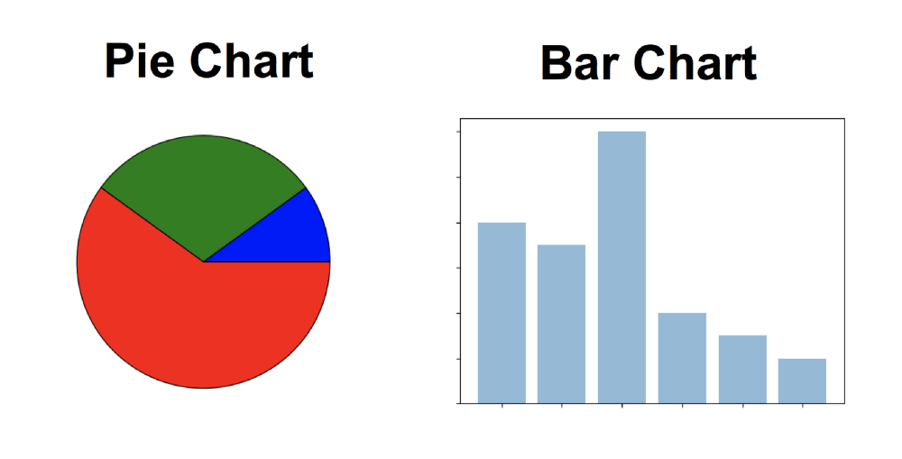
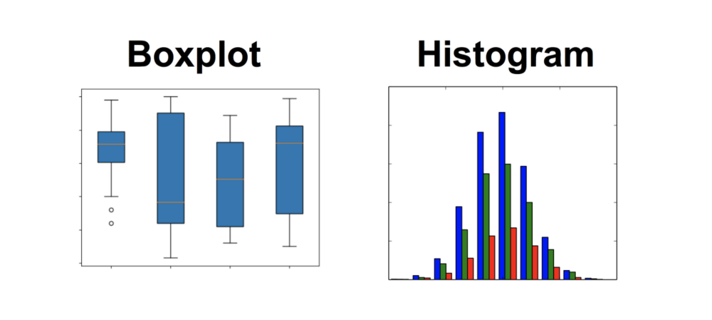

# Data Type
*Data Types are an important concept of statistics, which needs to be understood, to correctly apply statistical measurements to your data and therefore to correctly conclude certain assumptions about it. This blog post will introduce you to the different data types you need to know, to do proper exploratory data analysis (EDA), which is one of the most underestimated parts of a machine learning project*

## Introduction to Data Types
Having a good understanding of the different data types, also called measurement scales, is a crucial prerequisite for doing Exploratory Data Analysis (EDA), since you can use certain statistical measurements only for specific data types.

You also need to know which data type you are dealing with to choose the right visualization method. Think of data types as a way to categorize different types of variables. We will discuss the main types of variables and look at an example for each. We will sometimes refer to them as measurement scales.

### Categorical Data
Categorical data represents characteristics. Therefore it can represent things like a person’s gender, language etc. Categorical data can also take on numerical values (Example: 1 for female and 0 for male). Note that those numbers don’t have mathematical meaning.

#### Nominal Data
Nominal values represent discrete units and are used to label variables, that have no quantitative value. Just think of them as „labels“. Note that nominal data that has no order. Therefore if you would change the order of its values, the meaning would not change. You can see two examples of nominal features below:

The left feature that describes a persons gender would be called „dichotomous“, which is a type of nominal scales that contains only two categories.

#### Ordinal Data
Ordinal values represent discrete and ordered units. It is therefore nearly the same as nominal data, except that it’s ordering matters. You can see an example below:

Note that the difference between Elementary and High School is different than the difference between High School and College. This is the main limitation of ordinal data, the differences between the values is not really known. Because of that, ordinal scales are usually used to measure non-numeric features like happiness, customer satisfaction and so on.

### Numerical Data
#### Discrete Data
We speak of discrete data if its values are distinct and separate. In other words: We speak of discrete data if the data can only take on certain values. This type of data can’t be measured but it can be counted. It basically represents information that can be categorized into a classification. An example is the number of heads in 100 coin flips.

You can check by asking the following two questions whether you are dealing with discrete data or not: Can you count it and can it be divided up into smaller and smaller parts?

#### Continuous Data
Continuous Data represents measurements and therefore their values can’t be counted but they can be measured. An example would be the height of a person, which you can describe by using intervals on the real number line.

##### Interval Data

Interval values represent ordered units that have the same difference. Therefore we speak of interval data when we have a variable that contains numeric values that are ordered and where we know the exact differences between the values. An example would be a feature that contains temperature of a given place like you can see below:

The problem with interval values data is that they don’t have a „true zero“. That means in regards to our example, that there is no such thing as no temperature. With interval data, we can add and subtract, but we cannot multiply, divide or calculate ratios. Because there is no true zero, a lot of descriptive and inferential statistics can’t be applied.

##### Ratio Data
Ratio values are also ordered units that have the same difference. Ratio values are the same as interval values, with the difference that they do have an absolute zero. Good examples are height, weight, length etc.

### Why Data Types are important?
Datatypes are an important concept because statistical methods can only be used with certain data types. You have to analyze continuous data differently than categorical data otherwise it would result in a wrong analysis. Therefore knowing the types of data you are dealing with, enables you to choose the correct method of analysis.

### How to choose graph and test on type of data
#### Nominal Data
When you are dealing with nominal data, you collect information through:

Frequencies: The Frequency is the rate at which something occurs over a period of time or within a dataset.

Proportion: You can easily calculate the proportion by dividing the frequency by the total number of events. (e.g how often something happened divided by how often it could happen)

Percentage.

Visualization Methods: To visualize nominal data you can use a pie chart or a bar chart.

In Data Science, you can use one hot encoding, to transform nominal data into a numeric feature.

#### Ordinal Data
When you are dealing with ordinal data, you can use the same methods like with nominal data, but you also have access to some additional tools. Therefore you can summarize your ordinal data with frequencies, proportions, percentages. And you can visualize it with pie and bar charts. Additionally, you can use percentiles, median, mode and the interquartile range to summarize your data.

In Data Science, you can use one label encoding, to transform ordinal data into a numeric feature.

#### Continuous Data
When you are dealing with continuous data, you can use the most methods to describe your data. You can summarize your data using percentiles, median, interquartile range, mean, mode, standard deviation, and range.

Visualization Methods:

To visualize continuous data, you can use a histogram or a box-plot. With a histogram, you can check the central tendency, variability, modality, and kurtosis of a distribution. Note that a histogram can’t show you if you have any outliers. This is why we also use box-plots.

