# Graph
## load a library of particular r version
library("psych", lib.loc="~/R/win-library/3.2")

## chck features under consideration
names(emp)
 [1] "id"       "gender"   "bdate"    "educ"     "jobcat"   "salary"   "salbegin" "jobtime"  "prevexp"  "minority"
## select 100 observation and some continous features
salval<- emp[1:100,c("educ","salary","salbegin")]
head(salval)
```markdown
  educ salary salbegin
1   15  57000    27000
2   16  40200    18750
3   12  21450    12000
4    8  21900    13200
5   15  45000    21000
6   15  32100    13500
```
dim(salval)
```markdown
[1] 100   3
```markdown
## select continous features
selcat<-emp [ ,c("jobcat","gender")]
selval<- emp[1:100,c("educ","salary","salbegin")]
head(selval)
```markdown
  educ salary salbegin
1   15  57000    27000
2   16  40200    18750
3   12  21450    12000
4    8  21900    13200
5   15  45000    21000
6   15  32100    13500
```
dim(selval)
```markdown
[1] 100   3
```
## check stat parameter for data under consideration
describe(selval)
```markdown
vars   n     mean       sd median  trimmed      mad   min    max  range  skew kurtosis      se
educ        1 100    13.83     2.93     15    13.96     4.45     8     19     11 -0.38    -0.36    0.29
salary      2 100 38444.00 21270.85  30825 34176.88 10118.74 16200 135000 118800  2.09     4.79 2127.08
salbegin    3 100 17133.40  9211.90  14250 15554.75  4003.02  9000  79980  70980  3.75    20.30  921.19
```
table(selcat)
```markdown
           gender
jobcat      Female Male
  Clerical     206  157
  Custodial      0   27
  Manager       10   74
```
## calculate a standard aggregation like mean with diffrent cateogarical features  
with(emp,tapply(salary,gender,mean))
```markdown
 Female     Male 
26031.92 41441.78 
```
## calculating aggregation on multi dimensional features
with(emp,tapply(salary,selcat,mean)) // double dimensions- dimension eqaul to CAT variable
Error: unexpected '/' in "with(emp,tapply(salary,selcat,mean)) //"
with(emp,tapply(salary,selcat,mean)) ##// double dimensions- dimension eqaul to CAT variable
```markdown
           gender
jobcat        Female     Male
  Clerical  25003.69 31558.15
  Custodial       NA 30938.89
  Manager   47213.50 66243.24
  ```
selcat<-emp [ ,c("jobcat","gender","minority")]
with(emp,tapply(salary,selcat,mean)) ##// double dimensions- dimension eqaul to CAT variable
```markdown
, , minority = No

           gender
jobcat        Female     Male
  Clerical  25471.45 32671.64
  Custodial       NA 31178.57
  Manager   47213.50 65683.57

, , minority = Yes

           gender
jobcat       Female     Male
  Clerical  23062.5 28952.13
  Custodial      NA 30680.77
  Manager        NA 76037.50
```
### check type of data type being stored 
res1<-with(emp,tapply(salary,selcat,mean))
class(res1)
```markdown
[1] "array"
```markdown
### convert to datt frame resut  cross product of columns
res1df<-as.data.frame(res1)  ## array conevrting to dataframe.. But totally 3 dimension (3 CAT) - but data frame is 2 dimension- dimensional CAT..
##so Minority and Gender clubbing (as one)  and Jobcat - Totally 2 Dimensions. 
res1df
```markdown
          Female.No  Male.No Female.Yes Male.Yes
Clerical   25471.45 32671.64    23062.5 28952.13
Custodial        NA 31178.57         NA 30680.77
Manager    47213.50 65683.57         NA 76037.50
```
res2<-with(emp,tapply(salary,list(jobcat,gender),mean))
res2
```markdown
            Female     Male
Clerical  25003.69 31558.15
Custodial       NA 30938.89
Manager   47213.50 66243.24
```
res2<-with(emp,tapply(salary,list(jobcat,gender,minority),mean))    ##//here we are splitted selcat -> list variables
res2
```markdown
, , No

            Female     Male
Clerical  25471.45 32671.64
Custodial       NA 31178.57
Manager   47213.50 65683.57

, , Yes

           Female     Male
Clerical  23062.5 28952.13
Custodial      NA 30680.77
Manager        NA 76037.50
```
res2<-with(emp,tapply(salary,list(jobcat,gender),mean))
class(res2)
```markdown
[1] "matrix"
```
res2<-with(emp,tapply(salary,list(jobcat,gender,minority),mean))    ##//here we are splitted selcat -> list variables
class(res2)
```markdown
[1] "array"
```
cor(emp$salary,emp$educ)
```markdown
[1] 0.6605589
```
cor(emp$salary,emp$educ)*100  ##// the relation between salary and education is 66%
```markdown
[1] 66.05589
```
slice<-emp$gender
head(slice)
```markdown
[1] Male   Male   Female Female Male   Male  
Levels: Female Male
```
## plots graphs on cateograical and continous features
pie(slice)
Error in pie(slice) : 'x' values must be positive.
pie(emp$educ)

slice<-table(slice)
pie(slice)
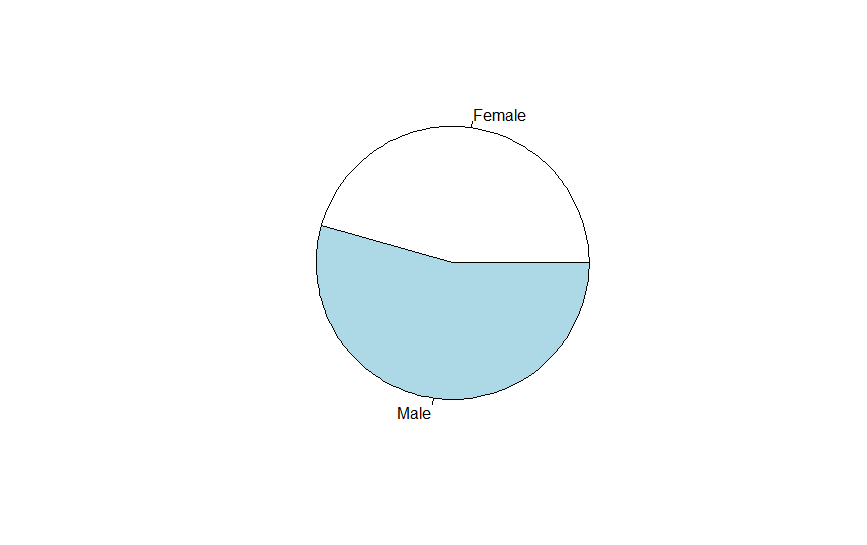
pie(table(emp$jobcat))
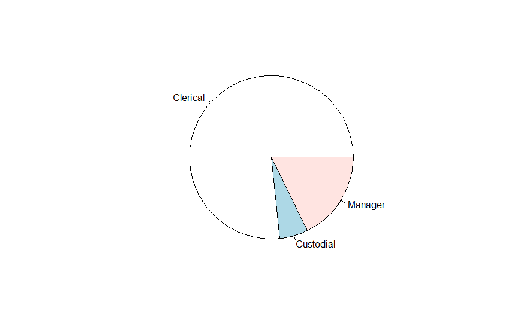
pie3D(slice,labels = c("male","female"))
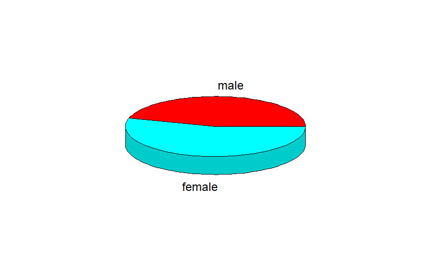
hist(emp$salary)  ## Histogram is used for Single CONT Variable.
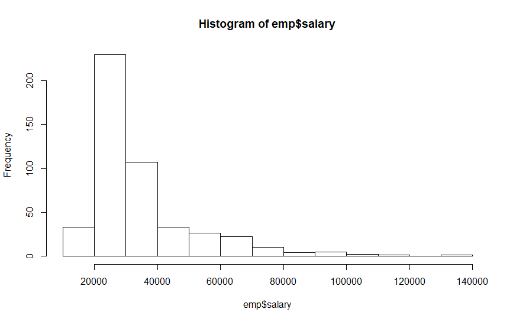
hist(emp$salary,breaks=5,col="green",xlab="Salary",Main="Salary Distribution")
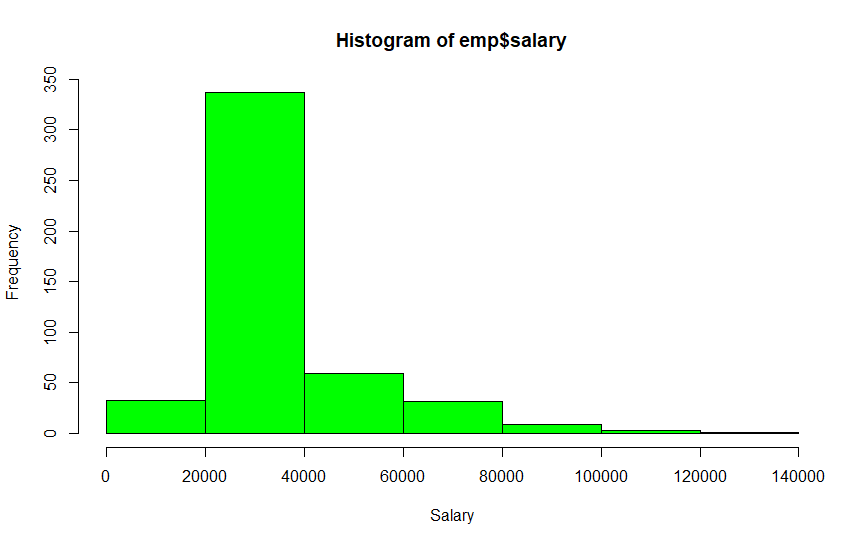

hist(emp$salary,breaks=3,col="green",xlab="Salary",main = "Salary Distribution")
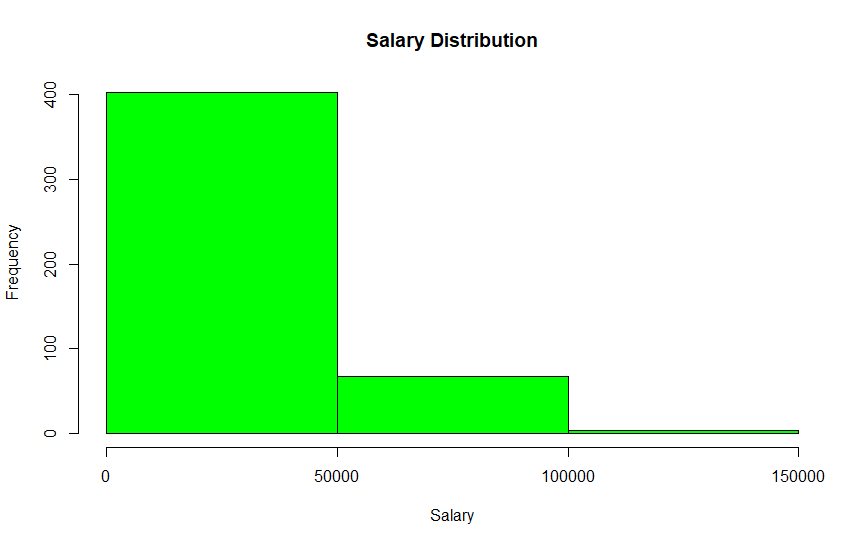

CONT & CONT
attach(emp)
plot(educ,salary)
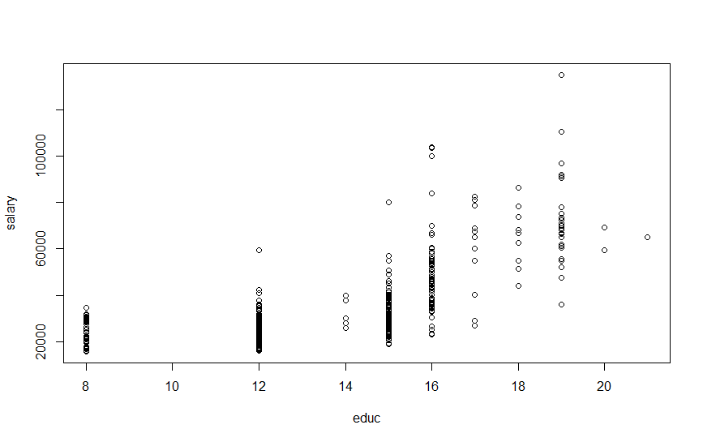


CONT BY CAT

boxplot(salary~jobcat,data=emp)  ##Salary is CONT and Jobcat is CAT
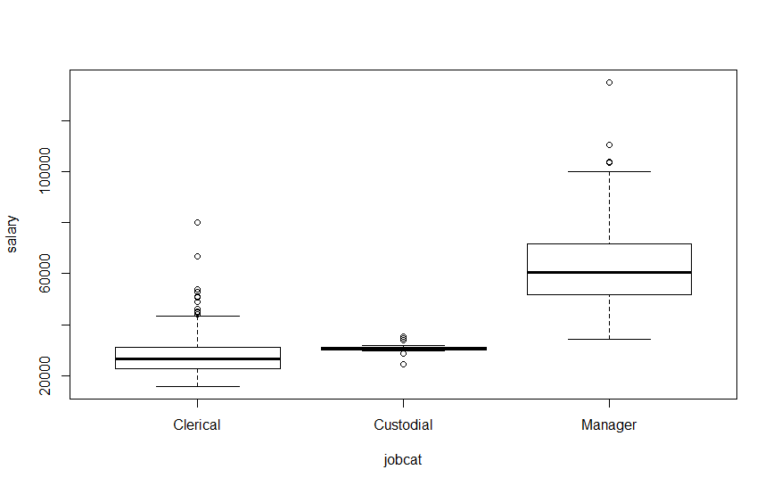

boxplot(salary~gender,data=emp)
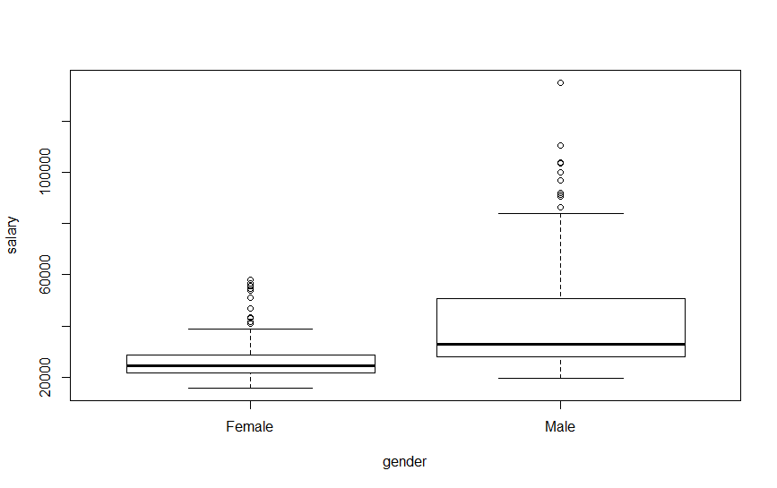


count<-table(gender,salary)
barplot(count,col=c('darkblue','red'),legend=rownames(count))
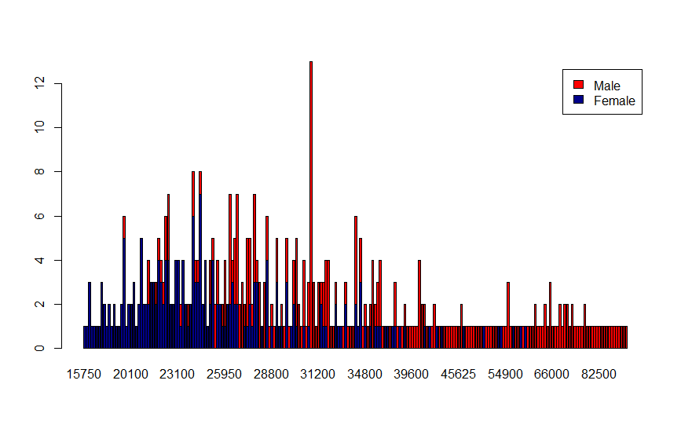

library(ggplot2)
ggplot(emp,aes(x=jobcat))+geom_bar()
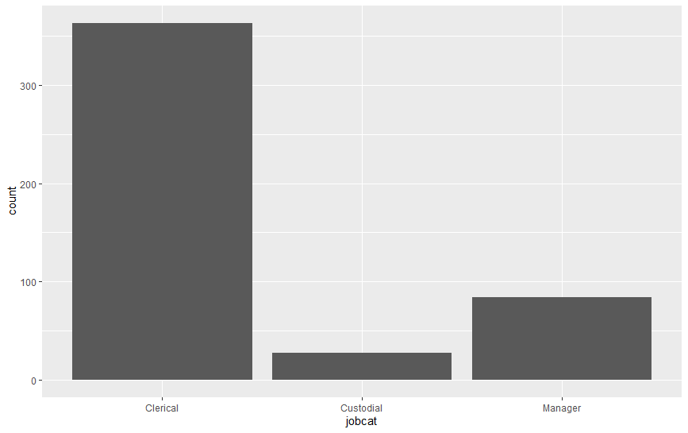
ggplot(emp,aes(x=jobcat,fill=gender))+geom_bar()
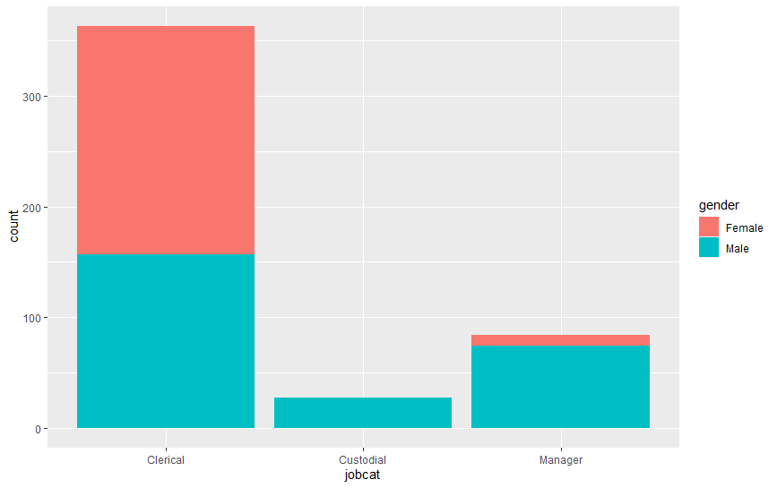
ggplot(emp,aes(x=educ,fill=gender))+geom_bar(position='dodge')
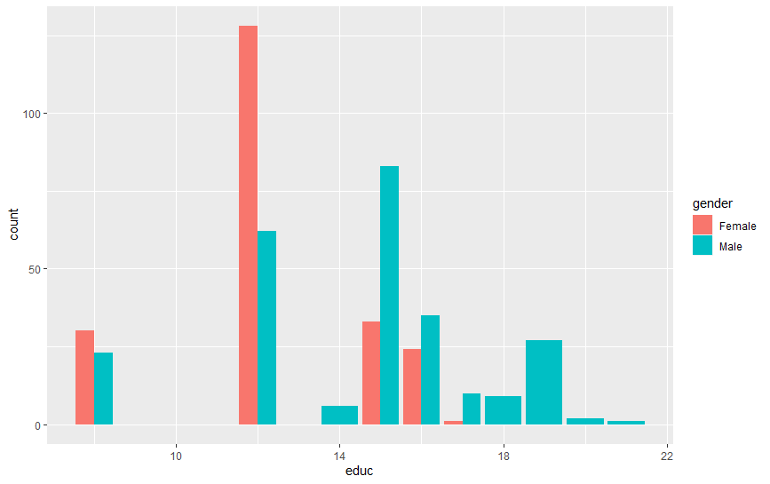

Scatterplot
ggplot(emp,aes(x=educ,y=salary))+geom_point()
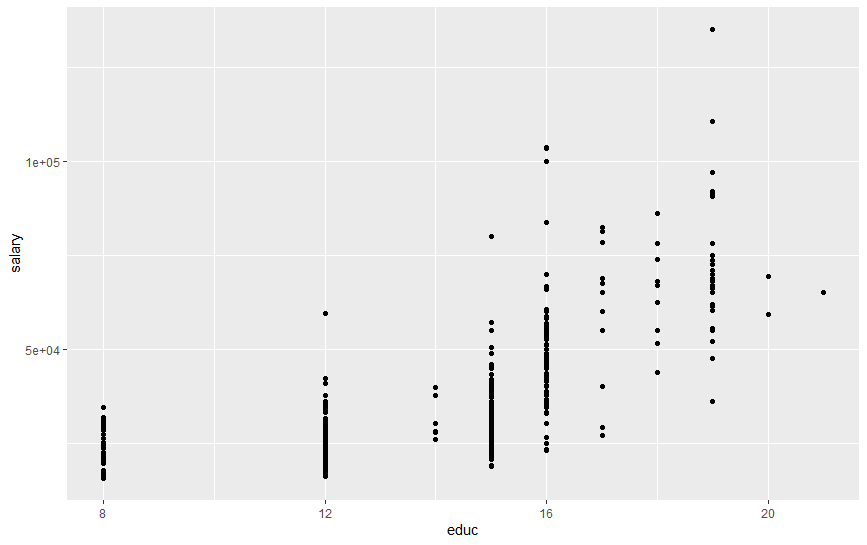

library(lattice)
xyplot(salary~salbegin|factor(jobcat),data=emp)
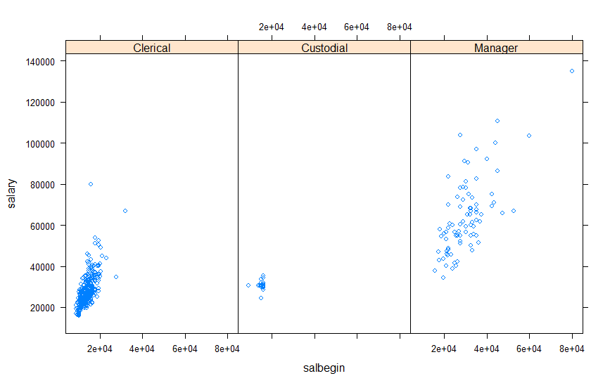

barchart(jobcat~salary,data=emp)
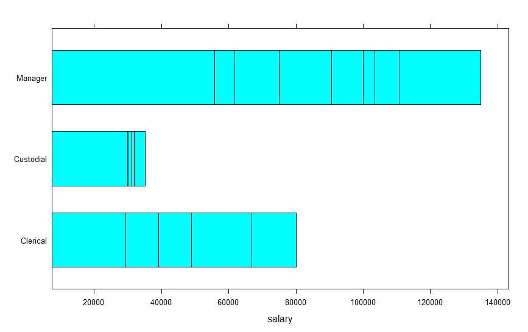

bwplot(minority~salary|factor(jobcat),data=emp)
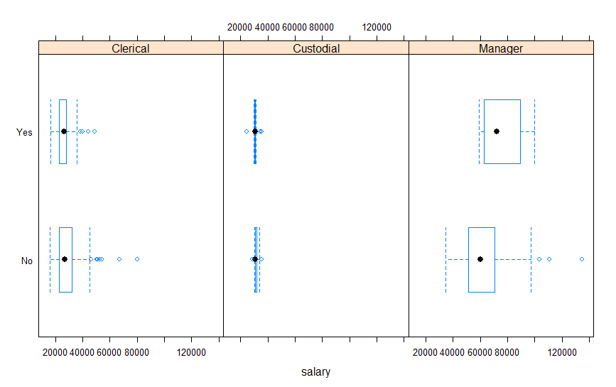

densityplot(salary~educ,data=emp)
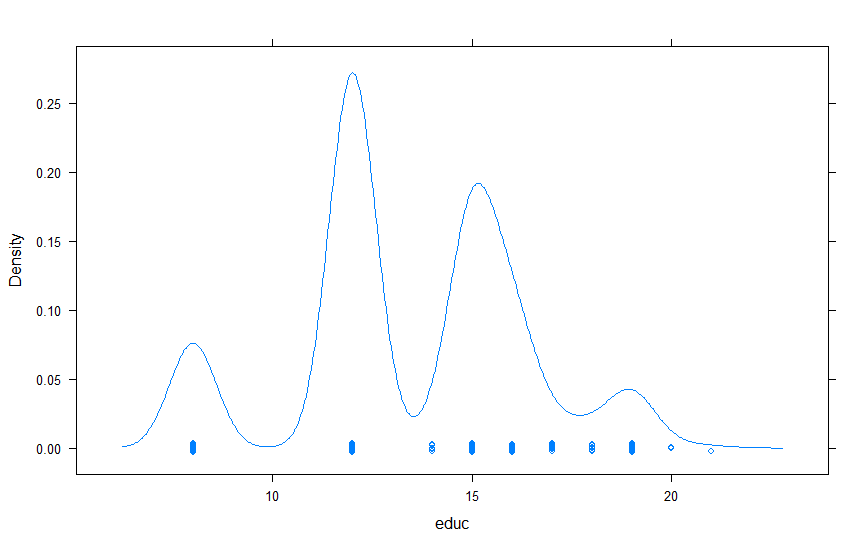
