# statistics


## Why study statistics?

1.	Data are everywhere
2.	Statistical techniques are used to make many decisions that affect our lives
3.	No matter what your career,  you will make professional decisions that involve data. An understanding of statistical methods will help you make these decisions efectively


## Applications of statistical concepts in the business world

*	Finance – correlation and regression, index numbers, time series analysis
*	Marketing – hypothesis testing, chi-square tests, nonparametric statistics
*	Personel – hypothesis testing, chi-square tests, nonparametric tests
*	Operating  management – hypothesis testing, estimation, analysis of variance, time series analysis


## statistics
*	The science of collectiong, organizing, presenting, analyzing, and interpreting data to assist in making more effective decisions
*	Statistical analysis – used to manipulate  summarize, and investigate data, so that useful decision-making information results.

### types
#### Descriptive statistics
Methods of organizing, summarizing, and presenting data in an informative way
#### Inferential statistics  
The methods used to determine something about a population on the basis of a sample
*	Population –The entire set of individuals or objects of interest or the measurements obtained from all individuals or objects of interest
*	Sample – A portion, or part, of the population of interest


A sample should have the same characteristics as the population it is representing.
Sampling can be:

*	with replacement: a member of the population may be chosen more than once (picking the candy from the bowl)
*	without replacement: a member of the population may be chosen only once (lottery ticket)


Sampling methods:
Sampling methods can be:

*	random (each member of the population has an equal chance of being selected)
*	nonrandom

The actual process of sampling causes sampling errors. For example, the sample may not be large enough or representative of the population. Factors not related to the sampling process cause non                              sampling errors.
Descriptive Statistics
*	Collect data
*	e.g., Survey
*	Present data
*	e.g., Tables and graphs
*	Summarize data
e.g., Sample mean

## What is Data?
Data is a collection of facts, such as numbers, words, measurements, observations or even just descriptions of things.
Data can be qualitative or quantitative.
*	Qualitative data is descriptive information (it describes something)
*	Quantitative data, is numerical information (numbers).


And Quantitative data can also be Discrete or Continuous:
•	Discrete data can only take certain values (like whole numbers)
•	Continuous data can take any value (within a range)
Put simply: Discrete data is counted, Continuous data is measured

### what data do


Census or Sample
* A Census is when we collect data for every member of the group (the whole "population").
* A Sample is when we collect data just for selected members of the group.
* A census is accurate, but hard to do. A sample is not as accurate, but may be good enough, and is a lot easier.
We collect data by doing a Survey.

Here are four steps to a successful survey:
*	Step one: create the questions
*	Step two: ask the questions
*	Step three: tally the results
*	Step four: present the results
You can also summarise the results using statistics, such as Mean, Median, Mode, Standard Deviation and Quartiles


### Accuracy
Accuracy is how close a measured value is to the actual (true) value

### Precision
Precision is how close the measured values are to each other.

#### Examples of Precision and Accuracy:


So, if you are playing soccer and you always hit the left goal post instead of scoring, then you are not accurate, but you are precise!

#### Note -- to remember
*	aCcurate is Correct (a bullseye).
*	pRecise is Repeating (hitting the same spot, but maybe not the correct spot)

### Bias (don't let precision fool you!)
When we measure something several times and all values are close, they may all be wrong if there is a "Bias"
Bias is a systematic (built-in) error which makes all measurements wrong by a certain amount

#### Examples of Bias
*	The scales read "1 kg" when there is nothing on them
*	You always measure your height wearing shoes with thick soles.
*	A stopwatch that takes half a second to stop when clicked
In each case all measurements are wrong by the same amount. That is bias.

#### 2 Numbers
```markdown
With just 2 numbers the answer is easy: go half-way between.
Example: what is the central value for 3 and 7?
Answer: Half-way between, which is 5.
 
You can calculate it by adding 3 and 7 and then dividing the result by 2:
(3+7) / 2 = 10/2 = 5
```


#### 3 or More Numbers
```markdown
You can use the same idea when you have 3 or more numbers:
Example: what is the central value of 3, 7 and 8?
Answer: You calculate it by adding 3, 7 and 8 and then dividing the results by 3 (because there are 3 numbers):
(3+7+8) / 3 = 18/3 = 6
```


#### mean
The mean is the average of the numbers.
Mean: Add up the numbers and divide by how many numbers.
But sometimes the Mean can let you down:
##### Example: Birthday Activities
Uncle Bob wants to know the average age at the party, to choose an activity.
There will be 6 kids aged 13, and also 5 babies aged 1.
Add up all the ages, and divide by 11 (because there are 11 numbers):
(13+13+13+13+13+13+1+1+1+1+1) / 11 = 7.5...


 	The mean age is about 7½, so he gets a Jumping Castle!
The 13 year olds are embarrassed, 
and the 1 year olds can't jump!
The Mean was accurate, but in this case it was not useful.

#### Median Value
The Median is the "middle" of a sorted list of numbers.
Example: Birthday Activities (continued)
List the ages in order:
1, 1, 1, 1, 1, 13, 13, 13, 13, 13, 13
Choose the middle number:
1, 1, 1, 1, 1, 13, 13, 13, 13, 13, 13
The Median age is 13 ... so let's have a Disco!
Sometimes there are two middle numbers. Just average them:
##### Example: What is the Median of 3, 4, 7, 9, 12, 15
There are two numbers in the middle:
3, 4, 7, 9, 12, 15
So we average them:
(7+9) / 2 = 16/2 = 8
The Median is 8

#### Mode
##### Finding the Mode
To find the mode, or modal value, first put the numbers in order, then count how many of each number. A number that appears most often is the mode.
Example: Birthday Activities (continued)
Group the numbers so we can count them:
1, 1, 1, 1, 1, 13, 13, 13, 13, 13, 13
"13" occurs 6 times, "1" occurs only 5 times, so the mode is 13.
How to remember? Think "mode is most"
But Mode can be tricky, there can sometimes be more than one Mode.
##### Example: What is the Mode of 3, 4, 4, 5, 6, 6, 7
Well ... 4 occurs twice but 6 also occurs twice.
So both 4 and 6 are modes.
When there are two modes it is called "bimodal", when there are three or more modes we call it "multimodal".

#### Outliers
Outlier share values that "lie outside" the other values.
 

They can change the mean a lot, so we can either not use them (and say so) or use the median or mode instead.
##### Example: 3, 4, 4, 5 and 104
Mean: Add them up, and divide by 5 (as there are 5 numbers):
(3+4+4+5+104) / 5 = 24
24 does not represent those numbers well at all!
Without the 104 the mean is:
(3+4+4+5) / 4 = 4
But please tell people you are not including the outlier.

#### Examples
Median: They are in order, so just choose the middle number, which is 4:
3, 4, 4, 5, 104
Mode: 4 occurs most often, so the Mode is 4
3, 4, 4, 5, 104
The Mean from a Frequency Table
It is easy to calculate the Mean:
Add up all the numbers, 
then divide by how many numbers there are.
Example 1: What is the Mean of these numbers?
6, 11, 7
•	Add the numbers: 6 + 11 + 7 = 24
•	Divide by how many numbers (there are 3 numbers): 24 ÷ 3 = 8
The Mean is 8

But sometimes we don't have a simple list of numbers, it might be a frequency table like this (the "frequency" says how often they occur):
Score	Frequency
1	2
2	5
3	4
4	2
5	1
(it says that score 1 occurred 2 times, score 2 occurred 5 times, etc)
We could list all the numbers like this:
Mean = 1+1 + 2+2+2+2+2 + 3+3+3+3 + 4+4 + 5(how many numbers)
But rather than do lots of adds (like 3+3+3+3) it is easier to use multiplication:
Mean = 2×1 + 5×2 + 4×3 + 2×4 + 1×5(how many numbers)
And rather than count how many numbers there are, we can add up the frequencies:
Mean = 2×1 + 5×2 + 4×3 + 2×4 + 1×52 + 5 + 4 + 2 + 1
And now we calculate:
Mean = 2 + 10 + 12 + 8 + 514  
=  3714  =  2.64...
And that is how to calculate the mean from a frequency table!
Here is another example:
Example: Parking Spaces per House in Hampton Street
Isabella went up and down the street to find out how many parking spaces each house has. Here are her results:

Parking
Spaces	Frequency
1	15
2	27
3	8
4	5
<pre>
What is the mean number of Parking Spaces?
Answer:
Mean =	15×1 + 27×2 + 8×3 + 5×4
       ------------------------
          15+27+8+5

=	15 + 54 + 24 + 20
  -----------------  
         55
=	2.05...
</pre>
The Mean is 2.05 (to 2 decimal places)
(much easier than adding all numbers separately!)
Notation 

Now you know how to do it, let's do that last example again, but using formulas.
 	This symbol (called Sigma) means "sum up"
(read more at Sigma Notation)


So we can say "add up all frequencies" this way:


(where f is frequency)
 

So now we are ready to do our example above, but with correct notation.
Example: Calculate the Mean of this Frequency Table
x	F
1	15
2	27
3	8
4	5
And here it is:
 
There you go! You can use sigma notation.
Calculate in the Table
It is often better to do the calculations in the table.
Example: (continued)
From the previous example, calculate f  × x in the right-hand column and then do totals:
x	f	fx
1	15	15
2	27	54
3	8	24
4	5	20
TOTALS:	55	113


And the Mean is then easy:
Mean = 113 / 55 = 2.05...

### Mean Deviation
The mean of the distances of each value from their mean.
Yes, we use "mean" twice: Find the mean ... use it to work out distances ... then find the mean of those distances!
Three steps:
•	1. Find the mean of all values
•	2. Find the distance of each value from that mean (subtract the mean from each value, ignore minus signs)
•	3. Then find the mean of those distances
Like this:
Example: the Mean Deviation of 3, 6, 6, 7, 8, 11, 15, 16
Step 1: Find the mean:
Mean =	3 + 6 + 6 + 7 + 8 + 11 + 15 + 16	=	72	= 9
	8		8	
Step 2: Find the distance of each value from that mean:
Value	Distance from 9
3	6
6	3
6	3
7	2
8	1
11	2
15	6
16	7
Which looks like this:
 
Step 3. Find the mean of those distances:
Mean Deviation =	6 + 3 + 3 + 2 + 1 + 2 + 6 + 7	=	30	= 3.75
	8		8	

So, the mean = 9, and the mean deviation = 3.75
It tells us how far, on average, all values are from the middle.
In that example the values are, on average, 3.75 away from the middle.
For deviation just think distance
Formula
The formula is:
<pre>
Mean Deviation =	Σ|x - μ|
                ---------
	                   N
Let's learn more about those symbols!
Firstly:
•	μ is the mean (in our example μ = 9)
•	x is each value (such as 3 or 16)
•	N is the number of values (in our example N = 8)
</pre>
#### Absolute Deviation
Each distance we calculated is called an Absolute Deviation, because it is the Absolute Value of the deviation (how far from the mean).
 
	To show "Absolute Value" we put "|" marks either side like this: |-3| = 3
For any value x:
Absolute Deviation = |x - μ|
From our example, the value 16 has Absolute Deviation = |x - μ| = |16 - 9| = |7| = 7
And now let's add them all up ...
Sigma
The symbol for "Sum Up" is Σ (called Sigma Notation), so we have:
Sum of Absolute Deviations = Σ|x - μ|
Divide by how many values N and we have:
Mean Deviation =	Σ|x - μ|
	N

Let's do our example again, using the proper symbols:
Example: the Mean Deviation of 3, 6, 6, 7, 8, 11, 15, 16
Step 1: Find the mean:
μ =	3 + 6 + 6 + 7 + 8 + 11 + 15 + 16	=	72	= 9
	8		8	
Step 2: Find the Absolute Deviations:
x	|x - μ|
3	6
6	3
6	3
7	2
8	1
11	2
15	6
16	7
	Σ|x - μ| = 30

Step 3. Find the Mean Deviation:
Mean Deviation =	Σ|x - μ|	=	30	= 3.75
	N		8	
Note: the mean deviation is sometimes called the Mean Absolute Deviation (MAD) because it is the mean of the absolute deviations.
What Does It "Mean" ?
Mean Deviation tells us how far, on average, all values are from the middle.
Here is an example (using the same data as on the Standard Deviation page):

Example: You and your friends have just measured the heights of your dogs (in millimetres):
 
The heights (at 
the shoulders) are: 600mm, 470mm, 170mm, 430mm and 300mm.

Step 1: Find the mean:
μ =	600 + 470 + 170 + 430 + 300	=	1970	= 394
	5		5	
Step 2: Find the Absolute Deviations:
x	|x - μ|
600	206
470	76
170	224
430	36
300	94
	Σ|x - μ| = 636

Step 3. Find the Mean Deviation:
Mean Deviation =	Σ|x - μ|	=	636	= 127.2
	N		5	

So, on average, the dogs' heights are 127.2 mm from the mean.
(Compare that with the Standard Deviation of 147 mm)


A Useful Check
The deviations on one side of the mean should equal the deviations on the other side.
From our first example:
Example: 3, 6, 6, 7, 8, 11, 15, 16
The deviations are:
 The heights (at 

6 + 3 + 3 + 2 + 1	=	2 + 6 + 7
15	=	15
Likewise:
Example: Dogs
Deviations left of mean: 224 + 94 = 318
Deviations right of mean: 206 + 76 + 36 = 318
If they are not equal ... you may have made a msitake!

#### Standard Deviation
The Standard Deviation is a measure of how spread out numbers are.
Its symbol is σ (the greek letter sigma)
The formula is easy: it is the square root of the Variance. So now you ask, "What is the Variance?"
#### Variance
The Variance is defined as:
The average of the squared differences from the Mean.
To calculate the variance follow these steps:
•	Work out the Mean (the simple average of the numbers)
•	Then for each number: subtract the Mean and square the result (the squared difference).
•	Then work out the average of those squared differences. (Why Square?)
Example
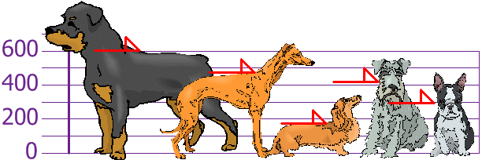
You and your friends have just measured the heights of your dogs (in millimetres):
 
The heights (at the shoulders) are: 600mm, 470mm, 170mm, 430mm and 300mm.
Find out the Mean, the Variance, and the Standard Deviation.
Your first step is to find the Mean:
Answer:
Mean  =  600 + 470 + 170 + 430 + 3005  =  19705  =  394
so the mean (average) height is 394 mm. Let's plot this on the chart:
 
Now we calculate each dog's difference from the Mean:
 
To calculate the Variance, take each difference, square it, and then average the result:
  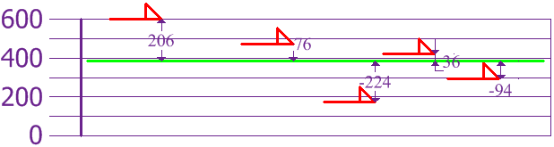

So the Variance is 21,704
And the Standard Deviation is just the square root of Variance, so:
Standard Deviation
 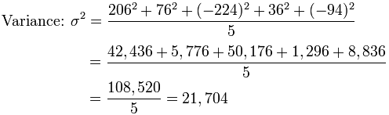

σ	= √21,704
	= 147.32...
	= 147 (to the nearest mm)

And the good thing about the Standard Deviation is that it is useful. Now we can show which heights are within one Standard Deviation (147mm) of the Mean:
  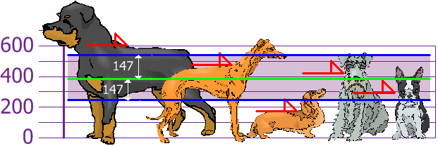

So, using the Standard Deviation we have a "standard" way of knowing what is normal, and what is extra large or extra small.
Rottweilers are tall dogs. And Dachshunds are a bit short ... but don't tell them!
Now try the Standard Deviation Calculator.
But ... there is a small change with Sample Data
Our example has been for a Population (the 5 dogs are the only dogs we are interested in).
But if the data is a Sample (a selection taken from a bigger Population), then the calculation changes!
When you have "N" data values that are:
•	The Population: divide by N when calculating Variance (like we did)
•	A Sample: divide by N-1 when calculating Variance
All other calculations stay the same, including how we calculated the mean.
Example: if our 5 dogs are just a sample of a bigger population of dogs, we divide by 4 instead of 5 like this:
Sample Variance = 108,520 / 4 = 27,130
Sample Standard Deviation = √27,130 = 164 (to the nearest mm)
Think of it as a "correction" when your data is only a sample.

#### Formulas
Here are the two formulas, explained at Standard Deviation Formulas if you want to know more:

The "Population Standard Deviation":	
	 
The "Sample Standard Deviation":	 
	 
Looks complicated, but the important change is to 
divide by N-1 (instead of N) when calculating a Sample Variance.

<pre>
*Footnote: Why square the differences?
If we just add up the differences from the mean ... the negatives cancel the positives:
 		4 + 4 − 4 − 44 = 0
So that won't work. How about we use absolute values?
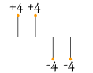 		|4| + |4| + |−4| + |−4|4 = 4 + 4 + 4 + 44 = 4
That looks good (and is the Mean Deviation), but what about this case:
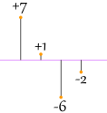 		|7| + |1| + |−6| + |−2|4 = 7 + 1 + 6 + 24 = 4
Oh No! It also gives a value of 4, Eve2n though the differences are more spread out.
So let us try squaring each difference (and taking the square root at the end):
 		√(42 + 42 + 42 + 424) = √(644) = 4
 		√(72 + 12 + 62 + 224) = √(904) = 4.74...
That is nice! The Standard Deviation is bigger when the differences are more spread out ... just what we want.
In fact this method is a similar idea to distance between points, just applied in a different way.
And it is easier to use algebra on squares and square roots than absolute values, which makes the standard deviation easy to use in other areas of mathematics.
</pre>


### Univariate and Bivariate Data
Univariate: one variable, 
Bivariate: two variables

#### Univariate means "one variable" (one type of data)
Example: Travel Time (minutes): 15, 29, 8, 42, 35, 21, 18, 42, 26
The variable is Travel Time
 
Example: Puppy Weights
You weigh the pups and get these results:
2.5, 3.5, 3.3, 3.1, 2.6, 3.6, 2.4
The variable is Puppy Weight
We can do lots of things with univariate data:
•	Find a central value using mean, median and mode
•	Find how spread out it is using range, quartiles and standard deviation
•	Make plots like Bar Graphs, Pie Charts and Histograms


#### Bivariate means "two variables", in other words there are two types of data
With bivariate data you have two sets of related data that you want to compare:
Example:
An ice cream shop keeps track of how much ice cream they sell versus the temperature on that day.
The two variables are Ice Cream Sales and Temperature.
Here are their figures for the last 12 days:
Ice Cream Sales vs Temperature
Temperature °C	Ice Cream Sales
14.2°	$215
16.4°	$325
11.9°	$185
15.2°	$332
18.5°	$406
22.1°	$522
19.4°	$412
25.1°	$614
23.4°	$544
18.1°	$421
22.6°	$445
17.2°	$408
And here is the same data as a Scatter Plot:
 

Now we can easily see that warmer weather and more ice cream sales are linked, but the relationship is not perfect.
So with bivariate data we are interested in comparing the two sets of data and finding any relationships.
We can use Tables, Scatter Plots, Correlation, Line of Best Fit, and plain old common sense.


We can use Tables, Scatter Plots, Correlation, Line of Best Fit, and plain old common sense.

Scatter Plots
 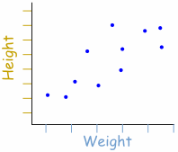
 		A Scatter (XY) Plot has points that show the relationship between two sets of data.
In this example, each dot shows one person's weight versus their height.
(The data is plotted on the graph as "Cartesian (x,y) Coordinates")

Example:
The local ice cream shop keeps track of how much ice cream they sell versus the noon temperature on that day. Here are their figures for the last 12 days:
Ice Cream Sales vs Temperature
Temperature °C	Ice Cream Sales
14.2°	$215
16.4°	$325
11.9°	$185
15.2°	$332
18.5°	$406
22.1°	$522
19.4°	$412
25.1°	$614
23.4°	$544
18.1°	$421
22.6°	$445
17.2°	$408
And here is the same data as a Scatter Plot:
  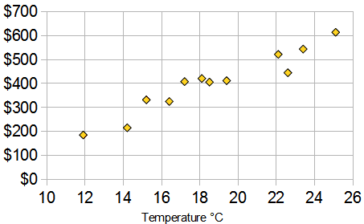

It is now easy to see that warmer weather leads to more sales, but the relationship is not perfect.


#### Correlation
When the two sets of data are strongly linked together we say they have a High Correlation.
The word Correlation is made of Co- (meaning "together"), and Relation
•	Correlation is Positive when the values increase together, and
•	Correlation is Negative when one value decreases as the other increases
Like this:
   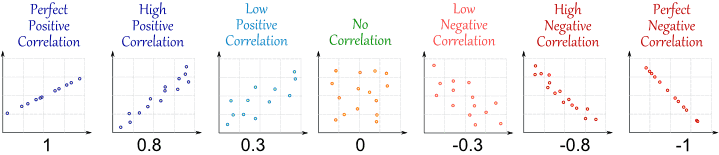

(Learn More About Correlation)
#### Negative Correlation
Correlations can be negative, which means there is a correlation but one value goes down as the other value increases.
Example : Birth Rate vs Income
The birth rate tends to be lower in richer countries.

Below is a scatter plot for about 100 different countries.	Country	Yearly
Production
per Person	Birth
Rate
Madagascar	$800	5.70
India	$3,100	2.85
Mexico	$9,600	2.49
Taiwan	$25,300	1.57
Norway	$40,000	1.78
   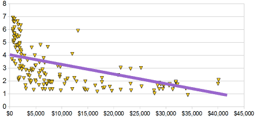

 
It has a negative correlation (the line slopes down)
#### Outliers
"Outliers" are values that "lie outside" the other values.
When we collect data, sometimes there are values that are "far away" from the main group of data ... what do we do with them?	 
   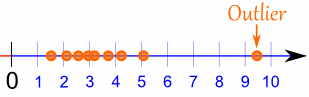

Example: Long Jump
    

A new coach has been working with the Long Jump team this month, and the athletes' performance has changed.
Augustus can now jump 0.15m further, June and Carol can jump 0.06m further.
Here are all the results:
•	Augustus: +0.15m
•	Tom: +0.11m
•	June: +0.06m
•	Carol: +0.06m
•	Bob: + 0.12m
•	Sam: -0.56m
Oh no! Sam got worse.
Here are the results on the number line:
    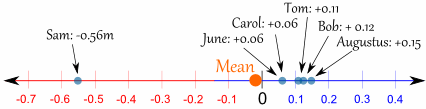

The mean is:
(0.15+0.11+0.06+0.06+0.12-0.56) / 6 = -0.06 / 6 = -0.01m
So, on average the performance went DOWN.
The coach is obviously useless ... right?
Sam's result is an "Outlier" ... what if we remove Sam's result?
    

Example: Long Jump (continued)
Let us try the results WITHOUT Sam:
Mean = (0.15+0.11+0.06+0.06+0.12)/5 = 0.1 m
Hey, the coach looks much better now!
But is that fair? Can we just get rid of values we don't like?


#### What To Do?
You need to think "why is that value over there?"
It may be quite normal to have high or low values
•	People can be short or tall
•	Some days there is no rain, other days there can be a downpour
•	Athletes can perform better or worse on different days
Or there may be an unusual reason for extreme data
Example: Long Jump (continued)
We find out that Sam was feeling sick that day. Not the coach's fault at all.
So it is a good idea in this case to remove Sam's result.
When we remove outliers we are changing the data, it is no longer "pure", so we shouldn't just get rid of the outliers without a good reason!
And when we do get rid of them, we should explain what we are doing and why.


#### Mean, Median and Mode
We saw how outliers affect the mean, but what about the median or mode?
Example: Long Jump (continued)
The median ("middle" value):
*	including Sam is: 0.085
*	without Sam is: 0.11 (went up a little)
The mode (the most common value):
*	including Sam is: 0.06
*	without Sam is: 0.06 (stayed the same)
The mode and median didn't change very much.
They also stayed around where most of the data is.
So it seems that outliers have the biggest effect on the mean, and not so much on the median or mode.

### Chi-Square Test

Groups and Numbers
You research two groups and put them in categories single, married or divorced:

The numbers are definitely different, but ...
•	Is that just random chance?
•	Or have you found something interesting?

The Chi-Square Test gives a "p" value to help you decide!
Example: "Which holiday do you prefer?"
<pre>
	Beach	Cruise
Men	209	280
Women	225	248
</pre>
Does Gender affect Preferred Holiday?
If Gender (Man or Woman) does affect Preferred Holiday we say they are dependent.
By doing some special calculations (explained later), we come up with a "p" value:
p value is 0.132
Now, p < 0.05 is the usual test for dependence. In this case p is greater than 0.05, so we believe the variables are independent (ie not linked together).
In other words Men and Women probably do not have a different preference for Beach Holidays or Cruises.

##### Understanding "p" Value
"p" is the probability the variables are independent.
Imagine that the previous example was in fact two random samples of Men each time:
 	 
Men:


Beach 209, Cruise 280	Men:


Beach 225, Cruise 248
Is it likely you would get such different results surveying Men each time?
Well the "p" value of 0.132 says that it really could happen every so often.
Surveys are random after all. We expect slightly different results each time, right?
So most people want to see a p value less than 0.05 before they are happy to say the results show the groups have a different response.
<pre>
Let's see another example:
Example: "Which pet do you prefer?"
	Cat	Dog
Men	207	282
Women	231	242
By doing the calculations (shown later), we come up with:
P value is 0.043
In this case p < 0.05, so this result is thought of as being "significant" meaning we think the variables are not independent.
In other words, because 0.043 < 0.05 we think that Gender is linked to Pet Preference (Men and Women have different preferences for Cats and Dogs).
Just out of interest, notice that the numbers in our two examples are similar, but the resulting p-values are very different: 0.132 and 0.043. This shows how sensitive the test is!


##### Why p<0.05 ?
It is just a choice! Using p<0.05 is common, but we could have chosen p<0.01 to be even more sure that the groups behave differently, or any value really.
##### Calculating P-Value
So how do we calculate this p-value? We use the Chi-Square Test!
##### Chi-Square Test
Note: Chi Sounds like "Hi" but with a K, so say Chi-Square like "Ki square"
And Chi is the greek letter Χ, so we can also write it Χ2
Important points before we get started:
•	This test only works for categorical data (data in categories), such as Gender {Men, Women} or colour {Red, Yellow, Green, Blue} etc, but not numerical data such as height or weight.
•	The numbers must be large enough. Each entry must be 5 or more. In our example we have values such as 209, 282, etc, so we are good to go.
Our first step is to state our hypotheses:
Hypothesis: A statement that might be true, which can then be tested.
The two hypotheses are.
•	Gender and preference for cats or dogs are independent.
•	Gender and preference for cats or dogs are not independent.
Lay the data out in a table:
	Cat	Dog
Men	207	282
Women	231	242
Add up rows and columns:
	Cat	Dog	
Men	207	282	489
Women	231	242	473
	438	524	962
Calculate "Expected Value" for each entry:
Multiply each row total by each column total and divide by the overall total:
	Cat	Dog	
Men	489×438/962	489×524/962	489
Women	473×438/962	473×524/962	473
	438	524	962
Which gives us:
	Cat	Dog	
Men	222.64	266.36	489
Women	215.36	257.64	473
	438	524	962
Subtract expected from actual, square it, then divide by expected:
	Cat	Dog	
Men	(207-222.64)2222.64	(282-266.36)2266.36	489
Women	(231-215.36)2215.36	(242-257.64)2257.64	473
	438	524	962
Which is:
	Cat	Dog	
Men	1.099	0.918	489
Women	1.136	0.949	473
	438	524	962
##### Now add up those values:
1.099 + 0.918 + 1.136 + 0.949 = 4.102
Chi-Square is 4.102
##### From Chi-Square to p
To get from Chi-Square to p-value is a difficult calculation, so either look it up in a table, or use the Chi-Square Calculator.
But first you will need a "Degree of Freedom" (DF)
Calculate Degrees of Freedom
Multiply (rows − 1) by (columns − 1)
Example: DF = (2 − 1)(2 − 1) = 1×1 = 1
Result
The result is:
p = 0.04283
Done!

</pre>
##### Chi-Square Formula
This is the formula for Chi-Square:

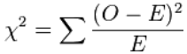

•	O = the Observed (actual) value
•	E = the Expected value
Normal Distribution
Data can be "distributed" (spread out) in different ways.
It can be spread out 
more on the left	
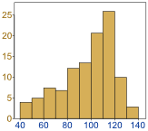

Or more on the right
 		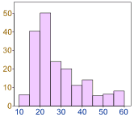
 
		
Or it can be all jumbled up
 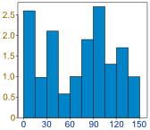

But there are many cases where the data tends to be around a central value with no bias left or right, and it gets close to a "Normal Distribution" like this:


But there are many cases where the data tends to be around a central value with no bias left or right, and it gets close to a "Normal Distribution" like this:
 
A Normal Distribution
The "Bell Curve" is a Normal Distribution. 
 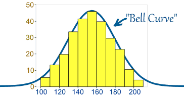

And the yellow histogram shows some data that 
follows it closely, but not perfectly (which is usual).
  
	It is often called a "Bell Curve"
because it looks like a bell.
Many things closely follow a Normal Distribution:
•	heights of people
•	size of things produced by machines
•	errors in measurements
•	blood pressure
•	marks on a test
We say the data is "normally distributed":
 
The Normal Distribution has:
•	mean = median = mode
•	symmetry about the centre
•	50% of values less than the mean
•	and 50% greater than the mean
 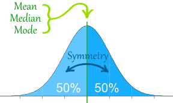


## MACHINE LEARNING:
The origins of machine learning
Since birth, we are inundated with data. Our body's sensors—the eyes, ears, nose, tongue, and nerves—are continually assailed with raw data that our brain translates into sights, sounds, smells, tastes, and textures. Using language, we are able to share these experiences with others.
From the advent of written language, human observations have been recorded. Hunters monitored the movement of animal herds, early astronomers recorded the alignment of planets and stars, and cities recorded tax payments, births, and deaths. Today, such observations, and many more, are increasingly automated and recorded in the ever-growing computerized databases.


The field of study interested in the development of computer algorithms to transform data into intelligent action is known as machine learning
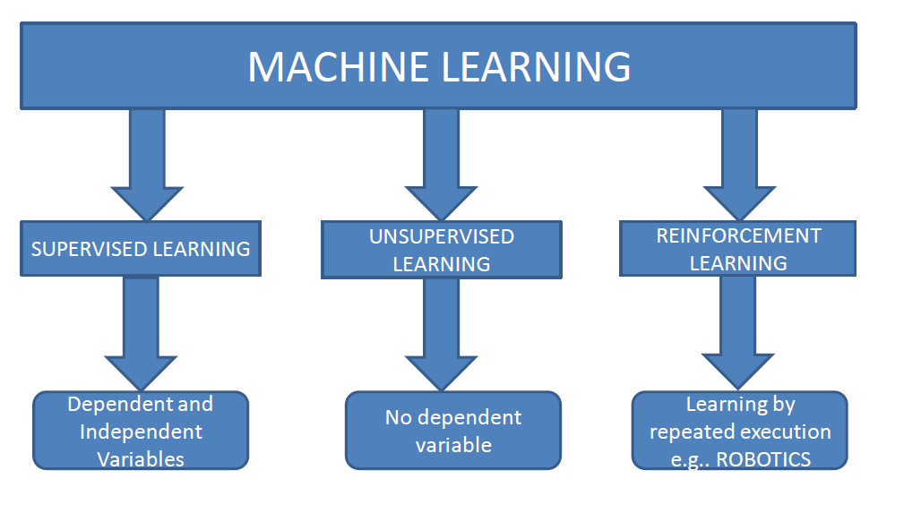
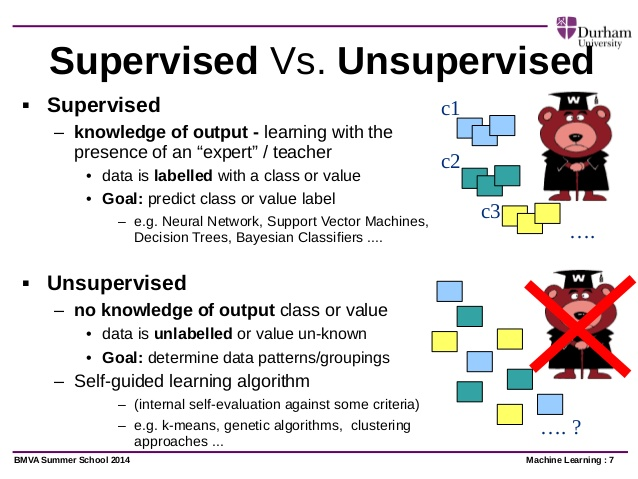
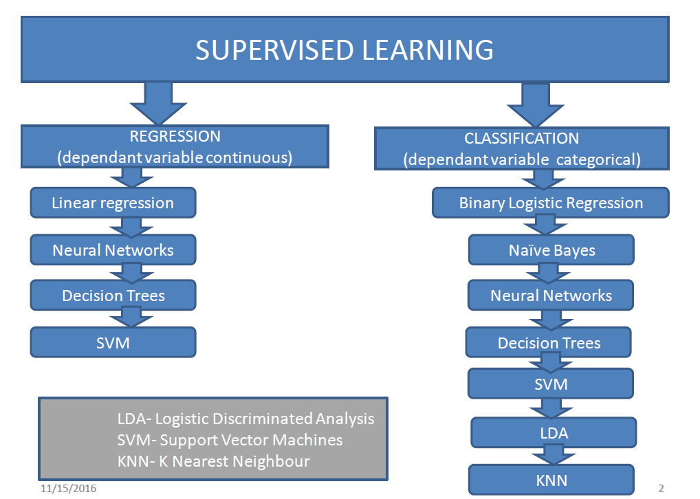


### Linear Regression:
Regression is concerned with specifying the relationship between a single numeric dependent variable (the value to be predicted) and one or more numeric independent variables (the predictors). As the name implies, the dependent variable depends upon the value of the independent variable or variables. The simplest forms of regression assume that the relationship between the independent and dependent variables follows a straight line.
Lines can be defined in a slope-intercept form similar to y = a + bx. In this form, the letter y indicates the dependent variable and x indicates the independent variable. The slope term b specifies how much the line rises for each increase in x. Positive values define lines that slope upward while negative values define lines that slope downward. The term is known as the intercept because it specifies the point where the line crosses, or intercepts, the vertical y axis. It indicates the value of y when x = 0.
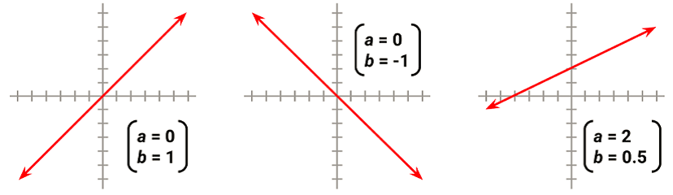
When there is only a single independent variable it is known as simple linear regression. In the case of two or more independent variables, this is known as multiple linear regression, or simply "multiple regression". Both of these techniques assume that the dependent variable is measured on a continuous scale.

#### Linearity Assumptions:
*	Linearity : correlation should be present either +ve or –ve.
*	Data should be normalized : mean =0 and SD=1( test to check normality is shapiro test where P>0.05
*	No outliers, P>0.05
*	Homoscedasticity, p>0.05: Y-Y^ is the error , which should be distributed in a homogenous way .
Eg: if error y-y^ is 50 throughout then its homoscedasticity
* If error is variant then it’s Heteroscedasticity
* Multivariance: Choosing variables wrt dependent variables. One single variable related to multivariable.
* No Auto correlation: the errors should be independent, output should not affect the previous or next error.
* Auto correlation: errors are not independent means errors are dependent
* No auto correlation: errors are independent
* Correlation is degree of relation between 2 variables
* Auto correlation is relation with one single variable but at different time lapse.
Eg: salary amount in two different months or checking temperature at different time.
* Multi collinearity exists: Independent variables are not independent with each other means independent variables has sum dependency between them. One independent variable affects another independent variable.


A simple linear regression model defines the relationship between a dependent variable and a single independent predictor variable using a line defined by an equation in the following form:

 <pre>
Y= predicted value
x- independent value
e-errors
a-	Intersept , if x=0 y will have sum value ie intersept
b-	Slope, every increase of x, y will increase
The intercept, α (alpha), describes where the line crosses the y axis, while the slope, β (beta), describes the change in y given an increase of x.
</pre>

#### Ordinary least squares estimation
In order to determine the optimal estimates of α and β, an estimation method known as Ordinary Least Squares (OLS) was used. In OLS regression, the slope and intercept are chosen so that they minimize the sum of the squared errors, that is, the vertical distance between the predicted y value and the actual y value. These errors are known as residuals, and are illustrated for several points in the following diagram:
 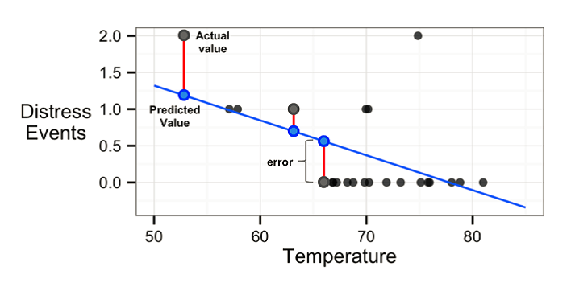

In mathematical terms, the goal of OLS regression can be expressed as the task of minimizing the following equation:

 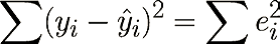

In plain language, this equation defines e (the error) as the difference between the actual y value and the predicted y value. The error values are squared and summed across all the points in the data.

The solution for a depends on the value of b. It can be obtained using the following formula

 
 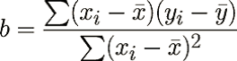

If we break this equation apart into its component pieces, we can simplify it a bit. The denominator for b should look familiar; it is very similar to the variance of x, which is denoted as Var(x), the variance involves finding the average squared deviation from the mean of x. This can be expressed as:
 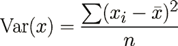
The numerator involves taking the sum of each data point's deviation from the mean x value multiplied by that point's deviation away from the mean y value. This is similar to the covariance function for x and y, denoted as Cov(x, y). The covariance formula is:
  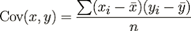

If we divide the covariance function by the variance function, the n terms get cancelled and we can rewrite the formula for b as:
 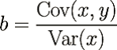


#### Correlations:
The correlation between two variables is a number that indicates how closely their relationship follows a straight line.
The correlation ranges between -1 and +1. The extreme values indicate a perfectly linear relationship, while a correlation close to zero indicates the absence of a linear relationship
The following formula defines Pearson's correlation:
  

Measuring the correlation between two variables gives us a way to quickly gauge the relationships among the independent and dependent variables.


```markdown
```

