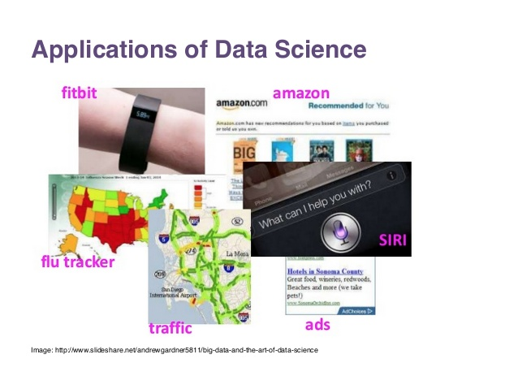
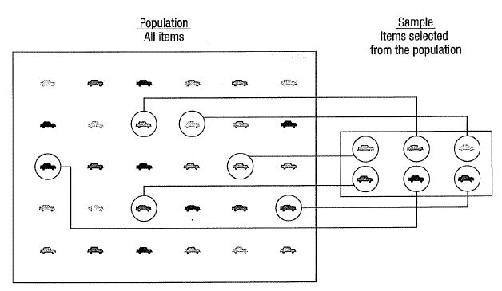
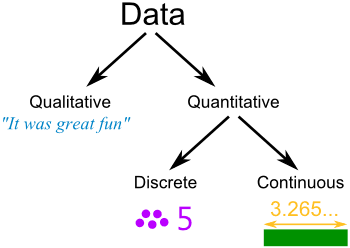
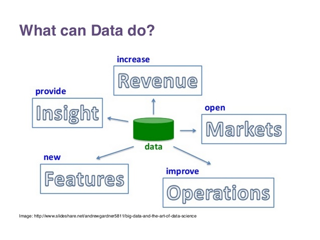
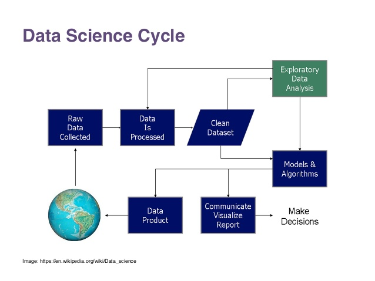
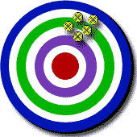
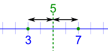
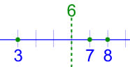
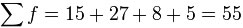
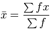

# statistics


## Why study statistics?

1.	Data are everywhere
2.	Statistical techniques are used to make many decisions that affect our lives
3.	No matter what your career,  you will make professional decisions that involve data. An understanding of statistical methods will help you make these decisions efectively


## Applications of statistical concepts in the business world

*	Finance – correlation and regression, index numbers, time series analysis
*	Marketing – hypothesis testing, chi-square tests, nonparametric statistics
*	Personel – hypothesis testing, chi-square tests, nonparametric tests
*	Operating  management – hypothesis testing, estimation, analysis of variance, time series analysis




## statistics
*	The science of collectiong, organizing, presenting, analyzing, and interpreting data to assist in making more effective decisions
*	Statistical analysis – used to manipulate  summarize, and investigate data, so that useful decision-making information results.

### types
#### Descriptive statistics
Methods of organizing, summarizing, and presenting data in an informative way
#### Inferential statistics  
The methods used to determine something about a population on the basis of a sample
*	Population –The entire set of individuals or objects of interest or the measurements obtained from all individuals or objects of interest
*	Sample – A portion, or part, of the population of interest


A sample should have the same characteristics as the population it is representing.
Sampling can be:

*	with replacement: a member of the population may be chosen more than once (picking the candy from the bowl)
*	without replacement: a member of the population may be chosen only once (lottery ticket)


Sampling methods:
Sampling methods can be:

*	random (each member of the population has an equal chance of being selected)
*	nonrandom

The actual process of sampling causes sampling errors. For example, the sample may not be large enough or representative of the population. Factors not related to the sampling process cause non                              sampling errors.
Descriptive Statistics
*	Collect data
*	e.g., Survey
*	Present data
*	e.g., Tables and graphs
*	Summarize data
e.g., Sample mean

## What is Data?
Data is a collection of facts, such as numbers, words, measurements, observations or even just descriptions of things.
Data can be qualitative or quantitative.
*	Qualitative data is descriptive information (it describes something)
*	Quantitative data, is numerical information (numbers).



And Quantitative data can also be Discrete or Continuous:
•	Discrete data can only take certain values (like whole numbers)
•	Continuous data can take any value (within a range)
Put simply: Discrete data is counted, Continuous data is measured

### what data do


Census or Sample
* A Census is when we collect data for every member of the group (the whole "population").
* A Sample is when we collect data just for selected members of the group.
* A census is accurate, but hard to do. A sample is not as accurate, but may be good enough, and is a lot easier.
We collect data by doing a Survey.

Here are four steps to a successful survey:
*	Step one: create the questions
*	Step two: ask the questions
*	Step three: tally the results
*	Step four: present the results
You can also summarise the results using statistics, such as Mean, Median, Mode, Standard Deviation and Quartiles



### Accuracy
Accuracy is how close a measured value is to the actual (true) value

### Precision
Precision is how close the measured values are to each other.

#### Examples of Precision and Accuracy:


So, if you are playing soccer and you always hit the left goal post instead of scoring, then you are not accurate, but you are precise!

#### Note -- to remember
*	aCcurate is Correct (a bullseye).
*	pRecise is Repeating (hitting the same spot, but maybe not the correct spot)

### Bias (don't let precision fool you!)
When we measure something several times and all values are close, they may all be wrong if there is a "Bias"
Bias is a systematic (built-in) error which makes all measurements wrong by a certain amount

#### Examples of Bias
*	The scales read "1 kg" when there is nothing on them
*	You always measure your height wearing shoes with thick soles.
*	A stopwatch that takes half a second to stop when clicked
In each case all measurements are wrong by the same amount. That is bias.

#### 2 Numbers
```markdown
With just 2 numbers the answer is easy: go half-way between.
Example: what is the central value for 3 and 7?
Answer: Half-way between, which is 5.
 
You can calculate it by adding 3 and 7 and then dividing the result by 2:
(3+7) / 2 = 10/2 = 5
```


#### 3 or More Numbers
```markdown
You can use the same idea when you have 3 or more numbers:
Example: what is the central value of 3, 7 and 8?
Answer: You calculate it by adding 3, 7 and 8 and then dividing the results by 3 (because there are 3 numbers):
(3+7+8) / 3 = 18/3 = 6
```


#### mean
The mean is the average of the numbers.
Mean: Add up the numbers and divide by how many numbers.
But sometimes the Mean can let you down:
##### Example: Birthday Activities
Uncle Bob wants to know the average age at the party, to choose an activity.
There will be 6 kids aged 13, and also 5 babies aged 1.
Add up all the ages, and divide by 11 (because there are 11 numbers):
(13+13+13+13+13+13+1+1+1+1+1) / 11 = 7.5...


 	The mean age is about 7½, so he gets a Jumping Castle!
The 13 year olds are embarrassed, 
and the 1 year olds can't jump!
The Mean was accurate, but in this case it was not useful.

#### Median Value
The Median is the "middle" of a sorted list of numbers.
Example: Birthday Activities (continued)
List the ages in order:
1, 1, 1, 1, 1, 13, 13, 13, 13, 13, 13
Choose the middle number:
1, 1, 1, 1, 1, 13, 13, 13, 13, 13, 13
The Median age is 13 ... so let's have a Disco!
Sometimes there are two middle numbers. Just average them:
##### Example: What is the Median of 3, 4, 7, 9, 12, 15
There are two numbers in the middle:
3, 4, 7, 9, 12, 15
So we average them:
(7+9) / 2 = 16/2 = 8
The Median is 8

#### Mode
##### Finding the Mode
To find the mode, or modal value, first put the numbers in order, then count how many of each number. A number that appears most often is the mode.
Example: Birthday Activities (continued)
Group the numbers so we can count them:
1, 1, 1, 1, 1, 13, 13, 13, 13, 13, 13
"13" occurs 6 times, "1" occurs only 5 times, so the mode is 13.
How to remember? Think "mode is most"
But Mode can be tricky, there can sometimes be more than one Mode.
##### Example: What is the Mode of 3, 4, 4, 5, 6, 6, 7
Well ... 4 occurs twice but 6 also occurs twice.
So both 4 and 6 are modes.
When there are two modes it is called "bimodal", when there are three or more modes we call it "multimodal".

#### Outliers
Outlier share values that "lie outside" the other values.
 

They can change the mean a lot, so we can either not use them (and say so) or use the median or mode instead.
##### Example: 3, 4, 4, 5 and 104
Mean: Add them up, and divide by 5 (as there are 5 numbers):
(3+4+4+5+104) / 5 = 24
24 does not represent those numbers well at all!
Without the 104 the mean is:
(3+4+4+5) / 4 = 4
But please tell people you are not including the outlier.

#### Examples
Median: They are in order, so just choose the middle number, which is 4:
3, 4, 4, 5, 104
Mode: 4 occurs most often, so the Mode is 4
3, 4, 4, 5, 104
The Mean from a Frequency Table
It is easy to calculate the Mean:
Add up all the numbers, 
then divide by how many numbers there are.
Example 1: What is the Mean of these numbers?
6, 11, 7
•	Add the numbers: 6 + 11 + 7 = 24
•	Divide by how many numbers (there are 3 numbers): 24 ÷ 3 = 8
The Mean is 8

But sometimes we don't have a simple list of numbers, it might be a frequency table like this (the "frequency" says how often they occur):
Score	Frequency
1	2
2	5
3	4
4	2
5	1
(it says that score 1 occurred 2 times, score 2 occurred 5 times, etc)
We could list all the numbers like this:
Mean = 1+1 + 2+2+2+2+2 + 3+3+3+3 + 4+4 + 5(how many numbers)
But rather than do lots of adds (like 3+3+3+3) it is easier to use multiplication:
Mean = 2×1 + 5×2 + 4×3 + 2×4 + 1×5(how many numbers)
And rather than count how many numbers there are, we can add up the frequencies:
Mean = 2×1 + 5×2 + 4×3 + 2×4 + 1×52 + 5 + 4 + 2 + 1
And now we calculate:
Mean = 2 + 10 + 12 + 8 + 514  
=  3714  =  2.64...
And that is how to calculate the mean from a frequency table!
Here is another example:
Example: Parking Spaces per House in Hampton Street
Isabella went up and down the street to find out how many parking spaces each house has. Here are her results:

Parking
Spaces	Frequency
1	15
2	27
3	8
4	5
<pre>
What is the mean number of Parking Spaces?
Answer:
Mean =	15×1 + 27×2 + 8×3 + 5×4
       ------------------------
          15+27+8+5

=	15 + 54 + 24 + 20
  -----------------  
         55
=	2.05...
</pre>
The Mean is 2.05 (to 2 decimal places)
(much easier than adding all numbers separately!)
Notation 

Now you know how to do it, let's do that last example again, but using formulas.
 	This symbol (called Sigma) means "sum up"
(read more at Sigma Notation)


So we can say "add up all frequencies" this way:


(where f is frequency)
 

So now we are ready to do our example above, but with correct notation.
Example: Calculate the Mean of this Frequency Table
x	F
1	15
2	27
3	8
4	5
And here it is:
 
There you go! You can use sigma notation.
Calculate in the Table
It is often better to do the calculations in the table.
Example: (continued)
From the previous example, calculate f  × x in the right-hand column and then do totals:
x	f	fx
1	15	15
2	27	54
3	8	24
4	5	20
TOTALS:	55	113


And the Mean is then easy:
Mean = 113 / 55 = 2.05...

### Mean Deviation
The mean of the distances of each value from their mean.
Yes, we use "mean" twice: Find the mean ... use it to work out distances ... then find the mean of those distances!
Three steps:
•	1. Find the mean of all values
•	2. Find the distance of each value from that mean (subtract the mean from each value, ignore minus signs)
•	3. Then find the mean of those distances
Like this:
Example: the Mean Deviation of 3, 6, 6, 7, 8, 11, 15, 16
Step 1: Find the mean:
Mean =	3 + 6 + 6 + 7 + 8 + 11 + 15 + 16	=	72	= 9
	8		8	
Step 2: Find the distance of each value from that mean:
Value	Distance from 9
3	6
6	3
6	3
7	2
8	1
11	2
15	6
16	7
Which looks like this:
 
Step 3. Find the mean of those distances:
Mean Deviation =	6 + 3 + 3 + 2 + 1 + 2 + 6 + 7	=	30	= 3.75
	8		8	

So, the mean = 9, and the mean deviation = 3.75
It tells us how far, on average, all values are from the middle.
In that example the values are, on average, 3.75 away from the middle.
For deviation just think distance
Formula
The formula is:
<pre>
Mean Deviation =	Σ|x - μ|
                ---------
	                   N
Let's learn more about those symbols!
Firstly:
•	μ is the mean (in our example μ = 9)
•	x is each value (such as 3 or 16)
•	N is the number of values (in our example N = 8)
</pre>


```markdown
```

