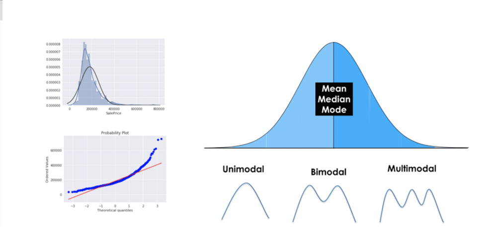
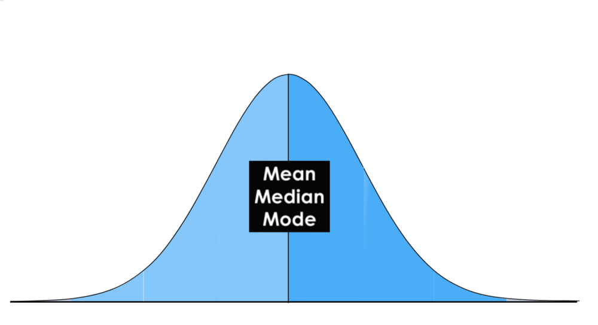
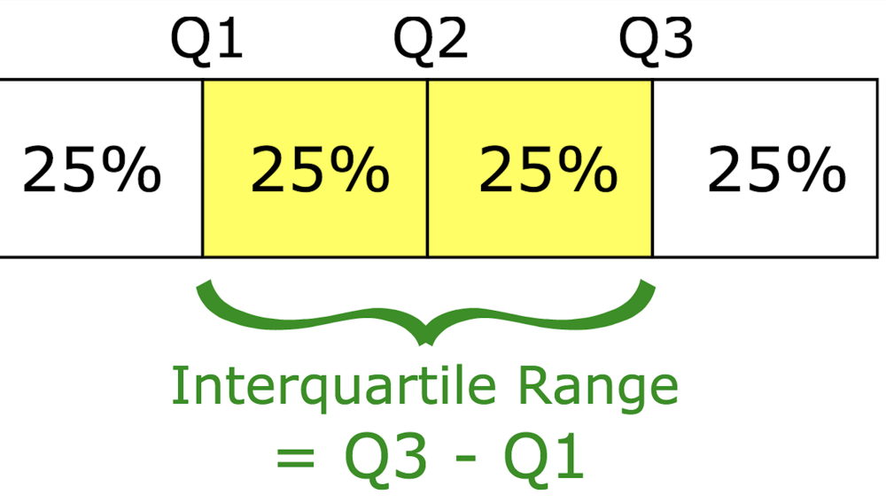
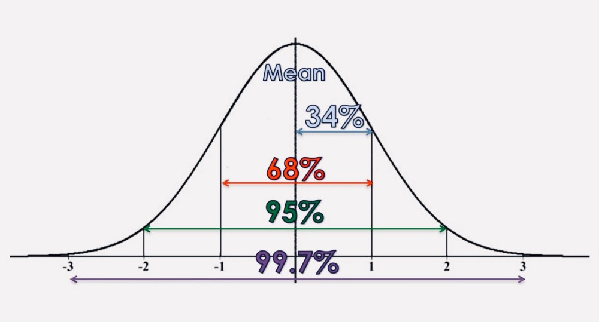
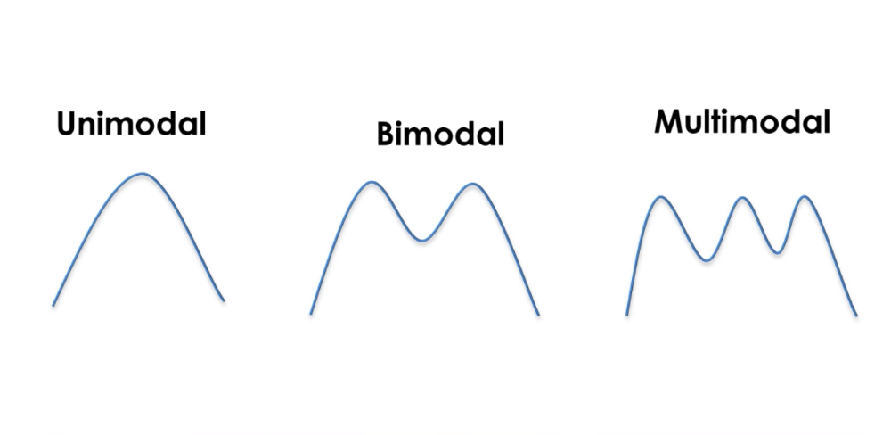
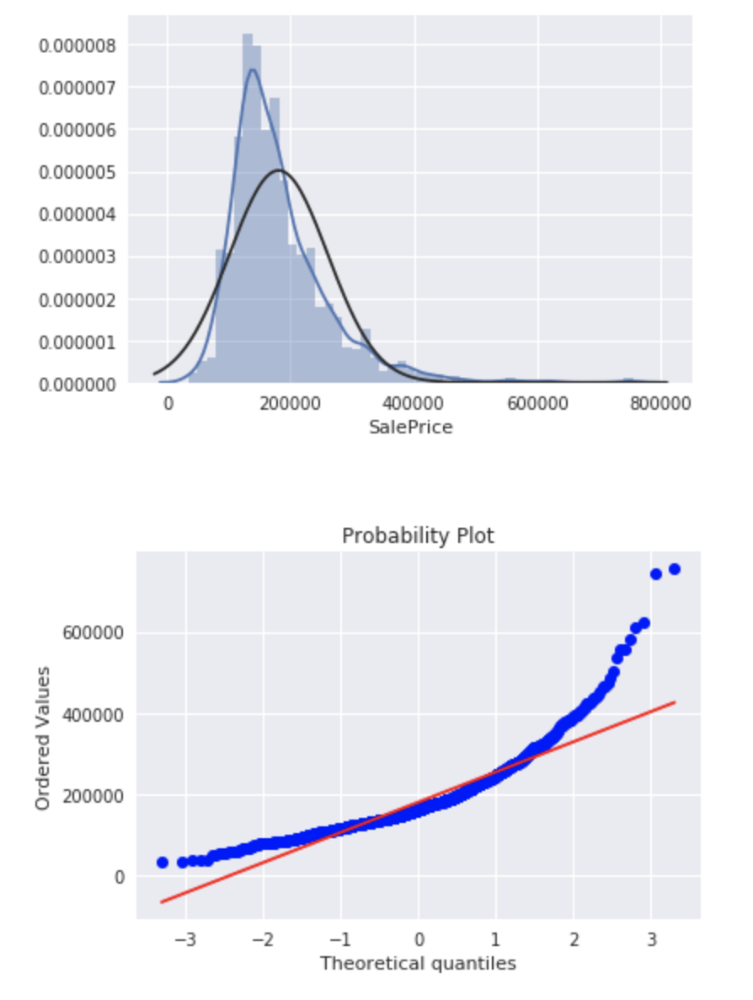

# Descriptive Statistics

Descriptive Statistical Analysis helps you to understand your data and is a very important part of Machine Learning. This is due to Machine Learning being all about making predictions. On the other hand, statistics is all about drawing conclusions from data, which is a necessary initial step. In this post you will learn about the most important descriptive statistical concepts. They will help you understand better what your data is trying to tell you, which will result in an overall better machine learning model and understanding.

## Table of Contents 
* [Introduction](#Introduction)
* [Normal Distribution](#NormalDistribution)
* [Central Tendency (mean, mode, median)](#CentralTendency)
* [Measures of Variability (range, interquartile range)](#MeasuresofVariability)
* [Variance and Standard Deviation](#VarianceandStandardDeviation)
* [Modality](#Modality)
* [Skewness](#Skewness)
* [Kurtosis](#Kurtosis)
* [Summary](#Summary)

## Introduction 

Introduction
Doing a descriptive statistical analysis of your dataset is absolutely crucial. A lot of people skip this part and therefore lose a lot of valuable insights about their data, which often leads to wrong conclusions. Take your time and carefully run descriptive statistics and make sure that the data meets the requirements to do further analysis.

But first of all, we should go over what statistics really is:

Statistics is a branch of mathematics that deals with collecting, interpreting, organization and interpretation of data.

Within statistics, there are two main categories:

* Descriptive Statistics: In Descriptive Statistics your are describing, presenting, summarizing and organizing your data (population), either through numerical calculations or graphs or tables.

* Inferential statistics: Inferential Statistics are produced by more complex mathematical calculations, and allow us to infer trends and make assumptions and predictions about a population based on a study of a sample taken from it.

## Normal Distribution 
The normal distribution is one of the most important concepts in statistics since nearly all statistical tests require normally distributed data. It basically describes how large samples of data look like when they are plotted. It is sometimes called the “bell curve“ or the “Gaussian curve“.

Inferential statistics and the calculation of probabilities require that a normal distribution is given. This basically means, that if your data is not normally distributed, you need to be very careful what statistical tests you apply to it since they could lead to wrong conclusions.

A normal Distribution is given if your data is symmetrical, bell-shaped, centered and unimodal.

In a perfect normal distribution, each side is an exact mirror of the other. It should look like the distribution on the picture below:

You can see on the picture that the distribution is bell-shaped, which simply means that it is not heavily peaked. Unimodal means that there is only one peak.
## Central Tendency (mean, mode, median) 
In statistics we have to deal with the mean, mode and the median. These are also called the „Central Tendency“. These are just three different kinds of „averages” and certainly the most popular ones.

The mean is simply the average and considered the most reliable measure of central tendency for making assumptions about a population from a single sample. Central tendency determines the tendency for the values of your data to cluster around its mean, mode, or median. The mean is computed by the sum of all values, divided by the number of values.

The mode is the value or category that occurs most often within the data. Therefore a dataset has no mode, if no number is repeated or if no category is the same. It is possible that a dataset has more than one mode, but I will cover this in the „Modality“ section below. The mode is also the only measure of central tendency that can be used for categorical variables since you can’t compute for example the average for the variable „gender“. You simply report categorical variables as numbers and percentages.

The median is the “middle” value or midpoint in your data and is also called the „50th percentile“. Note that the median is much less affected by outliers and skewed data than the mean. I will explain this with an example: Imagine you have a dataset of housing prizes that range mostly from $100,000 to $300,000 but contains a few houses that are worth more than 3 million Dollars. These expensive houses will heavily effect then mean since it is the sum of all values, divided by the number of values. The median will not be heavily affected by these outliers since it is only the “middle” value of all data points. Therefore the median is a much more suited statistic, to report about your data.

In a normal distribution, these measures all fall at the same midline point. This means that the mean, mode and median are all equal.
## Measures of Variability (range, interquartile range) 
The most popular variability measures are the range, interquartile range (IQR), variance, and standard deviation. These are used to measure the amount of spread or variability within your data.

The range describes the difference between the largest and the smallest points in your data.

The interquartile range (IQR) is a measure of statistical dispersion between upper (75th) and lower (25th) quartiles.

While the range measures where the beginning and end of your datapoint are, the interquartile range is a measure of where the majority of the values lie.

The difference between the standard deviation and the variance is often a little bit hard to grasp for beginners, but I will explain it thoroughly below.
## Variance and Standard Deviation 
The Standard Deviation and the Variance also measure, like the Range and IQR, how spread apart our data is (e.g the dispersion). Therefore they are both derived from the mean.

The variance is computed by finding the difference between every data point and the mean, squaring them, summing them up and then taking the average of those numbers.

The squares are used during the calculation because they weight outliers more heavily than points that are near to the mean. This prevents that differences above the mean neutralize those below the mean.

The problem with Variance is that because of the squaring, it is not in the same unit of measurement as the original data.

Let’s say you are dealing with a dataset that contains centimeter values. Your variance would be in squared centimeters and therefore not the best measurement. 

This is why the Standard Deviation is used more often because it is in the original unit. It is simply the square root of the variance and because of that, it is returned to the original unit of measurement.

Let’s look at an example that illustrates the difference between variance and standard deviation:

Imagine a data set that contains centimeter values between 1 and 15, which results in a mean of 8. Squaring the difference between each data point and the mean and averaging the squares renders a variance of 18.67 (squared centimeters), while the standard deviation is 4.3 centimeters.

When you have a low standard deviation, your data points tend to be close to the mean. A high standard deviation means that your data points are spread out over a wide range.

Standard deviation is best used when data is unimodal. In a normal distribution, approximately 34% of the data points are lying between the mean and one standard deviation above or below the mean. Since a normal distribution is symmetrical, 68% of the data points fall between one standard deviation above and one standard deviation below the mean. Approximately 95% fall between two standard deviations below the mean and two standard deviations above the mean. And approximately 99.7% fall between three standard deviations above and three standard deviations below the mean.

The picture below illustrates that perfectly.

With the so-called „Z-Score“, you can check how many standard deviations below (or above) the mean, a specific data point lies. With R you can just use the „sd()“ function. To better understand the concept of a normal distribution, we will now discuss the concepts of modality, symmetry and peakedness.
## Modality 
The modality of a distribution is determined by the number of peaks it contains. Most distributions have only one peak but it is possible that you encounter distributions with two or more peaks.

The picture below shows visual examples of the three types of modality:

Unimodal means that the distribution has only one peak, which means it has only one frequently occurring score, clustered at the top. A bimodal distribution has two values that occur frequently (two peaks) and a multimodal has two or several frequently occurring values.
## Skewness 
Skewness is a measurement of the symmetry of a distribution.

Therefore it describes how much a distribution differs from a normal distribution, either to the left or to the right. The skewness value can be either positive, negative or zero. Note that a perfect normal distribution would have a skewness of zero because the mean equals the median.

Below you can see an illustration of the different types of skewness:

We speak of a positives skew if the data is piled up to the left, which leaves the tail pointing to the right.

A negative skew occurs if the data is piled up to the right, which leaves the tail pointing to the left. Note that positive skews are more frequent than negative ones.

A good measurement for the skewness of a distribution is Pearson’s skewness coefficient that provides a quick estimation of a distributions symmetry. To compute the skewness in pandas you can just use the „skew()“ function.
## Kurtosis 
Kurtosis measures whether your dataset is heavy-tailed or light-tailed compared to a normal distribution. Data sets with high kurtosis have heavy tails and more outliers and data sets with low kurtosis tend to have light tails and fewer outliers. Note that a histogram is an effective way to show both the skewness and kurtosis of a data set because you can easily spot if something is wrong with your data. A probability plot is also a great tool because a normal distribution would just follow the straight line.

A good way to mathematically measure the kurtosis of a distribution is fishers measurement of kurtosis.

Now we will discuss the three most common types of kurtosis.

A normal distribution is called mesokurtic and has kurtosis of or around zero. A platykurtic distribution has negative kurtosis and tails are very thin compared to the normal distribution. Leptokurtic distributions have kurtosis greater than 3 and the fat tails mean that the distribution produces more extreme values and that it has a relatively small standard deviation.

If you already recognized that a distribution is skewed, you don’t need to calculate it’s kurtosis, since the distribution is already not normal. In pandas you can view the kurtosis simply by calling the „kurtosis()“ function.
## Summary 
This will gave you a proper introduction to descriptive statistics. You learned what a Normal Distribution looks like and why it is important. Furthermore, you gained knowledge about the three different kinds of averages (mean, mode and median), also called the Central Tendency. Afterwards, you learned about the range, interquartile range, variance and standard deviation. Then we discussed the three types of modality and that you can describe how much a distribution differs from a normal distribution in terms of Skewness. Lastly, you learned about Leptokurtic, Mesokurtic and Platykurtic distributions.

