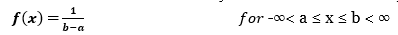
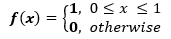
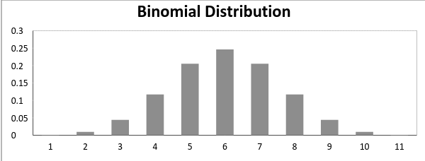

# Probablity Distribution 
## Introduction
Welcome to the world of Probability in Data Science! Let me start things off with an intuitive example.

Suppose you are a teacher at a university. After checking assignments for a week, you graded all the students. You gave these graded papers to a data entry guy in the university and tell him to create a spreadsheet containing the grades of all the students. But the guy only stores the grades and not the corresponding students.

He made another blunder, he missed a couple of entries in a hurry and we have no idea whose grades are missing. Let’s find a way to solve this.

One way is that you visualize the grades and see if you can find a trend in the data.

The graph that you have plot is called the frequency distribution of the data. You see that there is a smooth curve like structure that defines our data, but do you notice an anomaly? We have an abnormally low frequency at a particular score range. So the best guess would be to have missing values that remove the dent in the distribution.

This is how you would try to solve a real-life problem using data analysis. For any Data Scientist, a student or a practitioner, distribution is a must know concept. It provides the basis for analytics and inferential statistics.

While the concept of probability gives us the mathematical calculations, distributions help us actually visualize what’s happening underneath.

## Table of Contents
1. [Common Data Types](#CommonDataTypes)
2. [Types of Distributions](#TypesofDistributions)
   - [Bernoulli Distribution](#BernoulliDistribution)
   - [Uniform Distribution](#UniformDistribution)
   - [Binomial Distribution](#BinomialDistribution)
   - [Normal Distribution](#NormalDistribution)
   - [Poisson Distribution](#PoissonDistribution)
   - [Exponential Distribution](#ExponentialDistribution)
3. [Relations between the Distributions](#RelationsbetweentheDistributions)
4. [Test your Knowledge!](#TestyourKnowledge)

## Common Data Types 
Before we jump on to the explanation of distributions, let’s see what kind of data can we encounter. The data can be discrete or continuous.

Discrete Data, as the name suggests, can take only specified values. For example, when you roll a die, the possible outcomes are 1, 2, 3, 4, 5 or 6 and not 1.5 or 2.45.

Continuous Data can take any value within a given range. The range may be finite or infinite. For example, A girl’s weight or height, the length of the road. The weight of a girl can be any value from 54 kgs, or 54.5 kgs, or 54.5436kgs.

Now let us start with the types of distributions.
## Types of Distributions 
### Bernoulli Distribution 
Let’s start with the easiest distribution that is Bernoulli Distribution. It is actually easier to understand than it sounds!

All you cricket junkies out there! At the beginning of any cricket match, how do you decide who is going to bat or ball? A toss! It all depends on whether you win or lose the toss, right? Let’s say if the toss results in a head, you win. Else, you lose. There’s no midway.

A Bernoulli distribution has only two possible outcomes, namely 1 (success) and 0 (failure), and a single trial. So the random variable X which has a Bernoulli distribution can take value 1 with the probability of success, say p, and the value 0 with the probability of failure, say q or 1-p.

Here, the occurrence of a head denotes success, and the occurrence of a tail denotes failure.
Probability of getting a head = 0.5 = Probability of getting a tail since there are only two possible outcomes.

The probability mass function is given by: px(1-p)1-x  where x € (0, 1).
It can also be written as

The probabilities of success and failure need not be equally likely, like the result of a fight between me and Undertaker. He is pretty much certain to win. So in this case probability of my success is 0.15 while my failure is 0.85

Here, the probability of success(p) is not same as the probability of failure. So, the chart below shows the Bernoulli Distribution of our fight.

Here, the probability of success = 0.15 and probability of failure = 0.85. The expected value is exactly what it sounds. If I punch you, I may expect you to punch me back. Basically expected value of any distribution is the mean of the distribution. The expected value of a random variable X from a Bernoulli distribution is found as follows:

E(X) = 1*p + 0*(1-p) = p

The variance of a random variable from a bernoulli distribution is:

V(X) = E(X²) – [E(X)]² = p – p² = p(1-p)

There are many examples of Bernoulli distribution such as whether it’s going to rain tomorrow or not where rain denotes success and no rain denotes failure and Winning (success) or losing (failure) the game.
### Uniform Distribution 
When you roll a fair die, the outcomes are 1 to 6. The probabilities of getting these outcomes are equally likely and that is the basis of a uniform distribution. Unlike Bernoulli Distribution, all the n number of possible outcomes of a uniform distribution are equally likely.

A variable X is said to be uniformly distributed if the density function is:

The graph of a uniform distribution curve looks like

You can see that the shape of the Uniform distribution curve is rectangular, the reason why Uniform distribution is called rectangular distribution.

For a Uniform Distribution, a and b are the parameters. 

The number of bouquets sold daily at a flower shop is uniformly distributed with a maximum of 40 and a minimum of 10.

Let’s try calculating the probability that the daily sales will fall between 15 and 30.

The probability that daily sales will fall between 15 and 30 is (30-15)*(1/(40-10)) = 0.5

Similarly, the probability that daily sales are greater than 20 is  = 0.667

The mean and variance of X following a uniform distribution is:

Mean -> E(X) = (a+b)/2

Variance -> V(X) =  (b-a)²/12

The standard uniform density has parameters a = 0 and b = 1, so the PDF for standard uniform density is given by:

 
### Binomial Distribution 
Let’s get back to cricket.  Suppose that you won the toss today and this indicates a successful event. You toss again but you lost this time. If you win a toss today, this does not necessitate that you will win the toss tomorrow. Let’s assign a random variable, say X, to the number of times you won the toss. What can be the possible value of X? It can be any number depending on the number of times you tossed a coin.

There are only two possible outcomes. Head denoting success and tail denoting failure. Therefore, probability of getting a head = 0.5 and the probability of failure can be easily computed as: q = 1- p = 0.5.

A distribution where only two outcomes are possible, such as success or failure, gain or loss, win or lose and where the probability of success and failure is same for all the trials is called a Binomial Distribution.

The outcomes need not be equally likely. Remember the example of a fight between me and Undertaker? So, if the probability of success in an experiment is 0.2 then the probability of failure can be easily computed as q = 1 – 0.2 = 0.8.

Each trial is independent since the outcome of the previous toss doesn’t determine or affect the outcome of the current toss. An experiment with only two possible outcomes repeated n number of times is called binomial. The parameters of a binomial distribution are n and p where n is the total number of trials and p is the probability of success in each trial.

On the basis of the above explanation, the properties of a Binomial Distribution are

Each trial is independent.
There are only two possible outcomes in a trial- either a success or a failure.
A total number of n identical trials are conducted.
The probability of success and failure is same for all trials. (Trials are identical.)
 

The mathematical representation of binomial distribution is given by:

A binomial distribution graph where the probability of success does not equal the probability of failure looks like

Now, when probability of success = probability of failure, in such a situation the graph of binomial distribution looks like

The mean and variance of a binomial distribution are given by:

Mean -> µ = n*p

Variance -> Var(X) = n*p*q

 
### Normal Distribution 
### Poisson Distribution 
### Exponential Distribution 
## Relations between the Distributions  
## Test your Knowledge 

