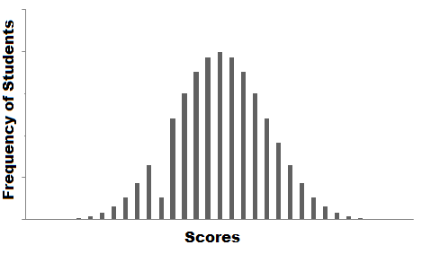

# Probablity Distribution 
## Introduction
Welcome to the world of Probability in Data Science! Let me start things off with an intuitive example.

Suppose you are a teacher at a university. After checking assignments for a week, you graded all the students. You gave these graded papers to a data entry guy in the university and tell him to create a spreadsheet containing the grades of all the students. But the guy only stores the grades and not the corresponding students.

He made another blunder, he missed a couple of entries in a hurry and we have no idea whose grades are missing. Let’s find a way to solve this.

One way is that you visualize the grades and see if you can find a trend in the data.

The graph that you have plot is called the frequency distribution of the data. You see that there is a smooth curve like structure that defines our data, but do you notice an anomaly? We have an abnormally low frequency at a particular score range. So the best guess would be to have missing values that remove the dent in the distribution.

This is how you would try to solve a real-life problem using data analysis. For any Data Scientist, a student or a practitioner, distribution is a must know concept. It provides the basis for analytics and inferential statistics.

While the concept of probability gives us the mathematical calculations, distributions help us actually visualize what’s happening underneath.

## Table of Contents
1. Common Data Types
2. Types of Distributions
 - Bernoulli Distribution
 - Uniform Distribution
 - Binomial Distribution
 - Normal Distribution
 - Poisson Distribution
 - Exponential Distribution
3. Relations between the Distributions
4. Test your Knowledge!

