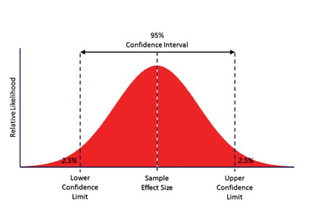
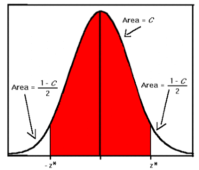

# Statistics Core

## Lets take an example
We want to improve the sales of our product through advertisements. So, let’s look at our channels of advertisement: Television, Radio, Social Media, Newspaper etc.
```markdown
So, Advertisement budget (Y) is known as Dependent Variable or response, and Television(X1), Radio(X2), Social Media(X3), Newspaper(X4) are known as Independent variable or predictors.
```

## Prediction
Relationship:- Y = f(X) + e is our real observed values.
f is the target function that best maps input variables (X) to an output variable (Y).
Our prediction of Y will depend on the accuracy of y`(y`=f`(X)), which in turn depends on 2 other quantities:- reducible error and irreducible error. In general, f` wants to be a perfect estimator of f, but reducible error exists in the form of inaccuracy. This error is reducible because we can improve the accuracy of f` by using the most appropriate statistical learning method. However, even if it were possible to form a perfect estimator for f, such that y`=f(X), our prediction would still have some error, called irreducible error. This error exists because y is also a function of e, which cannot be predicted by X. 
e is the irreducible error because it has some amount of unmeasured variability associated with it, which is useful while predicting Y. We don’t measure them, and therefore, f cannot use them for the prediction.


Our main focus should be on how to reduce the reducible error. Prediction problems are like: given the characteristics of this person, which category would you put him in? This problem is all about predicting Y when you’ve been given the X input variables.

## Inference
When we want to understand the relationship between the response(Y) and predictors(X), is known as inference. We cannot treat f` as a black box, because we want to know it’s exact form. We would like to understand the kind of relationship which exists between the predictors and response, whether it is positively or negatively correlated.
This would answer questions like: “Which media contributes to sales the most?” etc. The main gist of these problems would be how much an individual input variable(X) affects the output variable(Y).
Linear models would help us with simple and interpretable inferences, but may not yield as accurate predictions as some other statistical methods.
### Parametric Models
It is a family of distributions which can easily be defined using a finite number of parameters. In this kind of models, you know which model to fit your data.

Example:- yi=β0+β1xi+ei is a linear regression.

It is associated with a specified probability distribution that you “assume” your data follows. This kind of approach reduces the problem of estimating f down to a few sets of parameters.

Example of Parametric Models:- Linear Regression, Logistic Regression, and SVM.
The only disadvantage is that the model we choose may not match the true unknown form of f. If the chosen model is too far from true f, then our estimates from that model will be poor. 
To address this problem, we can choose some flexible models that can fit many different functional forms for f.

### Non-Parametric Models
It is based on either being distribution-free or having a specified distribution but with the distribution’s parameters unspecified. This data will tell you what the ‘regression’ should look like.
Y = f(X) + e, where f() can be any function.
The data will tell you what the function will look like. We don’t speculate any assumptions about the functional form of f we’re trying to learn before training the model. The model will be determined by the data.
Example of Parametric Models:- KNN, Decision Trees, and RBF kernel SVM.
The only disadvantage is that we need a very large number of observational data to get an accurate estimate of true f. This leads to a growth in the complexity of the model and flexibility.

## Restrictive vs. Flexible Approach
If we are interested mainly in inference, then the restrictive model is the one which we should choose. It is because of the simplicity and interpretability associated with it. 
Example: Linear Regression will help us understand the relationship between Y and X1, X2, ..Xp.
Suppose, instead of choosing a simpler, restrictive model had we chosen a complex and a flexible model like KNN. We would not be able to understand how an individual predictor is associated with a response variable.
Times when we are only interested in the predictions and not interpretability, then we should use a flexible model.
Example: predicting prices of stock.
Also, sometimes we may obtain more accurate predictions using a less flexible approach, because of overfitting in a highly flexible method.

## Supervised vs UnSupervised Learning
If the response(Y) variable is given, it goes under the supervised learning method. It is learning in which we train the machine using data which is well labelled with correct answers. 
Supervised learning is divided into two parts: regression or classification. Problems with a quantitative response are called regression problems, and problems with a qualitative response are called classification problems. Quantitative response means real values like height, prices etc. and qualitative means categorical.
Example:- Linear regression, logistic regression and KNN etc.
If the response(Y) variable is not given, it goes under the unsupervised learning method. We wish to learn the underlying structure of our data without any explicit labels being provided. 
It has Clustering, which helps us in segmentation.
Mean Squared Error


It is computed using the training data ie. used to fit the model. We should not be really interested in f`(xi) = Yi; instead we want to know whether f`(x0) is approximately equal to y0; where (x0, y0) is an unseen test observation.
As model flexibility increases, a model may yield small training MSE but might result in large test MSE because of overfitting. This happens because our statistical learning method is working too hard to find patterns in the training data, which is leading it to pick up random noise rather than true properties of the unknown function f.

Bias-Variance Tradeoff
This expected test MSE is the sum of: the variance of f`(x0), the squared bias of f`(x0), the variance of error(e).


This equation tells us to lower both the biasness and the variance. 
Variance refers to the amount by which f` changes if we estimate it using an unseen training dataset. It is the tendency to learn random things by fitting highly flexible models that learn the error/noise in the data too closely. It leads to overfitting. Since training data is fit to statistical learning method, various training datasets will result in different f`. f`should not change much, ideally. But a method with high variance will keep changing f` as the training data will change. In general, flexible methods are more prone to higher variance.
Bias is the method’s tendency to consistently learn the wrong thing by not taking into account all the information in the data. It pays very little attention to the training data and oversimplifies the model. This results in underfitting. If we approximate a very complicated problem with a very simple model, leads to bias.
Parametric or linear machine learning algorithms often have a high bias but a low variance, and non-parametric algorithms have low bias but high variance.
An ideal fit would be that captures the regularities in the dataset enough to be able to generalizable to unseen data points from the same source. Unfortunately, in practice, it is nearly impossible to do both simultaneously. Therefore, we have a trade-off in play.


## Population parameter vs. Sample Statistics

The goal of the researcher is not to draw conclusions about the sample but to draw conclusions about the population from the provided sample. Thus researchers must use statistics on the sample to infer about the values in the population. These values in the population are called parameters. Parameters are the unknown characteristics of the entire population, like the population mean and median. Sample statistics describe the characteristics of a fraction of population which, is taken as the sample. The sample mean and median is fixed and known.
### Sampling Error
Suppose, I have 3000 people who go for a morning walk in a park. I can get their average weight and population mean, which is an exact representation of the average height. In practice, calculating true mean is not viable every time. Therefore, we will take a portion of the total population of 3000, i. e., 1000. If the sample is chosen at random rather than observed, then the expected mean is similar to the true mean. However, as it is a random sample, the mean could vary from true mean. The difference between the sample mean and the true meaning is known as sampling error.
### Standard Error
It refers to the standard deviation of all the means. It shows how much the values of the mean of a bunch of samples differ from one another.
Suppose, we want to observe how much sale occurs in 3 days. By taking means of sales each day, we can get the average sales. However, there are many external factors that influence sales, like, discounts, holidays, etc. Thus, instead of taking the mean of one day, we take means of 3 days.
The Standard Error of the means now refers to the change in the mean with different observation each time.
If we measure multiple samples of a dataset, means won’t be same and will spread. SE of samples is the standard deviation of the sample means and gives us a measure of the spread.

## Confidence Interval & Confidence Level


“According to a survey, the oranges in the orchard with a 96% level of confidence weighs between (132–139 gm)”.
(132–139 gm) is the confidence interval. It is a range of values within which the true value lies. CI is used to express the range in which we are sure the population parameter lies. Whenever we want to express an estimate of a population parameter, it is a good practice to state its CI. The width of CI tells us a lot about certainty we have about the population from the collected sample. When you don’t know much about the population’s behaviour, you need to use t-distribution to find the Confidence Interval.
96% confidence level means that if the survey or polls were to be repeated with the same conditions, over and over again, the results of the survey would match the results from the actual population 96% of the time.
Two things which affect CI is Variation and Sample Size:-
#### Variation:
If all the values in the population were similar, then the sample would have little variation. Every sample of the population would be similar to each other.
##### Low Variation causing Similar Samples causing Narrow CI
##### High Variation causing Varied Samples causing Wider CI
Sample Size: If we take small samples, we don’t have any findings to base our inference upon. Small samples will differ from one another, and have less detail, leading to wider CI
Large sample size causing more details causing Narrow CI
Small sample size causing fewer details causing Wider CI
#### Margin of Error
Surveys are based on facts collected from a sample, not the entire population. Some amount of error is bound to occur as we have to infer real statistics based on samples, like sampling error, which occurs because everyone isn’t taken into account. The margin of error is supposed to measure the maximum amount by which the sample results are expected to differ from those of the actual population. It measures accuracy, not the amount of bias.
margin of error = critical value * standard error
```markdown
Example: We know 49% will vote for Mrs Dix in the elections, with a margin of confidence +/-2. This means I am confident that between 47%(49%-2%) and 51%(49%+2%) of the population will vote for her.
```
### Hypothesis Test
The main purpose is to test the results of surveys and polls to check if the results were meaningful and repeatable and not random. It is whether we can accept or reject a claim using statistics. It examines two claims about the population. Example: The drug for a headache will not be effective, or will the height of female and male students differ? Generally, the statement is in the form of “If (do this to an independent variable), then(this will happen to the dependent variable)”.
Null and Alternative Hypothesis

The null hypothesis (H0), is usually the hypothesis that sample observations result purely from chance. It is the fact that is commonly known. Researchers work to reject it. The idea is that there is no relationship and whatever is being reflected in the result of sampling error. It proposes that no statistical significance exists in a set of given observations. The power of analytics or statistical procedure is its ability to show that the null hypothesis H0 is false when it actually is false.
The alternative hypothesis (H1 or Ha), is the hypothesis that sample observations are influenced by some non-random cause. The idea is that the relationship in the sample reflects the relationship in the population. Example: 

H0: Earth is flat. There exists a relationship between the population and Ha.
Alternate Hypothesis: Earth is round


#### Type I and Type II Error
**Type I Error means rejecting the True null hypothesis and accepting the alternate hypothesis. It is a false positive. A smoke detector detecting smoke when there is no smoke.
Type II Error means accepting the null hypothesis when an alternate hypothesis is true. It is a false negative. When fire alarm fails to detect fire.**

Alpha and Beta Level


z indicates the alpha level in a two-tailed test
Alpha level is also known as the significance level, α. It is the probability of making the wrong decision,i.e., rejecting the null hypothesis when it is true. Low alpha levels mean that we need strong evidence to be able to reject the null hypothesis. This means that alpha level of 1% requires more statistical evidence than 5%.
Why is 5% used as significance level so commonly?
The smaller the alpha level, the little is the chance to reject True Null hypothesis. And, also the smaller is the chance to reject the False null hypothesis, because of the tiny area. The more you try to avoid Type I Error, the more you are likely to make a Type II Error.

A confidence level is 1- α, which means accepting the null hypothesis when it is True.
Beta level means the probability of making a Type II Error, i.e., rejecting the Alternate hypothesis when it is True.

#### P-Value
It is used by all the hypothesis testing to check the strength of the evidence provided by the population in form of data. It is the evidence against the null hypothesis. The value is between 0 and 1:
A small p-value ( ≤ 0.05) indicates strong evidence against the null hypothesis, so you reject the null hypothesis. It means that the sample results aren’t consistent with the null hypothesis that is true.
A large p-value (> 0.05) indicates weak evidence against the null hypothesis, therefore you fail to reject the null hypothesis. It means that the sample results are consistent with a null hypothesis that is true.
If the p-value is less than or equal to the alpha level, we reject the null hypothesis.


### Skewness
It is the degree of distortion from the symmetrical bell curve or the normal distribution. It measures the lack of symmetry in data distribution.
It differentiates extreme values in one versus the other tail. A symmetrical distribution will have a skewness of 0.
There are two types of Skewness: Positive and Negative

**Positive Skewness means when the tail on the right side of the distribution is longer or fatter. The mean and median will be greater than the mode.
Negative Skewness is when the tail of the left side of the distribution is longer or fatter than the tail on the right side. The mean and median will be less than the mode.**

```markdown
So, when is the skewness too much?
The rule of thumb seems to be:
If the skewness is between -0.5 and 0.5, the data are fairly symmetrical.
If the skewness is between -1 and -0.5(negatively skewed) or between 0.5 and 1(positively skewed), the data are moderately skewed.
If the skewness is less than -1(negatively skewed) or greater than 1(positively skewed), the data are highly skewed.


Example
Let us take a very common example of house prices. Suppose we have house values ranging from $100k to $1,000,000 with the average being $500,000.
If the peak of the distribution was left of the average value, portraying a positive skewness in the distribution. It would mean that many houses were being sold for less than the average value, i.e. $500k. This could be for many reasons, but we are not going to interpret those reasons here.
If the peak of the distributed data was right of the average value, that would mean a negative skew. This would mean that the houses were being sold for more than the average value.

```

### Kurtosis
Kurtosis is all about the tails of the distribution — not the peakedness or flatness. It is used to describe the extreme values in one versus the other tail. It is actually the measure of outliers present in the distribution.
High kurtosis in a data set is an indicator that data has heavy tails or outliers. If there is a high kurtosis, then, we need to investigate why do we have so many outliers. It indicates a lot of things, maybe wrong data entry or other things. Investigate!
Low kurtosis in a data set is an indicator that data has light tails or lack of outliers. If we get low kurtosis(too good to be true), then also we need to investigate and trim the dataset of unwanted results.


* Mesokurtic: This distribution has kurtosis statistic similar to that of the normal distribution. It means that the extreme values of the distribution are similar to that of a normal distribution characteristic. This definition is used so that the standard normal distribution has a kurtosis of three.

* Leptokurtic (Kurtosis > 3): Distribution is longer, tails are fatter. Peak is higher and sharper than Mesokurtic, which means that data are heavy-tailed or profusion of outliers. 
Outliers stretch the horizontal axis of the histogram graph, which makes the bulk of the data appear in a narrow (“skinny”) vertical range, thereby giving the “skinniness” of a leptokurtic distribution.

* Platykurtic: (Kurtosis < 3): Distribution is shorter, tails are thinner than the normal distribution. The peak is lower and broader than Mesokurtic, which means that data are light-tailed or lack of outliers.
The reason for this is because the extreme values are less than that of the normal distribution.
