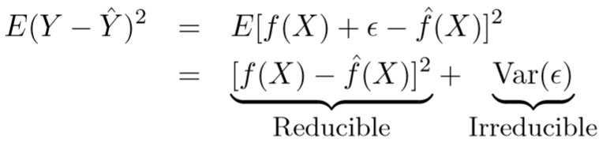
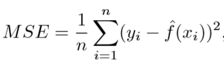
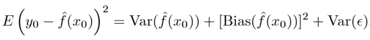

# Statistics Core

## Lets take an example
We want to improve the sales of our product through advertisements. So, let’s look at our channels of advertisement: Television, Radio, Social Media, Newspaper etc.
```markdown
So, Advertisement budget (Y) is known as Dependent Variable or response, and Television(X1), Radio(X2), Social Media(X3), Newspaper(X4) are known as Independent variable or predictors.
```

## Prediction
Relationship:- Y = f(X) + e is our real observed values.
f is the target function that best maps input variables (X) to an output variable (Y).
Our prediction of Y will depend on the accuracy of y`(y`=f`(X)), which in turn depends on 2 other quantities:- reducible error and irreducible error. In general, f` wants to be a perfect estimator of f, but reducible error exists in the form of inaccuracy. This error is reducible because we can improve the accuracy of f` by using the most appropriate statistical learning method. However, even if it were possible to form a perfect estimator for f, such that y`=f(X), our prediction would still have some error, called irreducible error. This error exists because y is also a function of e, which cannot be predicted by X. 
e is the irreducible error because it has some amount of unmeasured variability associated with it, which is useful while predicting Y. We don’t measure them, and therefore, f cannot use them for the prediction.


Our main focus should be on how to reduce the reducible error. Prediction problems are like: given the characteristics of this person, which category would you put him in? This problem is all about predicting Y when you’ve been given the X input variables.

## Inference
When we want to understand the relationship between the response(Y) and predictors(X), is known as inference. We cannot treat f` as a black box, because we want to know it’s exact form. We would like to understand the kind of relationship which exists between the predictors and response, whether it is positively or negatively correlated.
This would answer questions like: “Which media contributes to sales the most?” etc. The main gist of these problems would be how much an individual input variable(X) affects the output variable(Y).
Linear models would help us with simple and interpretable inferences, but may not yield as accurate predictions as some other statistical methods.
### Parametric Models
It is a family of distributions which can easily be defined using a finite number of parameters. In this kind of models, you know which model to fit your data.

Example:- yi=β0+β1xi+ei is a linear regression.

It is associated with a specified probability distribution that you “assume” your data follows. This kind of approach reduces the problem of estimating f down to a few sets of parameters.

Example of Parametric Models:- Linear Regression, Logistic Regression, and SVM.
The only disadvantage is that the model we choose may not match the true unknown form of f. If the chosen model is too far from true f, then our estimates from that model will be poor. 
To address this problem, we can choose some flexible models that can fit many different functional forms for f.

### Non-Parametric Models
It is based on either being distribution-free or having a specified distribution but with the distribution’s parameters unspecified. This data will tell you what the ‘regression’ should look like.
Y = f(X) + e, where f() can be any function.
The data will tell you what the function will look like. We don’t speculate any assumptions about the functional form of f we’re trying to learn before training the model. The model will be determined by the data.
Example of Parametric Models:- KNN, Decision Trees, and RBF kernel SVM.
The only disadvantage is that we need a very large number of observational data to get an accurate estimate of true f. This leads to a growth in the complexity of the model and flexibility.

## Restrictive vs. Flexible Approach
If we are interested mainly in inference, then the restrictive model is the one which we should choose. It is because of the simplicity and interpretability associated with it. 
Example: Linear Regression will help us understand the relationship between Y and X1, X2, ..Xp.
Suppose, instead of choosing a simpler, restrictive model had we chosen a complex and a flexible model like KNN. We would not be able to understand how an individual predictor is associated with a response variable.
Times when we are only interested in the predictions and not interpretability, then we should use a flexible model.
Example: predicting prices of stock.
Also, sometimes we may obtain more accurate predictions using a less flexible approach, because of overfitting in a highly flexible method.

## Supervised vs UnSupervised Learning
If the response(Y) variable is given, it goes under the supervised learning method. It is learning in which we train the machine using data which is well labelled with correct answers. 
Supervised learning is divided into two parts: regression or classification. Problems with a quantitative response are called regression problems, and problems with a qualitative response are called classification problems. Quantitative response means real values like height, prices etc. and qualitative means categorical.
Example:- Linear regression, logistic regression and KNN etc.
If the response(Y) variable is not given, it goes under the unsupervised learning method. We wish to learn the underlying structure of our data without any explicit labels being provided. 
It has Clustering, which helps us in segmentation.
Mean Squared Error




It is computed using the training data ie. used to fit the model. We should not be really interested in f`(xi) = Yi; instead we want to know whether f`(x0) is approximately equal to y0; where (x0, y0) is an unseen test observation.
As model flexibility increases, a model may yield small training MSE but might result in large test MSE because of overfitting. This happens because our statistical learning method is working too hard to find patterns in the training data, which is leading it to pick up random noise rather than true properties of the unknown function f.

Bias-Variance Tradeoff
This expected test MSE is the sum of: the variance of f`(x0), the squared bias of f`(x0), the variance of error(e).


This equation tells us to lower both the biasness and the variance. 
Variance refers to the amount by which f` changes if we estimate it using an unseen training dataset. It is the tendency to learn random things by fitting highly flexible models that learn the error/noise in the data too closely. It leads to overfitting. Since training data is fit to statistical learning method, various training datasets will result in different f`. f`should not change much, ideally. But a method with high variance will keep changing f` as the training data will change. In general, flexible methods are more prone to higher variance.
Bias is the method’s tendency to consistently learn the wrong thing by not taking into account all the information in the data. It pays very little attention to the training data and oversimplifies the model. This results in underfitting. If we approximate a very complicated problem with a very simple model, leads to bias.
Parametric or linear machine learning algorithms often have a high bias but a low variance, and non-parametric algorithms have low bias but high variance.
An ideal fit would be that captures the regularities in the dataset enough to be able to generalizable to unseen data points from the same source. Unfortunately, in practice, it is nearly impossible to do both simultaneously. Therefore, we have a trade-off in play.


