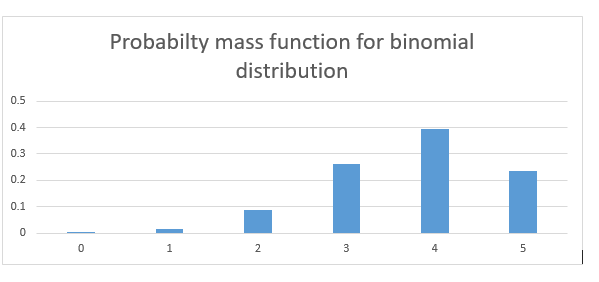
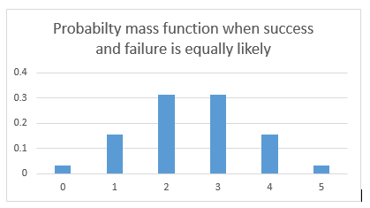
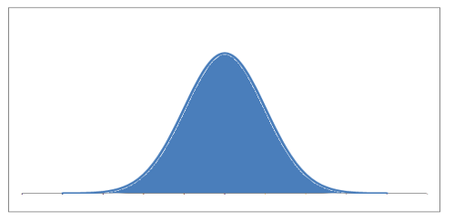

# Statistics
Statistically, the probability of any one of us being here is so small that you’d think the mere fact of existing would keep us all in a contented dazzlement of surprise

## Table of Contents](#)
* [What is Probability?](#WhatisProbability)
* [Random Variables](#RandomVariables)
* [Calculating Probability](#CalculatingProbability)
* [Binomial Distribution](#BinomialDistribution)
* [Continuous Random variable](#ContinuousRandomvariable)
* [Central Limit Theorem](#CentralLimitTheorem)
* [Area under a Normal Distribution](#AreaunderaNormalDistribution)
* [Z scores](#Zscores)
* [Open Challenges](#OpenChallenges)

## What is Probability? 
Simply put, probability is an intuitive concept. We use it on a daily basis without necessarily realising that we are speaking and applying probability to work.

Life is full of uncertainties. We don’t know the outcomes of a particular situation until it happens. Will it rain today? Will I pass the next math test? Will my favorite team win the toss? Will I get a promotion in next 6 months? All these questions are examples of uncertain situations we live in. Let us map them to few common terminology which we will use going forward.

Experiment – are the uncertain situations, which could have multiple outcomes. Whether it rains on a daily basis is an experiment.
Outcome is the result of a single trial. So, if it rains today, the outcome of today’s trial from the experiment is “It rained”
Event is one or more outcome from an experiment. “It rained” is one of the possible event for this experiment.
Probability is a measure of how likely an event is. So, if it is 60% chance that it will rain tomorrow, the probability of Outcome “it rained” for tomorrow is 0.6

### Why do we need probability?
In an uncertain world, it can be of immense help to know and understand chances of various events. You can plan things accordingly. If it’s likely to rain, I would carry my umbrella. If I am likely to have diabetes on the basis of my food habits, I would get myself tested. If my customer is unlikely to pay me a renewal premium without a reminder, I would remind him about it.

So knowing the likelihood might be very beneficial.

## Random Variables 
To calculate the likelihood of occurence of an event, we need to put a framework to express the outcome in numbers. We can do this by mapping the outcome of an experiment to numbers.

Let’s define X to be the outcome of a coin toss.

X = outcome of a coin toss

Possible Outcomes:

1 if heads
0 if tails
Let’s take another one.

Suppose, I win the game if I get a sum of 8 while rolling two fair dice. I can define my random variable Y to be (the sum of the upward face of two fair dice )

Y can take values = (2, 3, 4, 5, 6, 7, 8, 9, 10, 11, 12)

A few things to note about random variables:

Each value of the random variable may or may not be equally likely. There is only 1 combination of dice, with sum 2{(1,1)}, while a sum of 5 can be achieved by {(1,4), (2,3), (3,2), (4,1)}. So, 5 is more likely to occur as compared to 2. On the contrary, the likelihood of a head or a tail in a coin toss is equal and 50-50.
Sometimes, the random variables can only take fixed values, or values only in a certain interval. For example in a dice, the top face will only show values between 1 and 6. It cannot take a 2.25 or a 1.5. Similarly, when a coin is flipped, it can only show heads and tails and nothing else. On the other hand, if I define my random variable to be the amount of sugar in orange. It can take any value like 1.4g, 1.45g, 1.456g, 1.4568g as so on. All these values are possible and all infinite values between them are also possible. So, in this case, the random variable is continuous with a possibility of all real numbers.
Don’t think random variable as a traditional variable (even though both are called variables) like y=x+2, where the value of y is dependent on x. Random variable is defined in terms of the outcome of a process. We quantify the process using the random variable

## Calculating Probability 
Let’s say you went to a fair. There is a stall playing the game of spinning wheel. There are two colors evenly spread on the wheel – red and green. If you land on red, you lose, if you land on green you win.

So what happens when you spin the wheel? You either win or you lose? There is no third outcome in this case. If the wheel is fair, there is a 50% chance of winning and 50% chance of losing.

Next, suppose the organizer decides to increase the prize money and reduce the green area. Now only ¼th area is green and ¾th is red.

How likely are you to win now?

Only 25%! This 25% or .25 is the probability of winning.

Two throws of a dice
The next stall is our favorite dice stall, where we win if we get a sum of 8 in two throws. Let’s see if we have more chances to win here.

Let’s take random variable X to be the sum of two throws. X can take values (2, 3, 4, 5, 6, 7, 8, 9, 10, 11, 12). Let’s see the probability of each number.

Let’s see the probability of each number.

There are 6 possibilities in the first throw (we can get any number) and same 6 in the second. So total number if combinations would be 36.

Let’s see how:

2{(1,1)}  => 1/36

3{(1,2),(2,1)} => 2/36

4{(2,2),(3,1),(1,3)} => 3/36

5{(1,4),(4,1),(2,3),(3,2)} => 4/36

6{(3,3),(1,5),(5,1),(2,4),(4,2)} => 5/36

7{(1,6),(6,1),(2,5),(5,2),(3,4),(4,3)} => 6/36

8{(2,6),(6,2),(3,5),(5,3),(4,4)} => 5/36

9{(3,6),(6,3),(5,4),(4,5)} => 4/36

10{(4,6),(6,4),(5,5)} => 3/36

11{(5,6),(6,5)} => 2/36

12{(6,6)} = > 1/36

So, the chance of success here is 5/36 or approximately 1 in 7, while failure is 31/36. So, unless the stall rewards me 7x of the money I bet on winning, it is a bad game to participate in.

We can write this as:

p (Success)= 5/36
p (Failure)= 31/36
You can also see that the total probability is 1. There are only these 2 possibilities.

Let’s see how these probabilities look like. The probability function for a discrete random variable is the probability mass function. It shows the exact probabilities for a particular value of the random variable.

Here is an important thing to note, a sum of 2.5 is not possible on the throw of two dice. So essentially, my random variable is discrete. There are only fixed integer values that it can take and we can see the probabilities of each occurring.

## Binomial Distribution 
Most of the times, the situations we encounter are pass-fail type. The democrats either win or lose the election. I either get a heads or tails on the coin toss. You either win or lose your football game (assuming that there is always a forced outcome). So there are only two outcomes – win and lose or success and failure. The likelihood of the two may or may not be the same.

Let us understand this through an interesting example.

Let’s say your football team is playing a series of 5 games against your opponent. Who ever wins more games (out of 5) wins the title.

Let us say, your team might is more skilled and has 75% chances of winning. So, there is a 25% chance of losing it.

What is the probability of you winning the series? Is it 75% or is it something else?

Let us find out. What are the possible scenarios in playing 5 games?

WWWWW, WWWWL, WWWLL, WWLLL, WLLLL, LLLLL, LWWWW and so on….

So for the first game, there are two possibilities, you either win or lose, again for the second game we have two possibilities. Assuming that the first game has no effect on the outcome of the second – No one gets tired, no one gets under pressure after losing etc.

So let’s define our random variable X to be a number of wins in 5 games. Remember probability of winning is 0.75 and losing is 0.25. Assume that a tie doesn’t happen.

X=Number of wins in 5 games

So the first game has 2 outcomes – win and lose, second again has 2 and so on.

So total possibilities is 2*2*2*2*2 = 32

P (X=0) denotes the probability that you lose all the games and there is only one way that can happen i.e. {LLLLL} = 0.25*0.25*0.25*0.25*0.25 (multiplying the probabilities of losing the each time, lost first time and second time and third time and so on..)
P(X=1) denotes the probability that you win only 1 game i.e.(WLLLL or LWLLL or LLWLL or LLLWL or LLLLW). So there are 5 cases where you win 1 game = 5*0.75*0.25*0.25*0.25*0.25=0.0146
While we can count each of these possible outcomes, it becomes very exhaustive and intensive exercise. Let us take help of combinatorics here. Choose 2 wins out of 5 games = 5C2 ()

so, the Probability for getting k successes in n Bernoulli trails is given by:

P(X=k) = nCk pk qn-k  ,  here p is the probability of success and q is the probability of failure

Let’s see how this comes.

P(X=2) denotes the probability that you win 2 games. So there are 5C2() = 10 cases where you win 2 games. Hence probability = 10*0.75*0.75*0.25*0.25*0.25=0.088
P(X=3) denotes the probability that you win 3 games. So, there are 5C3() =10 cases where you win 3 games. Hence probability = 10*0.75*0.75*0.75*0.25*0.25=0.264
Similarly,  P(X=4) = 0.395
P(X=5) = 0.237
What we just calculated were discrete probabilities for a Binomial distribution. If we look at these probabilities we get something like:
As you can see the probability of winning the series is much higher than 0.75.

The general definition of a binomial distribution is the discrete probability distribution of the number of success in a sequence of n independent Bernoulli trials (having only yes/no or true/false outcomes).

If the events are equally likely to occur i.e. p = q = 0.5, the probability distribution looks something like the graph below. Here the probability of success and failure is the same.

What difference do we see in the two probability distributions?  The first one is skewed towards right. Reason being the likelihood to win is more, hence more wins are more likely than more losses.

In the second case when wins and losses are equally likely, so the distribution is symmetrical.

 

Let’s assume that probability of winning and losing is equal. p=q=0.5

Now, What if I increase my number of trials? What if I play 20 games of football with a probability of winning and losing to be 50-50? There are a lot more possibilities and combinations. The bars get thinner and thinner.

The bars get thinner and thinner.

What if I play an infinite number of times with equal probability for winning and losing?

The bars get infinitely small and the probability distribution looks something like a continuous set of bars which are very close, almost continuous. This now becomes a probability density function. Notice that this now becomes a continuous function.

Let’s point out some interesting things that happened.

The probabilities are high for the mean values of the random variables. When we were playing 5 football games, the random variable (X = the wins) could take values between 0 – 5. The mean value being 2.5. The probability is highest for 2 and 3. When we move towards the continuous curve, the probability is highest for the exact mean
The probabilities are low as we move away from the mean.
 

## Continuous Random variable 
## Central Limit Theorem 
## Area under a Normal Distribution 
## Z scores 
## Open Challenges 

