# Statistics
Statistically, the probability of any one of us being here is so small that you’d think the mere fact of existing would keep us all in a contented dazzlement of surprise

## Table of Contents](#)
* [What is Probability?](#WhatisProbability)
* [Random Variables](#RandomVariables)
* [Calculating Probability](#CalculatingProbability)
* [Binomial Distribution](#BinomialDistribution)
* [Continuous Random variable](#ContinuousRandomvariable)
* [Central Limit Theorem](#CentralLimitTheorem)
* [Area under a Normal Distribution](#AreaunderaNormalDistribution)
* [Z scores](#Zscores)
* [Open Challenges](#OpenChallenges)

## What is Probability? 
Simply put, probability is an intuitive concept. We use it on a daily basis without necessarily realising that we are speaking and applying probability to work.

Life is full of uncertainties. We don’t know the outcomes of a particular situation until it happens. Will it rain today? Will I pass the next math test? Will my favorite team win the toss? Will I get a promotion in next 6 months? All these questions are examples of uncertain situations we live in. Let us map them to few common terminology which we will use going forward.

Experiment – are the uncertain situations, which could have multiple outcomes. Whether it rains on a daily basis is an experiment.
Outcome is the result of a single trial. So, if it rains today, the outcome of today’s trial from the experiment is “It rained”
Event is one or more outcome from an experiment. “It rained” is one of the possible event for this experiment.
Probability is a measure of how likely an event is. So, if it is 60% chance that it will rain tomorrow, the probability of Outcome “it rained” for tomorrow is 0.6

### Why do we need probability?
In an uncertain world, it can be of immense help to know and understand chances of various events. You can plan things accordingly. If it’s likely to rain, I would carry my umbrella. If I am likely to have diabetes on the basis of my food habits, I would get myself tested. If my customer is unlikely to pay me a renewal premium without a reminder, I would remind him about it.

So knowing the likelihood might be very beneficial.

## Random Variables 
To calculate the likelihood of occurence of an event, we need to put a framework to express the outcome in numbers. We can do this by mapping the outcome of an experiment to numbers.

Let’s define X to be the outcome of a coin toss.

X = outcome of a coin toss

Possible Outcomes:

1 if heads
0 if tails
Let’s take another one.

Suppose, I win the game if I get a sum of 8 while rolling two fair dice. I can define my random variable Y to be (the sum of the upward face of two fair dice )

Y can take values = (2, 3, 4, 5, 6, 7, 8, 9, 10, 11, 12)

A few things to note about random variables:

Each value of the random variable may or may not be equally likely. There is only 1 combination of dice, with sum 2{(1,1)}, while a sum of 5 can be achieved by {(1,4), (2,3), (3,2), (4,1)}. So, 5 is more likely to occur as compared to 2. On the contrary, the likelihood of a head or a tail in a coin toss is equal and 50-50.
Sometimes, the random variables can only take fixed values, or values only in a certain interval. For example in a dice, the top face will only show values between 1 and 6. It cannot take a 2.25 or a 1.5. Similarly, when a coin is flipped, it can only show heads and tails and nothing else. On the other hand, if I define my random variable to be the amount of sugar in orange. It can take any value like 1.4g, 1.45g, 1.456g, 1.4568g as so on. All these values are possible and all infinite values between them are also possible. So, in this case, the random variable is continuous with a possibility of all real numbers.
Don’t think random variable as a traditional variable (even though both are called variables) like y=x+2, where the value of y is dependent on x. Random variable is defined in terms of the outcome of a process. We quantify the process using the random variable

## Calculating Probability 
Let’s say you went to a fair. There is a stall playing the game of spinning wheel. There are two colors evenly spread on the wheel – red and green. If you land on red, you lose, if you land on green you win.

So what happens when you spin the wheel? You either win or you lose? There is no third outcome in this case. If the wheel is fair, there is a 50% chance of winning and 50% chance of losing.

Next, suppose the organizer decides to increase the prize money and reduce the green area. Now only ¼th area is green and ¾th is red.

How likely are you to win now?

Only 25%! This 25% or .25 is the probability of winning.

Two throws of a dice
The next stall is our favorite dice stall, where we win if we get a sum of 8 in two throws. Let’s see if we have more chances to win here.

Let’s take random variable X to be the sum of two throws. X can take values (2, 3, 4, 5, 6, 7, 8, 9, 10, 11, 12). Let’s see the probability of each number.

Let’s see the probability of each number.

There are 6 possibilities in the first throw (we can get any number) and same 6 in the second. So total number if combinations would be 36.

Let’s see how:

2{(1,1)}  => 1/36

3{(1,2),(2,1)} => 2/36

4{(2,2),(3,1),(1,3)} => 3/36

5{(1,4),(4,1),(2,3),(3,2)} => 4/36

6{(3,3),(1,5),(5,1),(2,4),(4,2)} => 5/36

7{(1,6),(6,1),(2,5),(5,2),(3,4),(4,3)} => 6/36

8{(2,6),(6,2),(3,5),(5,3),(4,4)} => 5/36

9{(3,6),(6,3),(5,4),(4,5)} => 4/36

10{(4,6),(6,4),(5,5)} => 3/36

11{(5,6),(6,5)} => 2/36

12{(6,6)} = > 1/36

So, the chance of success here is 5/36 or approximately 1 in 7, while failure is 31/36. So, unless the stall rewards me 7x of the money I bet on winning, it is a bad game to participate in.

We can write this as:

p (Success)= 5/36
p (Failure)= 31/36
You can also see that the total probability is 1. There are only these 2 possibilities.

Let’s see how these probabilities look like. The probability function for a discrete random variable is the probability mass function. It shows the exact probabilities for a particular value of the random variable.

Here is an important thing to note, a sum of 2.5 is not possible on the throw of two dice. So essentially, my random variable is discrete. There are only fixed integer values that it can take and we can see the probabilities of each occurring.

## Binomial Distribution 
Most of the times, the situations we encounter are pass-fail type. The democrats either win or lose the election. I either get a heads or tails on the coin toss. You either win or lose your football game (assuming that there is always a forced outcome). So there are only two outcomes – win and lose or success and failure. The likelihood of the two may or may not be the same.

Let us understand this through an interesting example.

Let’s say your football team is playing a series of 5 games against your opponent. Who ever wins more games (out of 5) wins the title.

Let us say, your team might is more skilled and has 75% chances of winning. So, there is a 25% chance of losing it.

What is the probability of you winning the series? Is it 75% or is it something else?

Let us find out. What are the possible scenarios in playing 5 games?

WWWWW, WWWWL, WWWLL, WWLLL, WLLLL, LLLLL, LWWWW and so on….

So for the first game, there are two possibilities, you either win or lose, again for the second game we have two possibilities. Assuming that the first game has no effect on the outcome of the second – No one gets tired, no one gets under pressure after losing etc.

So let’s define our random variable X to be a number of wins in 5 games. Remember probability of winning is 0.75 and losing is 0.25. Assume that a tie doesn’t happen.

X=Number of wins in 5 games

So the first game has 2 outcomes – win and lose, second again has 2 and so on.

So total possibilities is 2*2*2*2*2 = 32

P (X=0) denotes the probability that you lose all the games and there is only one way that can happen i.e. {LLLLL} = 0.25*0.25*0.25*0.25*0.25 (multiplying the probabilities of losing the each time, lost first time and second time and third time and so on..)
P(X=1) denotes the probability that you win only 1 game i.e.(WLLLL or LWLLL or LLWLL or LLLWL or LLLLW). So there are 5 cases where you win 1 game = 5*0.75*0.25*0.25*0.25*0.25=0.0146
While we can count each of these possible outcomes, it becomes very exhaustive and intensive exercise. Let us take help of combinatorics here. Choose 2 wins out of 5 games = 5C2 ()

so, the Probability for getting k successes in n Bernoulli trails is given by:

P(X=k) = nCk pk qn-k  ,  here p is the probability of success and q is the probability of failure

Let’s see how this comes.

P(X=2) denotes the probability that you win 2 games. So there are 5C2() = 10 cases where you win 2 games. Hence probability = 10*0.75*0.75*0.25*0.25*0.25=0.088
P(X=3) denotes the probability that you win 3 games. So, there are 5C3() =10 cases where you win 3 games. Hence probability = 10*0.75*0.75*0.75*0.25*0.25=0.264
Similarly,  P(X=4) = 0.395
P(X=5) = 0.237
What we just calculated were discrete probabilities for a Binomial distribution. If we look at these probabilities we get something like:
As you can see the probability of winning the series is much higher than 0.75.

The general definition of a binomial distribution is the discrete probability distribution of the number of success in a sequence of n independent Bernoulli trials (having only yes/no or true/false outcomes).

If the events are equally likely to occur i.e. p = q = 0.5, the probability distribution looks something like the graph below. Here the probability of success and failure is the same.

What difference do we see in the two probability distributions?  The first one is skewed towards right. Reason being the likelihood to win is more, hence more wins are more likely than more losses.

In the second case when wins and losses are equally likely, so the distribution is symmetrical.

 

Let’s assume that probability of winning and losing is equal. p=q=0.5

Now, What if I increase my number of trials? What if I play 20 games of football with a probability of winning and losing to be 50-50? There are a lot more possibilities and combinations. The bars get thinner and thinner.

The bars get thinner and thinner.

What if I play an infinite number of times with equal probability for winning and losing?

The bars get infinitely small and the probability distribution looks something like a continuous set of bars which are very close, almost continuous. This now becomes a probability density function. Notice that this now becomes a continuous function.

Let’s point out some interesting things that happened.

The probabilities are high for the mean values of the random variables. When we were playing 5 football games, the random variable (X = the wins) could take values between 0 – 5. The mean value being 2.5. The probability is highest for 2 and 3. When we move towards the continuous curve, the probability is highest for the exact mean
The probabilities are low as we move away from the mean.
 

## Continuous Random variable 

Let’s see some cases where the random variables are continuous. Let’s say the weatherman is trying to measure the amount of rainfall that will happen tomorrow.

Let’s say the rainfall likely to happen is around 2 cm. But will it be exactly 2 cm? It can be 2.001 or 2.000001 or 2.000000001 and an infinite number of values in between. It’s even impossible for us to measure if it’s exactly 2 cm.

So, we calculate the probability of it, being in a range. We calculate the probability of rainfall being in the range of 2 cm to 2.01 cm. It will be the sum of probabilities for all values between 2 and 2.01. The area under the probability density function with limits 2 and 2.01 will give us that.
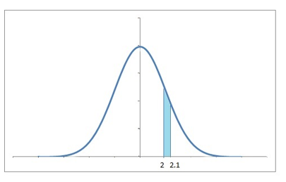

The probability density function may or may not be symmetrical.

Life of an insect
Suppose there is an insect whose lifespan ranges from 0 to 16 days. We’re looking for the probability that it will die in around 5 to 6 days. Again we would need the sum of probabilities for all values between 5 days and 6 days.

We look at the probability density function and find the area of the graph under the limits of 5 and 6. We can use definite integration under the desired limits for the probability density to find the area. We’re often interested in the probability of a range of values rather than the probability of an exact value.

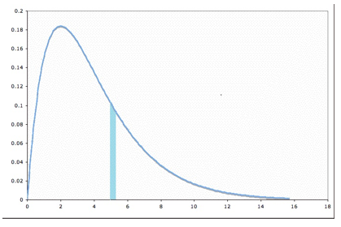

We can now imagine that the probability at a particular point would be the area of the thinnest possible bar we can imagine. To calculate the probability at x, we would need the area from x to x+Δ, where Δ is very very small.

The total probability density function would then be the collection of all such areas / probabilities.

The formula of the probability density function can be written as:

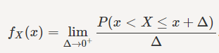

For a point x, Δ is the small value right after the point x.  We try to calculate the probability from x to x+ Δ, with limit if Δ tends to 0.

## Central Limit Theorem 
So when you have huge amount of data, you can be confused how to make sense of it. It is difficult to know what’s happening underneath it. To tackle this problem, what we do is take a small chunk of data & look at it. But we won’t be satisfied with just a single chunk. We’d try to look at multiple chunks to be sure of results.

Let’s say we have the cholesterol levels of all the people in India, we can look at the mean, median and mode of the data.  Maybe plot a histogram with sensible ranges and look at the data. Let’s assume this is how the data looks like. The mean of this data is 153.2

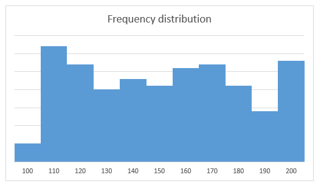

But this huge amount of data is really tough to process. To process it, we take the data of some 50 people and calculate their mean.

We again take a sample of some 50 people and calculate the mean and we keep doing that for quite a number of times. We now plot the means of these samples.
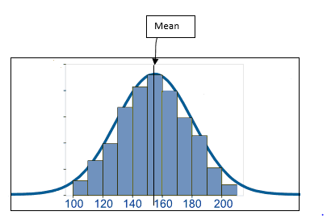

We see that these sample means form a frequency distribution which looks very symmetrical. The frequency around the mean of the actual data is the highest and gradually reduces as we move away from the mean on the either side.

So when we take means of cholesterol levels of 50 people, again and again, we observe the mean values are around 150-160. Only a few mean values is more than 170 and less than 140. There are very, very few over 190 or less than 110.

We can easily convert the frequencies to see probabilities. If we divide the frequency of a bin (range like 110 to 120) by the total number of data points, we get the probabilities of each bin. So, now the frequency distribution becomes a probability distribution of the same shape. The probability distribution approaches more and more towards

The probability distribution approaches more and more towards symmetry, when the sample size that we use to create those means, is very large. As the sample size approaches infinity, the probability distribution becomes a perfectly symmetrical where the center of the curve is the mean of the population. The curve is known as normal distribution.
## Area under a Normal Distribution 
What is a normal distribution?
The normal distribution informally called as a bell curve looks like this:

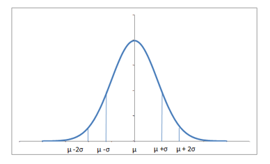

The equation of the normal distribution happens to be:

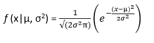

Here µ is the mean of the data while σ is the standard deviation of the data.

The normal distribution is perfectly symmetrical about the mean. The probabilities move similarly in both directions around the mean. The total area under the curve is 1, since summing up all the possible probabilities would give 1.

The distribution might vary a bit depending upon how spread the data is. If the data has a very high range and standard deviation, the normally distributed curve would be spread out and flatter, since a large number of values would be sufficiently away from the mean.

Also, if a lot of values are away from the mean, the probability for data being around the mean also drops. Similarly, if the standard deviation is low, which means most of the values are near around the mean, there is high probability of the sample mean being around the mean and the distribution is a lot skinnier. The higher the standard deviation, the thicker and flatter the curve.

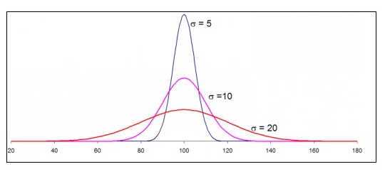

Let’s summarise the main points we saw:

Area under a probability density function gives the probability for the random variable to be in that range.
If I have a population data and I take random samples of equal size from the data, the sample means are approximately normally distributed
There is large probability for the means to be around the actual mean of the data, than to be farther away
Normal distributions for higher standard deviations are flatter as compared to those for lower standard deviations
 

7. Area Under the Normal Distribution
Now, let’s say I have a dataset of cholesterol levels of a number of patients and we need to calculate the probability of how many patients are healthy.

The mean value (µ) for cholesterol of all the patients is equal to 150 and standard deviation (σ) is equal to 15. The probability density function is a normal distribution given by the above equation.

We need to calculate the probability of cholesterol levels to be between 135 (150-15) and 165 (150+15) – the healthy cholesterol range.

Can you see that the healthy patients that we are talking about are one standard deviation on either side of the mean? This means we need to calculate the area under the curve with 135 and 165 as limits. Don’t worry, this area for normal distribution is already calculated for us and is ~68%.

So always for a normally distributed data, around 68% of the data falls within 1 standard deviation of the mean. So probability of the data being within 1 standard deviation if the mean = 0.68

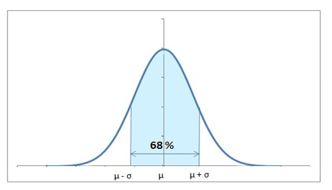

Let’s also calculate the probability of being 2 standard deviations away from the mean. Let’s say we need to warn the patients who are two standard deviations away.

This means 150+30 and 150-30.

The range of area to be calculated now is 120 to 180.

To your surprise, 95% of the values fall in this range.

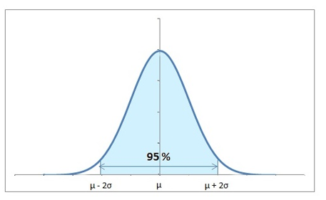

So the major chunk of the data falls within 2 standard deviations of the mean. So, we can safely say, that for the data to be more than 2 standard deviations away from the mean is highly unlikely – only 5% likely.

So, 95% of the patients have their cholesterol levels between 120 and 180. And the remaining 5% are really critical and different from the average values.
## Z scores 
We will encounter a lot of cases, where we would need to know the probability for the data to be less than or more than a particular value. This value will not be equal to 1σ or 2σ away from the mean.

The distance in terms of number of standard deviations, the observed value is away from the mean, is the standard score or the Z score.

A positive Z score indicates that the observed value is Z standard deviations above the mean. Negative Z score indicates that the value is below the mean.

Observed value = µ+zσ [µ is the mean and σ is the standard deviation]

In our cholesterol example, let’s see where 172 falls on the distribution. We will calculate the Z score to find the percentage of people having cholesterol less than 172.

172 = 150+Z*15

Here, we see that 172 is 1.47 {(142-150)/15} standard deviations more than the mean. This 1.47 is known as the z value.

Now, we would need to use these limits to calculate the area under the curve. Remember that the area under the curve is 1. Let’s calculate the probability of people having a cholesterol level of less than 172.

To your happiness, you will never have to actually calculate the area under the normal curve, we have the z table that can be used to calculate the probabilities for particular z values. The rows of the Z table have the Z score in tens, while the hundredths decimal is given by the columns. The value is the area under the curve less than that Z score.

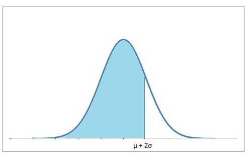

For a particular z score, we can look into the table to find the probability for values to fall less than that particular z value. It can be –ve or +ve. If we look out for 1.47, we find that ~93% data falls less than that. Therefore, 93% patients have cholesterol less than 172. Also, we can safely say that 7% have cholesterol more than 172.

 
## Open Challenges 

Hope you found the guide simple and useful. I hope some one would have given this early in my career. Here are a few challenges for you to try:

Challenge 1: Contrary to the popular expectation, try calculating the probability of getting 50 heads and 50 tails on 100 flips of fair coins? This expectation is known as the gambler’s fallacy! An approximate answer would suffice!

Challenge 2: Try another one – In the United States, the average IQ is 100, with a standard deviation of 15. What percentage of the population would you expect to have an IQ more than 120?
