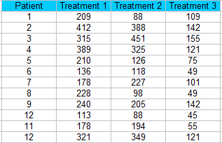
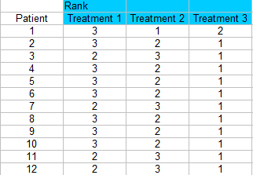
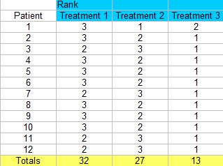
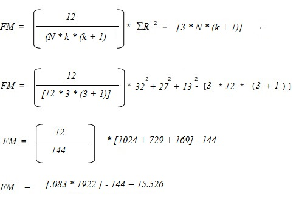

# Friedman Test
Friedman’s test is a non-parametric test for finding differences in treatments across multiple attempts. Nonparametric means the test doesn’t assume your data comes from a particular distribution (like the normal distribution). Basically, it’s used in place of the ANOVA test when you don’t know the distribution of your data.

Friedman’s test is an extension of the sign test, used when there are multiple treatments. In fact, if there are only two treatments the two tests are identical.

## Assumptions
* Data should be ordinal (e.g. the Likert scale) or continuous,
* Data comes from a single group, measured on at least three different occasions,
* The sample was created with a random sampling method,
* Blocks are mutually independent (i.e. all of the pairs are independent — one doesn’t affect the other),
* Observations are ranked within blocks with no ties.

The null hypothesis for the test is that the treatments all have identical effects, or that the samples differ in some way. For example, they have different centers, spreads, or shapes. The alternate hypothesis is that the treatments do have different effects.

1. Prepare your data for the test.
Step 1: Sort your data into blocks (columns in a spreadsheet).for this example, we have 12 patients getting three different treatments.
friedman 1

Step 2: Rank each column separately. The smallest score should get a rank of 1. I am ranking across rows here so each patient is being ranked a 1, 2, or 3 for each treatment.
friedman test 2

Step 3: Sum the ranks (find a total for each column).
friedman test 3

2. Run the Test
Note: This test isn’t usually run by hand, as the calculations are time consuming and labor intensive. Nearly all popular statistical software packages can run this test. However, I’m including the manual steps here for reference.

Step 4: Calculate the test statistic. You’ll need:

n: the number of subjects (12)
k: the number of treatments (3)
R: The total ranks for each of the three columns (32, 27, 13).
Insert these into the following formula and solve:
friedman calculations 1

Step 5: Find the FM critical value from the table of critical values for Friedman (see table below).
Use the k=3 table (as that is how many treatments we have) and an alpha level of 5%. You could choose a higher or lower alpha level, but 5% if fairly common — so use the 5% table if you don’t know your alpha level.

Looking up n-12 in that table, we find a FM critical value of 6.17.

Step 6: Compare the calculated FM test statistic (Step 4) to the FM critical value (Step 5). Reject the null hypothesis if the calculated F value is larger than the FM critical value.:

Calculated FM Test Statistic = 15.526.
FM Critical value from table = 6.17.
The calculated FM statistic is larger, so you would reject the null hypothesis.
