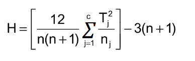

# kruskal Wallis

The Kruskal Wallis test is the non parametric alternative to the One Way ANOVA. Non parametric means that the test doesn’t assume your data comes from a particular distribution. The H test is used when the assumptions for ANOVA aren’t met (like the assumption of normality). It is sometimes called the one-way ANOVA on ranks, as the ranks of the data values are used in the test rather than the actual data points.
The test determines whether the medians of two or more groups are different. Like most statistical tests, you calculate a test statistic and compare it to a distribution cut-off point. The test statistic used in this test is called the H statistic. The hypotheses for the test are:

H0: population medians are equal.

H1: population medians are not equal.

The Kruskal Wallis test will tell you if there is a significant difference between groups. However, it won’t tell you which groups are different. For that, you’ll need to run a Post Hoc test.

## use cases
* You want to find out how test anxiety affects actual test scores. The independent variable “test anxiety” has three levels: no anxiety, low-medium anxiety and high anxiety. The dependent variable is the exam score, rated from 0 to 100%.
* You want to find out how socioeconomic status affects attitude towards sales tax increases. Your independent variable is “socioeconomic status” with three levels: working class, middle class and wealthy. The dependent variable is measured on a 5-point Likert scale from strongly agree to strongly disagree.

## Assumptions for the Kruskal Wallis Test
Your variables should have:

* One independent variable with two or more levels (independent groups). The test is more commonly used when you have three or more levels. For two levels, consider using the Mann Whitney U Test instead.
* Ordinal scale, Ratio Scale or Interval scale dependent variables.
* Your observations should be independent. In other words, there should be no relationship between the members in each group or between groups. For more information on this point, see: Assumption of Independence.
* All groups should have the same shape distributions. Most software (i.e. SPSS, Minitab) will test for this condition as part of the test.

## Running the H Test
Sample question: A shoe company wants to know if three groups of workers have different salaries:
Women: 23K, 41K, 54K, 66K, 78K.
Men: 45K, 55K, 60K, 70K, 72K
Minorities: 18K, 30K, 34K, 40K, 44K.

Step 1: Sort the data for all groups/samples into ascending order in one combined set.
20K
23K
30K
34K
40K
41K
44K
45K
54K
55K
60K
66K
70K
72K
90K

Step 2: Assign ranks to the sorted data points. Give tied values the average rank.
20K 1
23K 2
30K 3
34K 4
40K 5
41K 6
44K 7
45K 8
54K 9
55K 10
60K 11
66K 12
70K 13
72K 14
90K 15

Step 3: Add up the different ranks for each group/sample.
Women: 23K, 41K, 54K, 66K, 90K = 2 + 6 + 9 + 12 + 15 = 44.
Men: 45K, 55K, 60K, 70K, 72K = 8 + 10 + 11 + 13 + 14 = 56.
Minorities: 20K, 30K, 34K, 40K, 44K = 1 + 3 + 4 + 5 + 7 = 20.

Step 4: Calculate the H statistic:
h-test

Where:

n = sum of sample sizes for all samples,
c = number of samples,
Tj = sum of ranks in the jth sample,
nj = size of the jth sample.
h-test-2

H = 6.72

Step 5: Find the critical chi-square value, with c-1 degrees of freedom. For 3 – 1 degrees of freedom and an alpha level of .05, the critical chi square value is 5.9915.

Step 6: Compare the H value from Step 4 to the critical chi-square value from Step 5.

If the critical chi-square value is less than the H statistic, reject the null hypothesis that the medians are equal.

If the chi-square value is not less than the H statistic, there is not enough evidence to suggest that the medians are unequal.

In this case, 5.9915 is less than 6.72, so you can reject the null hypothesis.
