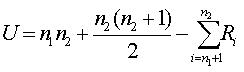

# Mann Whitney
Mann-Whitney U test is the non-parametric alternative test to the independent sample t-test.  It is a non-parametric test that is used to compare two sample means that come from the same population, and used to test whether two sample means are equal or not.  Usually, the Mann-Whitney U test is used when the data is ordinal or when the assumptions of the t-test are not met.

## Assumptions of the Mann-Whitney:

Mann-Whitney U test is a non-parametric test, so it does not assume any assumptions related to the distribution of scores.  There are, however, some assumptions that are assumed
1. The sample drawn from the population is random.
2. Independence within the samples and mutual independence is assumed.  That means that an observation is in one group or the other (it cannot be in both).
3. Ordinal measurement scale is assumed.

## Calculation of the Mann-Whitney U:

Where:
U=Mann-Whitney U test
N1 = sample size one
N2= Sample size two
Ri = Rank of the sample size

## Use of Mann-Whitney: 

Mann-Whitney U test is used for every field, but is frequently used in psychology, healthcare, nursing, business, and many other disciplines.  For example, in psychology, it is used to compare attitude or behavior, etc.  In medicine, it is used to know the effect of two medicines and whether they are equal or not.  It is also used to know whether or not a particular medicine cures the ailment or not.  In business, it can be used to know the preferences of different people and it can be used to see if that changes depending on location.

Types of question examined using the Mann-Whitney U

Good questions answered by the Mann-Whitney are examining rank differences.  For example,

Did the horse racing finishes differ by horse sex (male vs. female)?

Does the rank order of university preferences differ by geographic region of student (urban vs. rural)?

Administration, Analysis, and Reporting

Statistics Solutions consists of a team of professional methodologists and statisticians that can assist the student or professional researcher in administering the survey instrument, collecting the data, conducting the analyses and explaining the results.

## Example

