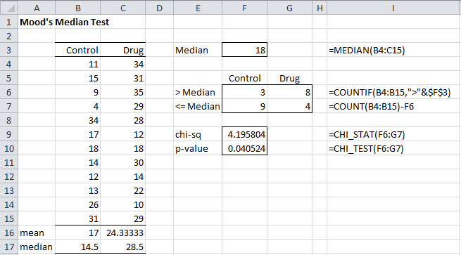

# Mood Median
Mood’s Median Test (for two samples)
The Mood’s Median Test, essentially a two sample version of the Sign Test, is used to determine whether the median of two independent samples are equal. To perform this test, you need to execute the following steps:

* Calculate the total median m of the combination of the two samples.
* Create a 2 × 2 contingency table whose first row consists of the number of elements in each sample that are greater than m and whose second row consists of the number of elements in each sample that are less than or equal to m
* Perform a chi-square test of independence
* If p-value < α then the medians of the populations from which the two samples are derived are unequal; otherwise they are equal

Example 1: Repeat Example 2 of Two Sample t-Test with Equal Variance to determine whether the Drug and Control groups have the same median based on the data in Figure 1.

Two samples data

Figure 1 – Data for Example 1

As can be seen in Wilcoxon Ranked Sum Test when we repeat this example using the Wilcoxon ranked sum test, this data is not normally distributed and so we need to use a non-parametric test.

We execute the steps in Mood’s Median Test as shown in Figure 2. Column I shows the formulas used in column F.

Mood's two-sample test

Figure 2 – Mood’s Median Tests for two samples

Since p-value = .0405 < .05 = α, we reject the null-hypothesis, and conclude there is a significant difference between the two population medians.

Observation: Generally the Wilcoxon Rank Sum or Mann-Whitney test is used instead of Mood’s Median Test since they provide more accurate results.

Real Statistics Functions: The Real Statistics Pack provides the following functions:

MOODS_STAT(R1) = the chi-square test statistic for Mood’s Median test where R1 contains the sample data.

MOODS_TEST(R1) = the p-value statistic for Mood’s Median test where R1 contains the sample data.

For Example 1, MOODS_STAT(B4:C15) = 4.196 and MOODS_TEST(B4:C15) = .0405.

Observation: Mood’s Median Test can also be applied to more than two samples and can be viewed as a weak version of the Kruskal-Wallis test.
