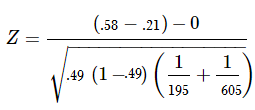
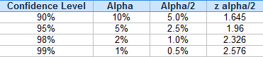

# Proportion

Sample question: let’s say you’re testing two flu drugs A and B. Drug A works on 41 people out of a sample of 195. Drug B works on 351 people in a sample of 605. Are the two drugs comparable? Use a 5% alpha level.

Step 1: Find the two proportions:
P1 = 41/195 = 0.21 (that’s 21%)
P2 = 351/605 = 0.58 (that’s 58%).
Set these numbers aside for a moment.

Step 2: Find the overall sample proportion. The numerator will be the total number of “positive” results for the two samples and the denominator is the total number of people in the two samples.
p = (41 + 351) / (195 + 605) = 0.49.
Set this number aside for a moment.

Step 3: Insert the numbers from Step 1 and Step 2 into the test statistic formula:
two-proprtion-z-test

two-proprtion-z-test-2

Solving the formula, we get:
Z = 8.99

We need to find out if the z-score falls into the “rejection region.”

Step 4: Find the z-score associated with α/2. I’ll use the following table of known values:
z alpha

The z-score associated with a 5% alpha level / 2 is 1.96.

Step 5: Compare the calculated z-score from Step 3 with the table z-score from Step 4. If the calculated z-score is larger, you can reject the null hypothesis.

8.99 > 1.96, so we can reject the null hypothesis.
