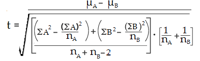
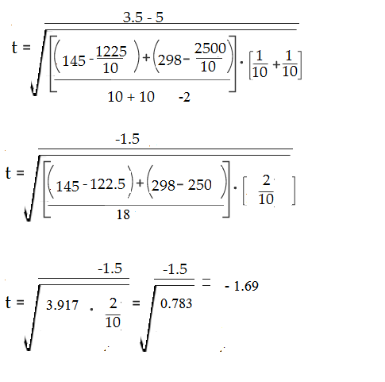
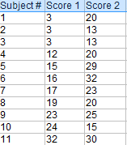
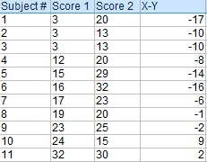
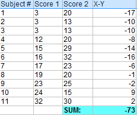
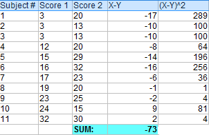
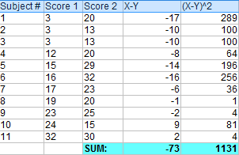
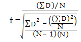
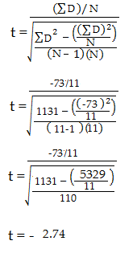

# Ttest
*The t test tells you how significant the differences between groups are; In other words it lets you know if those differences (measured in means/averages) could have happened by chance*

## use cases
### 1
Let’s say you have a cold and you try a naturopathic remedy. Your cold lasts a couple of days. The next time you have a cold, you buy an over-the-counter pharmaceutical and the cold lasts a week. You survey your friends and they all tell you that their colds were of a shorter duration (an average of 3 days) when they took the homeopathic remedy. What you really want to know is, are these results repeatable? A t test can tell you by comparing the means of the two groups and letting you know the probability of those results happening by chance.
### 2 
Student’s T-tests can be used in real life to compare means. For example, a drug company may want to test a new cancer drug to find out if it improves life expectancy. In an experiment, there’s always a control group (a group who are given a placebo, or “sugar pill”). The control group may show an average life expectancy of +5 years, while the group taking the new drug might have a life expectancy of +6 years. It would seem that the drug might work. But it could be due to a fluke. To test this, researchers would use a Student’s t-test to find out if the results are repeatable for an entire population

## Defination
The t score is a ratio between the difference between two groups and the difference within the groups. The larger the t score, the more difference there is between groups. The smaller the t score, the more similarity there is between groups. A t score of 3 means that the groups are three times as different from each other as they are within each other. When you run a t test, the bigger the t-value, the more likely it is that the results are repeatable.

* A large t-score tells you that the groups are different.
* A small t-score tells you that the groups are similar

## T-Values and P-values

How big is “big enough”? Every t-value has a p-value to go with it. A p-value is the probability that the results from your sample data occurred by chance. P-values are from 0% to 100%. They are usually written as a decimal. For example, a p value of 5% is 0.05. Low p-values are good; They indicate your data did not occur by chance. For example, a p-value of .01 means there is only a 1% probability that the results from an experiment happened by chance. In most cases, a p-value of 0.05 (5%) is accepted to mean the data is valid.


## Calculating the Statistic / Test Types

There are three main types of t-test:
* An Independent Samples t-test compares the means for two groups.
* A Paired sample t-test compares means from the same group at different times (say, one year apart).
* A One sample t-test tests the mean of a single group against a known mean

### Calculating an Independent Samples T Test By hand

Sample question: Calculate an independent samples t test for the following data sets:
Data set A: 1,2,2,3,3,4,4,5,5,6
Data set B: 1,2,4,5,5,5,6,6,7,9

```markdown
Step 1: Sum the two groups:
A: 1 + 2 + 2 + 3 + 3 + 4 + 4 + 5 + 5 + 6 = 35
B: 1 + 2 + 4 + 5 + 5 + 5 + 6 + 6 + 7 + 9 = 50

Step 2: Square the sums from Step 1:
352 = 1225
492 = 2500
Set these numbers aside for a moment.

Step 3: Calculate the means for the two groups:
A: (1 + 2 + 2 + 3 + 3 + 4 + 4 + 5 + 5 + 6)/10 = 35/10 = 3.5
B: (1 + 2 + 4 + 5 + 5 + 5 + 6 + 6 + 7 + 9) = 50/10 = 5
Set these numbers aside for a moment.

Step 4: Square the individual scores and then add them up:
A: 11 + 22 + 22 + 33 + 33 + 44 + 44 + 55 + 55 + 66 = 145
B: 12 + 22 + 44 + 55 + 55 + 55 + 66 + 66 + 77 + 99 = 298
Set these numbers aside for a moment.

Step 5: Insert your numbers into the following formula and solve:
t test formula a
```

```markdown
(ΣA)2: Sum of data set A, squared (Step 2).
(ΣB)2: Sum of data set B, squared (Step 2).
μA: Mean of data set A (Step 3)
μB: Mean of data set B (Step 3)
ΣA2: Sum of the squares of data set A (Step 4)
ΣB2: Sum of the squares of data set B (Step 4)
nA: Number of items in data set A
nB: Number of items in data set B
```

```markdown
Step 6: Find the Degrees of freedom (nA-1 + nB-1) = 18

Step 7: Look up your degrees of freedom (Step 6) in the t-table. If you don’t know what your alpha level is, use 5% (0.05).
18 degrees of freedom at an alpha level of 0.05 = 2.10.

Step 8: Compare your calculated value (Step 5) to your table value (Step 7). The calculated value of -1.79 is less than the cutoff of 2.10 from the table. Therefore p > .05. As the p-value is greater than the alpha level, we cannot conclude that there is a difference between means.
```

### paired t test
A paired t test (also called a correlated pairs t-test, a paired samples t test or dependent samples t test) is where you run a t test on dependent samples. Dependent samples are essentially connected — they are tests on the same person or thing. For example:

* Knee MRI costs at two different hospitals,
* Two tests on the same person before and after training,
* Two blood pressure measurements on the same person using different equipment.

#### use cases
##### 1
Choose the paired t-test if you have two measurements on the same item, person or thing. You should also choose this test if you have two items that are being measured with a unique condition. For example, you might be measuring car safety performance in Vehicle Research and Testing and subject the cars to a series of crash tests. Although the manufacturers are different, you might be subjecting them to the same conditions.

With a “regular” two sample t test, you’re comparing the means for two different samples. For example, you might test two different groups of customer service associates on a business-related test or testing students from two universities on their English skills. If you take a random sample each group separately and they have different conditions, your samples are independent and you should run an independent samples t test (also called between-samples and unpaired-samples).

he null hypothesis for the for the independent samples t-test is μ1 = μ2. In other words, it assumes the means are equal. With the paired t test, the null hypothesis is that the pairwise difference between the two tests is equal (H0: µd = 0). The difference between the two tests is very subtle; which one you choose is based on your data collection method.

### Calculating an paired T Test By hand

Sample question: Calculate a paired t test by hand for the following data:
paired t test example 2



Step 1: Subtract each Y score from each X score.
paired t test example 3


Step 2: Add up all of the values from Step 1.
Set this number aside for a moment.
paired t test example 4



Step 3: Square the differences from Step 1.
paired t test example 5



Step 4: Add up all of the squared differences from Step 3.
paired t test example 6


Step 5: Use the following formula to calculate the t-score:
paired samples t test example



ΣD: Sum of the differences (Sum of X-Y from Step 2)
ΣD2: Sum of the squared differences (from Step 4)
(ΣD)2: Sum of the differences (from Step 2), squared.
paired t test example 7v3




 
Step 6: Subtract 1 from the sample size to get the degrees of freedom. We have 11 items, so 11-1 = 10.

Step 7: Find the p-value in the t-table, using the degrees of freedom in Step 6. If you don’t have a specified alpha level, use 0.05 (5%). For this sample problem, with df=10, the t-value is 2.228.

Step 8: Compare your t-table value from Step 7 (2.228) to your calculated t-value (-2.74). The calculated t-value is greater than the table value at an alpha level of .05. The p-value is less than the alpha level: p <.05. We can reject the null hypothesis that there is no difference between means.

Note: You can ignore the minus sign when comparing the two t-values, as ± indicates the direction; the p-value remains the same for both directions.

